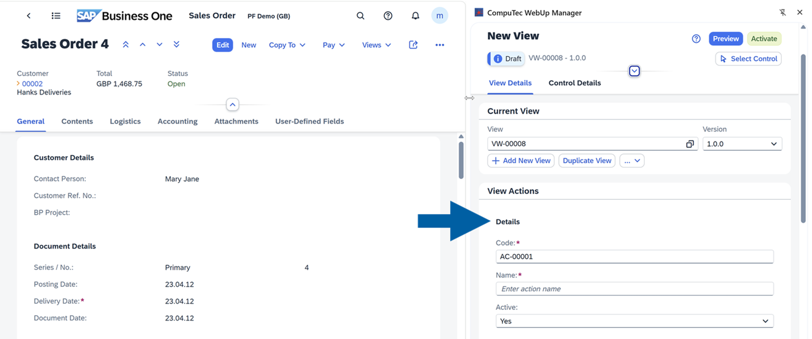
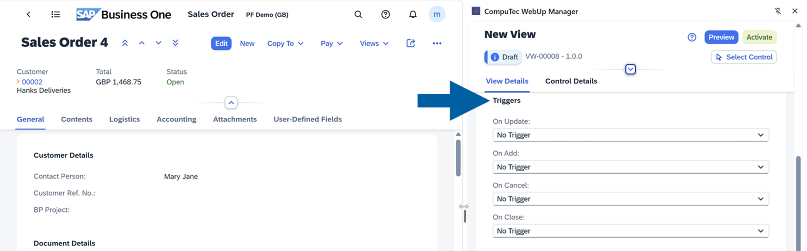
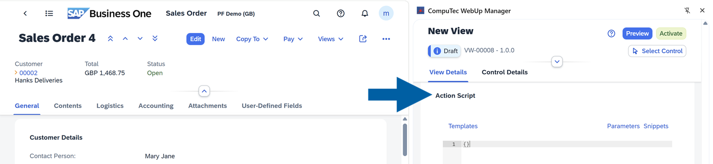
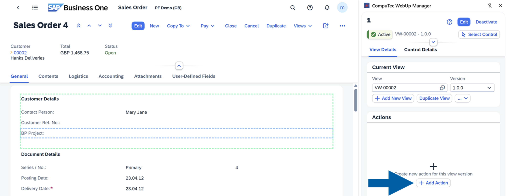
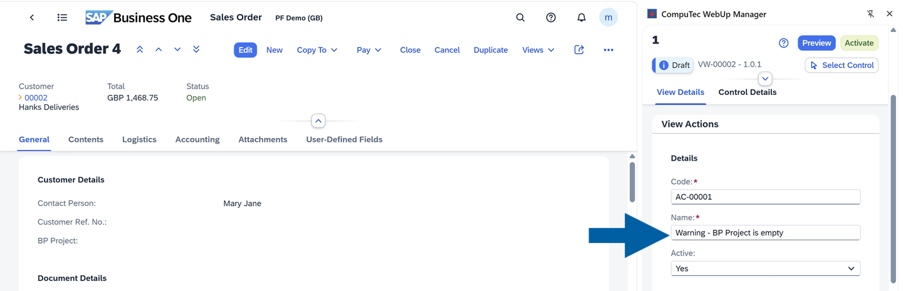
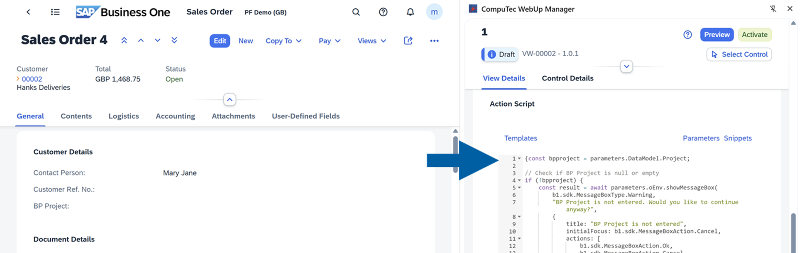
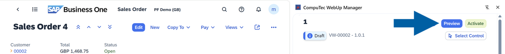
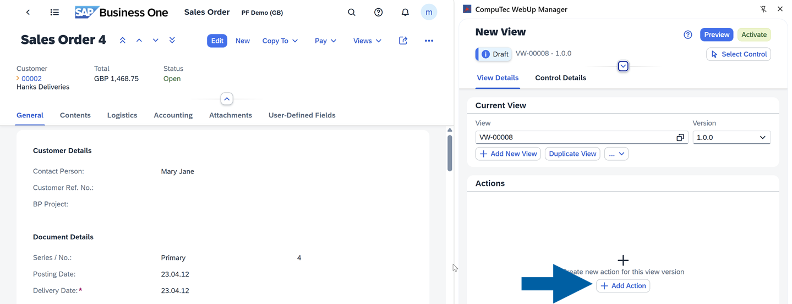
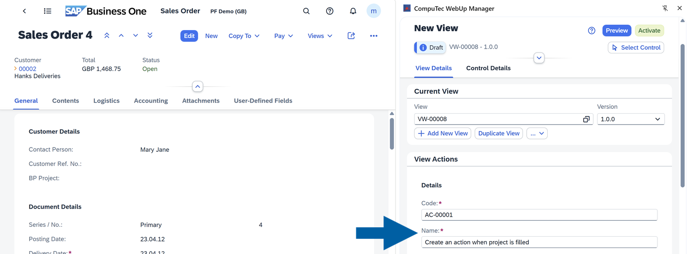
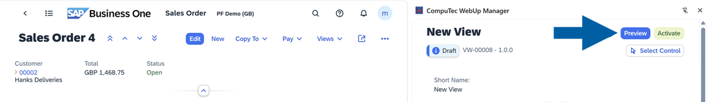

# View Actions

The **View Actions** function of CompuTec WebUp lets you create event-driven logic that runs before or after user actions in the SAP Business One Web Client. Each action is linked to a specific event and processed by CompuTec AppEngine.  

This function allows key users and administrators to extend the standard behavior of the SAP Web Client **without modifying core SAP objects or source code**.

:::info[Note]
You can access each CompuTec WebUp function from the **CompuTec WebUp Side Panel inside the SAP Business One Web Client**. Features open only if the current SAP Business One screen supports extensibility.
:::

## Main sections of CompuTec WebUp View Actions

The **View Actions** interface in **CompuTec WebUp Manager** has three main sections:

- **Details**: Here you’ll find the unique code of your action and a place to type its name. Here you can also make your action active or deactivate it.

  

- **Triggers**: You can choose to activate your action `Before` or `After` following triggers: `On Update`, `On Add`, `On Cancel` or `On Close`.

  

- **Action Script**: It’s the place where you can enter or paste your own JavaScript code. In this section, you can find some helpful elements:
  - **Templates**: Ready-made logic patterns for common tasks like confirmations, validations, or data retrieval. They give you a quick starting point, so you don’t have to build everything from scratch.
  - **Parameters**: Values passed during each action to SAP Business One, for example, an event field name. They help to dynamically link action logic with the user interface or underlying database context.
  - **Snippets**: Small pieces of reusable code that handle simple tasks, like single-line validations, data formatting, or conditional checks. You can use them to customize or extend the default logic.

  

:::note[info]
Each control in SAP Business One Web Client has its **Global Unique Identifier (GUID)**. You can copy it and use it in the script during the **View Actions** creation to precisely reference a control in your SAP Business One interface.  
To reference controls precisely when building actions, you can use the **Select Control** tool, the right-click **Inspect Element** or **Copy GUID** options.

:::

## Key features of CompuTec WebUp View Actions

### Validations  

You can create validations that are triggered `Before` or `After` a user updates, adds, cancels or closes a document, field or control.

The validations can include a custom popup message box if you want to ask for confirmation, warn the user, or guide them before the action continues.

▶ **Watch**: [CompuTec WebUp - Validation - Creating a Warning Prompt](https://www.youtube.com/watch?v=2CcmJlgOAb8&list=PLtT6kgaz5YneoXw5aRFA-SxXwzzB-u4vl&index=5)

#### Validations use case

You can create a warning prompt when a user doesn’t add a project name when updating the sales order. Here’s how to do this step by step:

1. Log in to your **SAP Business One Web Client** account.

2. Enter the document you want to work with. In our example it’s `Sales Oder`.

3. In **CompuTec WebUp Manager** extension panel, navigate to **View Details**.

    :::info[note]
    You must be logged in to your CompuTec AppEngine account to access the CompuTec WebUp browser extension.
    :::

4. Click **Add Action**.

    

5. Enter the action name.

    

6. Choose the trigger for your action. In our case, we choose `Before` in the **On Update** trigger field, because we want to make sure the user won’t save the document without the project name.

    

7. Now, it’s time to add our script to the **Action Script** field. In our example, we have a script showing a warning message if a `BP Project` field is empty. If our user clicks `Ok`, then they’ll continue anyway, but if they click `Cancel`, the further processing will be stopped.

    

8. Click **Add Action** to confirm.

9. Done! Now you can **Preview** and **Activate** it.

      :::note[info]
      After creating your action, you can test it using **Preview**. This interactive tool lets you validate your logic in real time directly within the SAP Business One Web Client. It helps you check results, confirm parameter values, and fine-tune your action before clicking **Activate** and deploying it.

      
      :::

### Automations

You can build **JavaScript-based automations** that run when specific `View` events occur.  

The automations can perform tasks such as creating documents through the Service Layer, updating field values, or reacting dynamically to changes on the screen.

▶ **Watch**: [CompuTec WebUp - Automation - Creating Activities and Actions](https://www.youtube.com/watch?v=VYICWbt62YY&list=PLtT6kgaz5YneoXw5aRFA-SxXwzzB-u4vl&index=6)

#### Automations use case

You can set up an action to automatically post an activity document when the user assigns a project name in the Sales Order document.

Here’s how to do this step by step:

1. Log in to your **SAP Business One Web Client account**.

2. Enter the document you want to work with. In our example it’s `Sales Oder`.

3. In **CompuTec WebUp Manager** extension panel, navigate to **View Details**.

    :::info[note]
    You must be logged in to your CompuTec AppEngine account to access the CompuTec WebUp browser extension.
    :::

4. Click **Add Action**.

    

5. In **Details**, add the action name.

   

6. In **Triggers**, choose `After` from the **On Update** list.

    

7. In **Action Script**, paste your script.

   

8. Done! Now you can **Preview** and **Activate** your action.

    :::note[info]
      After creating your action, you can test it using **Preview**. This interactive tool lets you validate your logic in real time directly within the SAP Business One Web Client. It helps you check results, confirm parameter values, and fine-tune your action before clicking **Activate** and deploying it.

      
      :::
