# View Actions

**View Actions** in **CompuTec WebUp Manager** let you define logic that runs when specific document events occur in the **SAP Business One Web Client**, such as when a document is added or updated.

A View Action can run before or after the document event and is processed by CompuTec AppEngine. This makes View Actions useful for document-level processes, such as validation or automation.

For example, you can use a View Action to check whether required information is provided before a user updates a Sales Order.

With View Actions, key users and administrators can extend standard SAP Business One Web Client behavior without modifying SAP core objects or source code.

:::note[info]
**View Actions** respond to document events, such as adding or updating a document. **Smart Actions** respond to interactions with UI controls, such as changing a field or clicking a button. [Read more](/docs/webup/components/smart-actions)
:::

:::info[Note]
You can access each CompuTec WebUp function from the **CompuTec WebUp Side Panel inside the SAP Business One Web Client**. Features open only if the current SAP Business One screen supports extensibility.
:::

## Main sections of CompuTec WebUp View Actions

The **View Actions** interface in **CompuTec WebUp Manager** has three main sections:

- **Details**: Here you’ll find the unique code of your action and a place to type its name. Here you can also make your action active or deactivate it.

    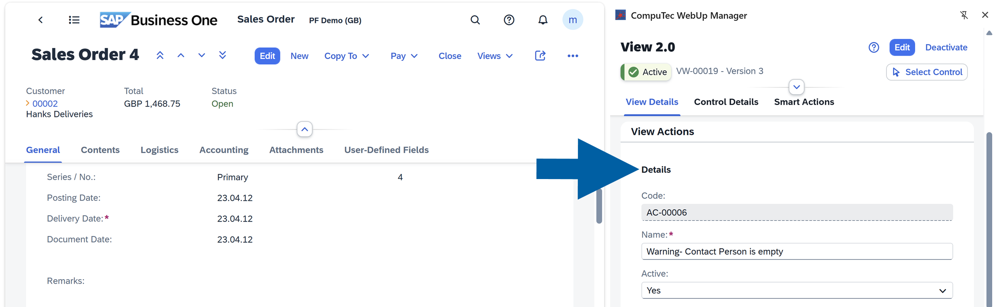

- **Triggers**: You can choose to activate your action `Before` or `After` following triggers: `On Update`, `On Add`, `On Cancel` or `On Close`.

    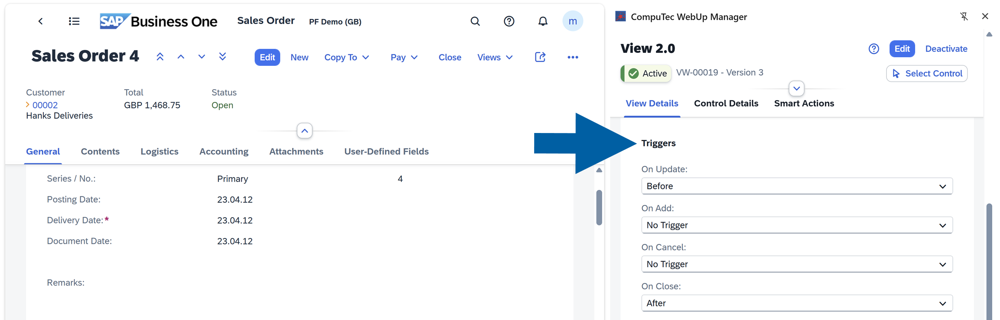

- **Action Script**: Use this area to enter or paste JavaScript code that defines the action logic. The **Parameter Helper** provides information about the parameters available for the action, helping you use data from the current SAP Business One context in your script.

    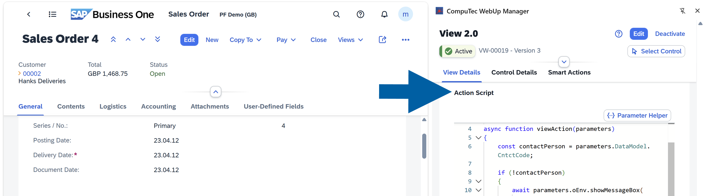

:::note[info]
Each control in SAP Business One Web Client has its **Global Unique Identifier (GUID)**. You can copy it and use it in the script during the **View Actions** creation to precisely reference a control in your SAP Business One interface.  
To reference controls precisely when building actions, you can use the **Select Control** tool, the right-click **Inspect Element** or **Copy GUID** options.

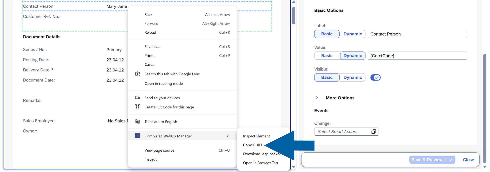
:::

## Key features of CompuTec WebUp View Actions

### Validations  

You can create validations that are triggered `Before` or `After` a user updates, adds, cancels or closes a document, field or control.

The validations can include a custom popup message box if you want to ask for confirmation, warn the user, or guide them before the action continues.

▶ **Watch**: [CompuTec WebUp - Validation - Creating a Warning Prompt](https://www.youtube.com/watch?v=2CcmJlgOAb8&list=PLtT6kgaz5YneoXw5aRFA-SxXwzzB-u4vl&index=5)

#### Validations use case

You can create a warning prompt when a user doesn’t add a project name when updating the sales order. Here’s how to do this step by step:

1. Log in to your **SAP Business One Web Client** account.

2. Enter the document you want to work with. In our example it’s `Sales Oder`.

3. In **CompuTec WebUp Manager** extension panel, navigate to **View Details**.

    :::info[note]
    You must be logged in to your CompuTec AppEngine account to access the CompuTec WebUp browser extension.
    :::

4. Click **Add Action**.

    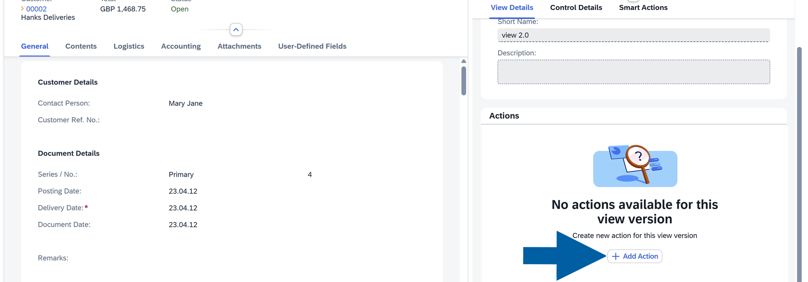

5. Enter the action details.

    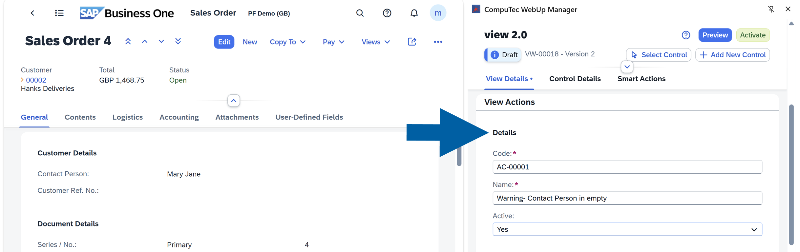

6. Choose the trigger for your action. In our case, we choose `Before` in the **On Update** trigger field, because we want to make sure the user won’t save the document without the contact person.

    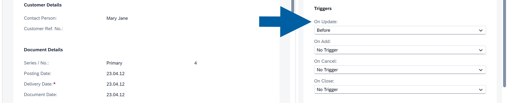

7. Now, it’s time to add our script to the **Action Script** field. In our example, we have a script showing a warning message if a `Contact Person` field is empty.

    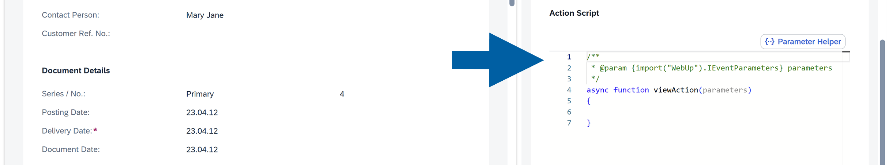

8. Click **Save & Preview** to confirm.

    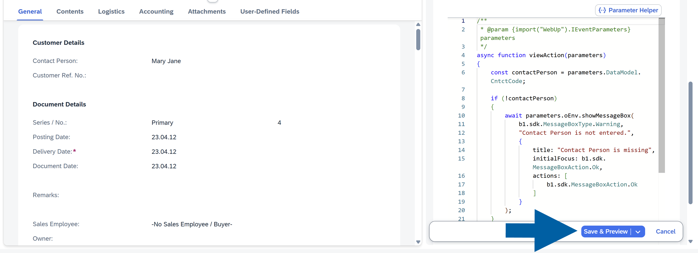

9. Now you can test your action in the preview mode.

    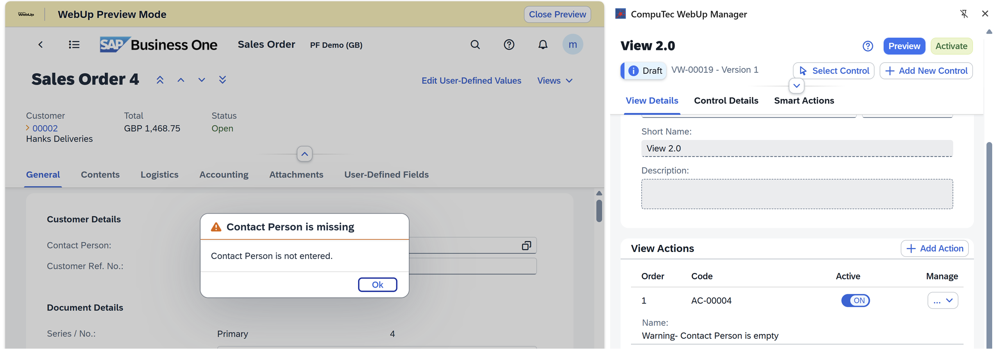

10. If you like how it works, **Activate** the action.

    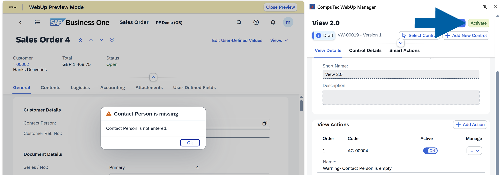

### Automations

You can build **JavaScript-based automations** that run when specific `View` events occur.  

The automations can perform tasks such as creating documents through the Service Layer, updating field values, or reacting dynamically to changes on the screen.

▶ **Watch**: [CompuTec WebUp - Automation - Creating Activities and Actions](https://www.youtube.com/watch?v=VYICWbt62YY&list=PLtT6kgaz5YneoXw5aRFA-SxXwzzB-u4vl&index=6)
