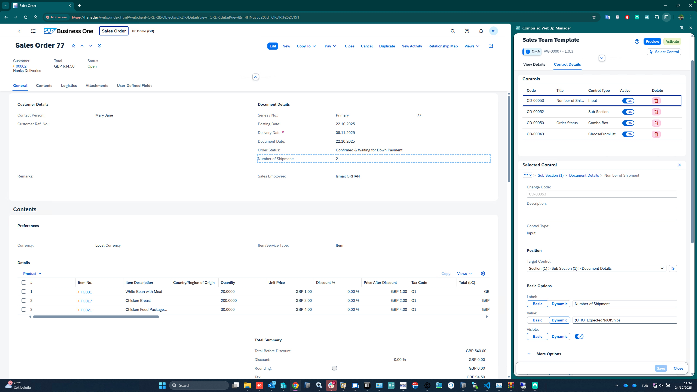

# View Layouts

The **View Layouts** component defines and manages the arrangement of UI controls within the **SAP Business One Web Client (AE)**.

Administrators can view, modify, and reposition controls across supported SAP views.  
Layout modifications are **context-aware** and stored in the **active user profile**.

Before applying advanced layout changes, an editable view must be created for the current SAP Web Client screen using the **Create View** option.

---

## Core Capabilities

- **Visual inspection** of UI controls within supported views.  
- **Selection of elements** via *Select Control* tool or right-click context menu (*Inspect Element*).  
- **Editing control identifiers** such as names, visibility, and position.  
- **Reordering or moving controls** between groups or subsections.  
- **Viewing and modifying control properties** in either *Basic* or *Dynamic* mode.

### Basic Mode
Allows direct editing of control attributes (e.g., **label**, **visibility**, **mandatory**).  
Useful for quick adjustments without data bindings.

### Dynamic Mode
Binds a control’s value to a data source (e.g., *Sales Quotation Total*) using **AE Data API models**.  
Ideal for context-sensitive UI behavior driven by underlying business logic.

> **Note:**  
> If a view is not supported by the SAP Web Client extensibility model, the panel displays **“Unsupported view”** and editing options are disabled.

> In certain layouts, subsections may not have visible labels — these sections are referenced by **order index** (the internal GUID is not displayed).

The **Select Control** tool and context menu can be combined with the **Copy GUID** helper for precise parameter references when defining actions.

---

## Example Use Cases

- Hiding unused fields in the *Sales Quotation* or *Business Partner* view.  
- Moving the *Contact Person* control into a different section.  
- Making *Posting Date* mandatory dynamically based on business logic.

*WebUp layout editing panel showing control selection*

*Property editor with Basic/Dynamic toggle*

*Example of repositioned controls within SAP Web Client*