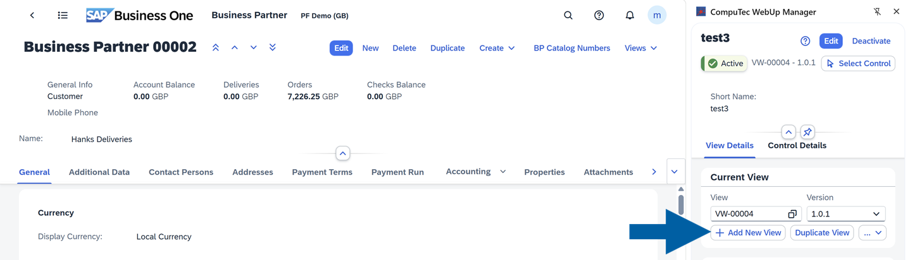
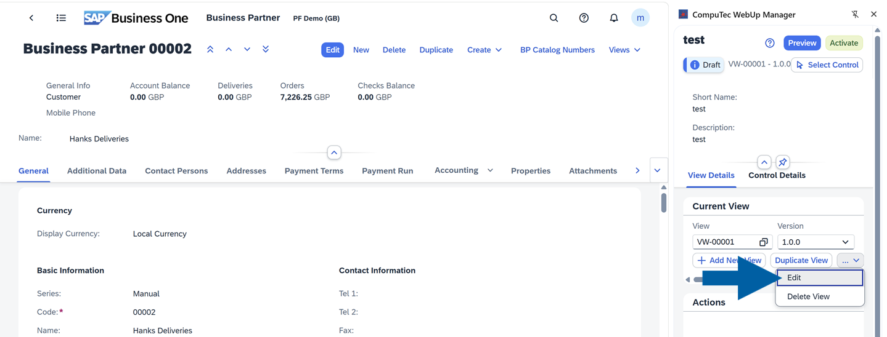
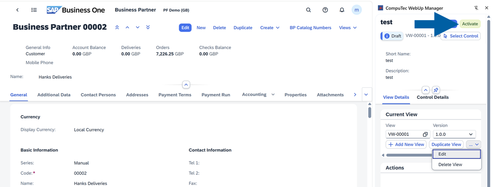
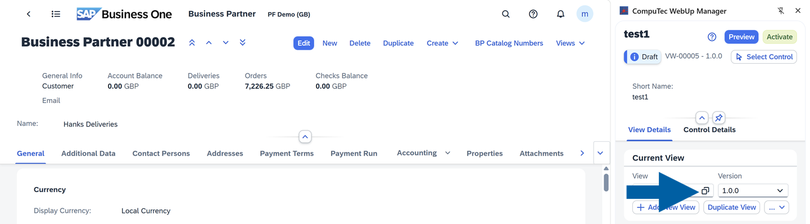
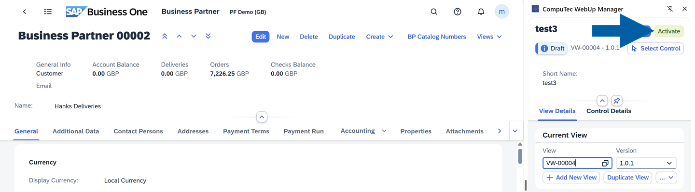
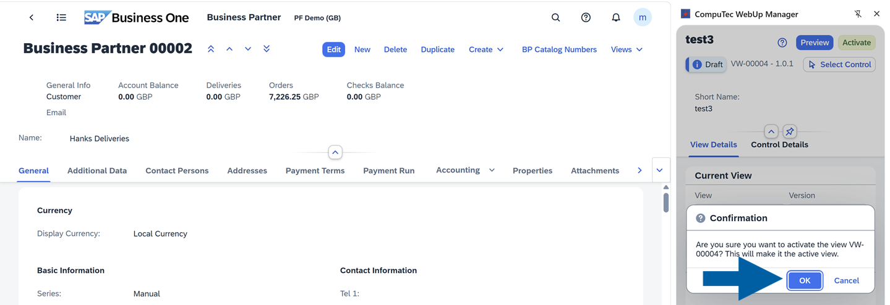

# View Management

CompuTec WebUp saves all your settings, such as layouts, actions, and bindings, inside **Views**. All your saved Views are kept in the company database, and if a setting is supported by the SAP Business One Web Client Extensibility Framework, it is automatically deployed as a standard SAP Business One Web Client extension using the SAP Business One Extension Manager.

Each **View** can have several **Versions**. This lets you make changes safely, test them, and go back to older versions if needed.

This setup keeps everything traceable, organized, and secure.

:::info[Note]
You can access each CompuTec WebUp function from the CompuTec WebUp Side Panel inside the SAP Business One Web Client. Features open only if the current SAP Business One screen supports extensibility.
:::

## Key functions of View Management

Here's a list of View Management key functions:

- **Add New View**: Starts a new view with default settings and gives you the basic structure for layouts, actions, and bindings.

   

- **Edit**: Lets you change the view's layout, actions, or bindings. All changes stay in a draft version until you decide to activate them.

   

- **Activate**: Sets the edited version as the active configuration used by the SAP Business One database. Depending on security settings, you may need to enter your credentials.

   

- You can also **return to the previous version** if something goes wrong. Just choose the view in the list you want to activate. It helps you fix issues quickly without losing any data.

   

:::info[note]

- Only one view version can be active at a time.
- All inactive versions remain archived for auditing, rollback, and troubleshooting purposes.

:::

## View Management example

You may need to edit a new version of a view while the current version remains active in production.
Once testing and validation are complete, you can activate the new version.

CompuTec WebUp automatically archives the previously active version as part of the version history.
Every change is logged, timestamped, and preserved, ensuring full traceability for auditing, diagnostics, and compliance.

To **activate** the previously saved view, follow these steps:

1. In **View**, click the collection icon to see the list of your saved views.

   

2. Select the view you want to activate.

   

3. Click **Activate**.

   

4. Click **OK** to confirm the activation.

   

5. Done! Now your selected view is active.
