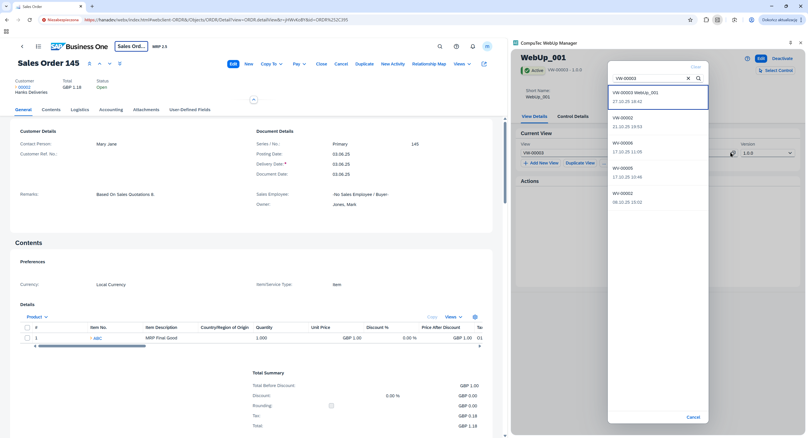
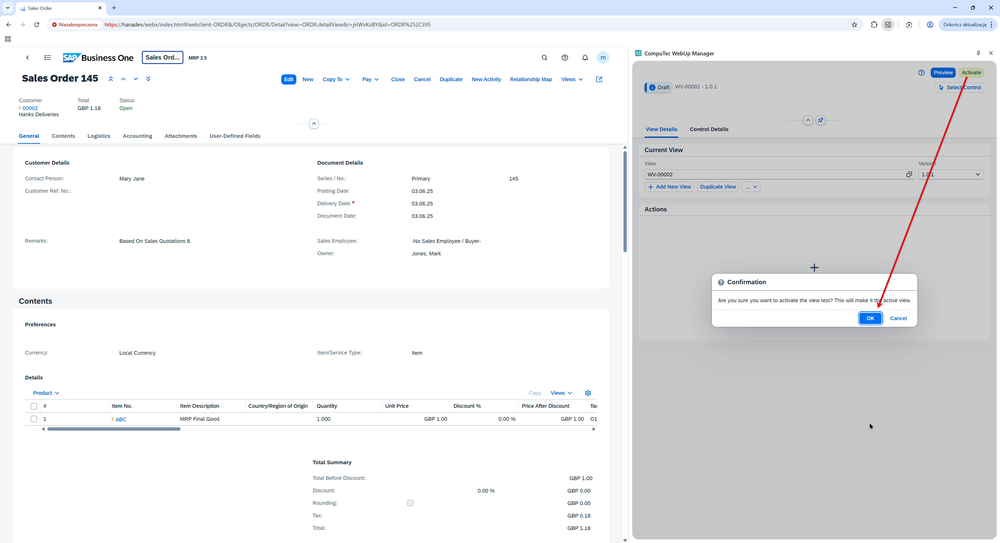

# View Management

All **WebUp configurations** — including layouts, actions, and bindings — are stored within **Views** managed by the **AppEngine Config Layer**.

Each **view** can contain multiple **versions**, allowing safe modification, activation, and rollback without losing historical data.  
This approach ensures full traceability and secure deployment of UI and logic updates.

---

## Profile Lifecycle

1. **Create** – initialize a new configuration profile with default settings.  
   Used to define the starting structure for layouts, actions, and bindings.

2. **Edit** – modify the layout, actions, or bindings associated with the selected profile.  
   Changes are isolated in a draft version until explicitly activated.

3. **Activate** – set the edited version as **active** for the connected SAP Business One database.  
   Activation may require user credentials depending on **AE security policies** and assigned permissions.

4. **Rollback** – revert to a previously active version if configuration errors or inconsistencies are detected.  
   Ensures continuity and rapid recovery without data loss.

> **Note:**  
> Only one version of a profile can be active at any given time.  
> All inactive versions remain archived for auditing, rollback, or diagnostic purposes.

---

## Versioning Example

- Edit version **1.0.2** while version **1.0.1** remains active in production.  
- After successful testing and verification, **activate version 1.0.3**.  
- The AppEngine automatically archives version **1.0.2** as part of the version history.

Each modification is **logged and timestamped**, and the **AppEngine** maintains a full **version history** for audit, diagnostics, and compliance tracking.

*View version list*

*Activation dialog and version confirmation*
