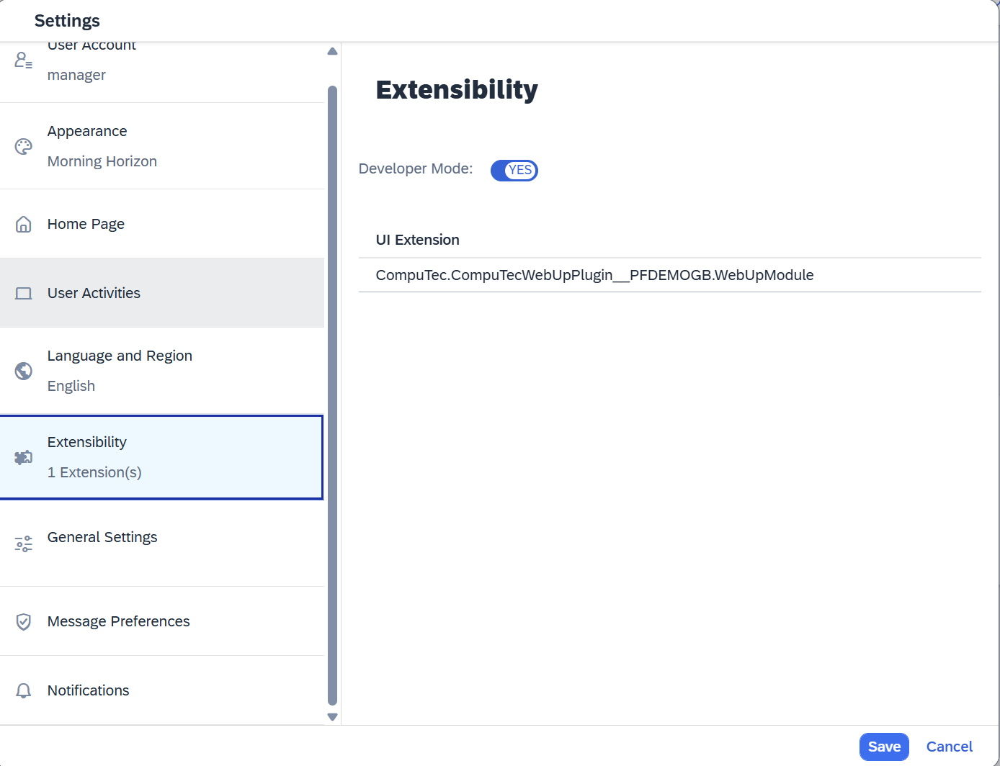

# Installation and Activation

This section describes the **installation and activation workflow** for the **WebUp extension** within the **CompuTec AppEngine Framework**.

---

## Overview

**WebUp** Solution consists of a few components:  

- **CompuTec WebUp App** – handles all customization and automation logic and stores persistent configuration settings.  
- **CompuTec WebUp Manager** – provides the user interface for creating, editing, and testing configurations.  
- **CompuTec WebUp Client** – extends the SAP Business One Web Client where the standard extensibility framework is limited.  

---

## 1 Prerequisites

**CompuTec AppEngine** must be installed and configured. [Installation](docs/appengine/administrators-guide/configuration-and-administration/installation) & [Configuration](docs/appengine/administrators-guide/configuration-and-administration/configuration) instructions.

## 2. Company and Web Client Activation

Make sure that the company is active in AppEngine and Web Client is [configured](docs/appengine/administrators-guide/configuration-and-administration/working-with-sap-business-one-web-client).

## 3. WebUp App Installation

Please install the **WebUp App** via the **AppEngine Store**.  
The installation process is fully automated and managed within AE. [App`s installation instructions](docs/appengine/administrators-guide/configuration-and-administration/plugins/plugin-installation-process)

## 4. Browser Extension Installation

### Chrome Browser

For the Chrome browser please go to the extension [store](https://chromewebstore.google.com/) and install:

- **CompuTec WebUp Client** extension for end users.
- **CompuTec WebUp Manager** extension for consultants and key users.

:::info
Currently those extensions are not available in the store. Please follow [this](./other/extension-manual-installation.md) to install them manually until the Google team validates the extension.
:::

### Microsoft Edge Browser

For the Microsoft Edge browser please go to the extension [store](https://microsoftedge.microsoft.com/addons/Microsoft-Edge-Extensions-Home) and install:

- **CompuTec WebUp Client** extension for end users.
- **CompuTec WebUp Manager** extension for consultants and key users.

:::info
Currently those extensions are not available in the store. Please follow [this](./other/extension-manual-installation.md) to install them manually until the Microsoft team validates the extension.
:::

## 5. Important informations

### Validate if CORS are correct in SAP Web Client

During the activation of a compan in AppEngine system displays instructions how to set up the CORS in Web CLient. Please make sure that all is correctly configured.

### Validate if Developer Mode is enabled SAP Web Client when Customizing User Interface

When customizing user interface using **CompuTec WebUp Manager**, please make sure that in Web Client Developer Mode is Enabled.

## Plugin Update

Updates are handled directly through the **AE Store**, following the same workflow as installation.  
The process preserves **assignments** and **configuration profiles**.
For the new versions of Browser extension you will be prompted after instalation.

---

:::info
Users are expected to follow their standard browser extension installation policies or consult official browser vendor documentation.
:::

*(Optional insert Fig. 4.4-1 — Conceptual diagram: Browser Extension ↔ AppEngine ↔ SAP Web Client)*

---

## Integration Verification

After installation, verify that both components — the **AppEngine plugin** and the **browser extension** — are active and communicating correctly.

### Verification Checklist

| Step | Action | Expected Result |
|------|---------|----------------|
| 1 | Launch SAP Business One Web Client | WebUp icon visible in the toolbar |
| 2 | Launch SAP Business One Web Client | In the Extensions you can see the WebUp tile |
| 3 | Open the WebUp panel | Connection indicator = **Active (green)** |
| 4 | Apply a test configuration | Toast message **"Configuration applied"** |

*(Insert Fig. 4.5-1 — WebUp connection status indicator in toolbar)*  
*(Insert Fig. 4.5-2 — "Configuration applied" confirmation toast)*

---

## Notes and Responsibilities

- Installation and updates within AE are **automated** and **controlled by AppEngine**.  
- **Support procedures**: Registered CompuTec partners should follow the standard support procedures used for other CompuTec solutions. Users without access to our JIRA portal can request support via email at [support@computec.one](mailto:support@computec.one)
