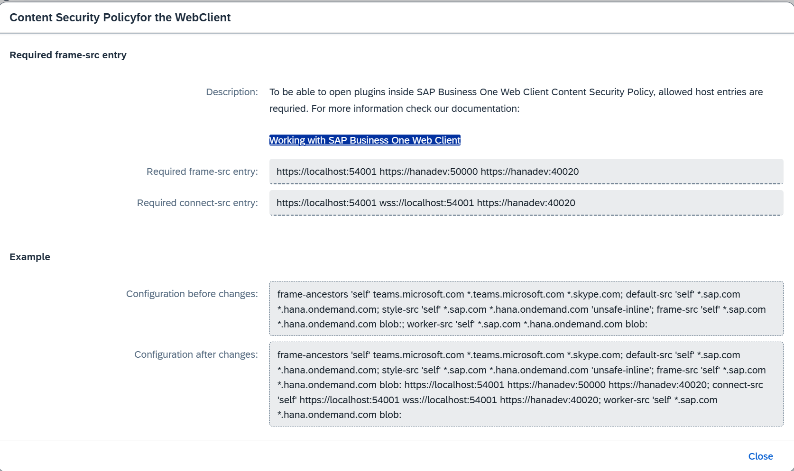

# Installation and Activation

This section describes the **installation and activation workflow** for the **WebUp extension** within the **CompuTec AppEngine Framework**.

---

## Overview

The **WebUp** solution consists of three components:  

- **CompuTec WebUp App** – handles all customization and automation logic and stores persistent configuration settings.  
- **CompuTec WebUp Manager** – provides the user interface for creating, editing, and testing configurations.  
- **CompuTec WebUp Client** – extends the SAP Business One Web Client where the standard extensibility framework is limited.  

---

## 1. Prerequisites

**CompuTec AppEngine** must be installed and configured. Follow the [Installation](/docs/appengine/administrators-guide/configuration-and-administration/installation) & [Configuration](/docs/appengine/administrators-guide/configuration-and-administration/configuration) instructions.

## 2. Company and Web Client Activation

Make sure that the company is active in AppEngine and the Web Client is [configured](/docs/appengine/administrators-guide/configuration-and-administration/working-with-sap-business-one-web-client).

## 3. WebUp App Installation

Please install the **WebUp App** via the **AppEngine Store**.  
The installation process is fully automated and managed within AE. Follow the [app installation instructions](/docs/appengine/administrators-guide/configuration-and-administration/plugins/plugin-installation-process).

## 4. Browser Extension Installation

### Chrome Browser

For the Chrome browser, please go to the [extensions store](https://chromewebstore.google.com/) and install:

- **CompuTec WebUp Client** extension for end users.
- **CompuTec WebUp Manager** extension for consultants and key users.

:::info
Currently, these extensions are not available in the store. Please follow [this guide](./other/extension-manual-installation.md) to install them manually until the Google team validates the extensions.
:::

### Microsoft Edge Browser

For the Microsoft Edge browser, please go to the [extensions store](https://microsoftedge.microsoft.com/addons/Microsoft-Edge-Extensions-Home) and install:

- **CompuTec WebUp Client** extension for end users.
- **CompuTec WebUp Manager** extension for consultants and key users.

:::info
Currently, these extensions are not available in the store. Please follow [this guide](./other/extension-manual-installation.md) to install them manually until the Microsoft team validates the extensions.
:::

## 5. Important Information

### Validate CORS Configuration in SAP Web Client

When activating a company in AppEngine, the system provides instructions for setting up CORS for the Web Client. Please ensure the configuration is correct and you have followed the **Content Security Policy** setup for the SAP Web Client.

### Validate Developer Mode in SAP Web Client When Customizing User Interface

When customizing the user interface with CompuTec WebUp Manager, ensure **Developer Mode** is enabled in the Web Client.

## Plugin Update

Updates are handled directly through the **AE Store**, following the same workflow as installation.  
The process preserves **assignments** and **configuration profiles**.
For new versions of the browser extension, you will be prompted after installation.

---

## Integration Verification

After installation, verify that both components — the **AppEngine plugin** and the **browser extension** — are active and communicating correctly.

---

## Notes and Responsibilities

- Installation and updates within AE are **automated** and **controlled by AppEngine**.  
- **Support procedures**: For support, please use our [CompuTec Helpdesk Portal](https://support.computec.pl/servicedesk/customer/portals?q=webUp)
- Any feedback is truly welcomed via the [CompuTec Helpdesk Portal](https://support.computec.pl/servicedesk/customer/portals?q=webUp)
