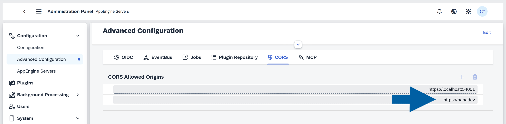
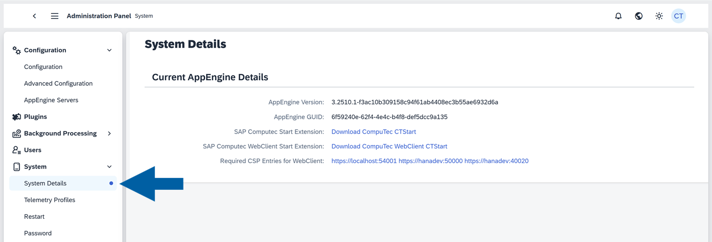
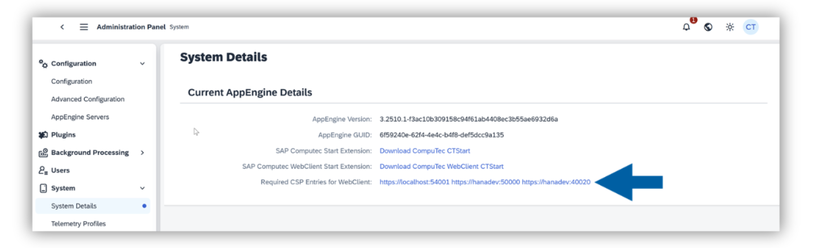
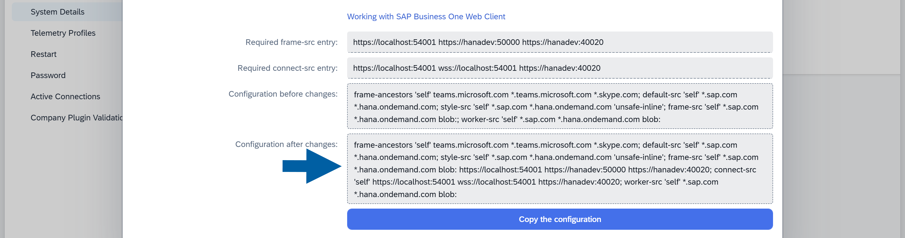
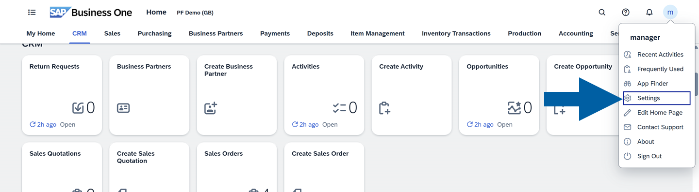
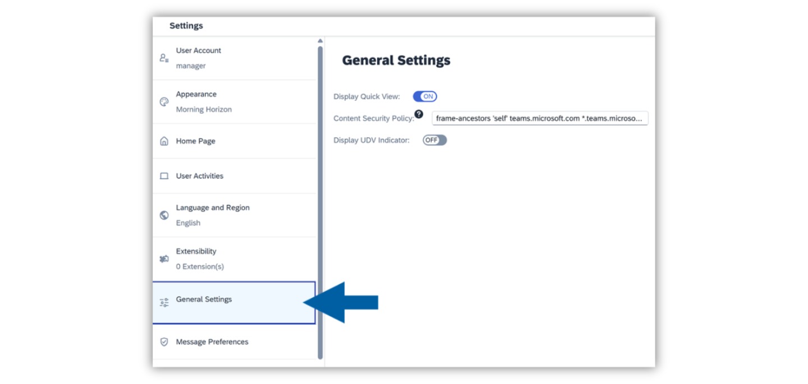
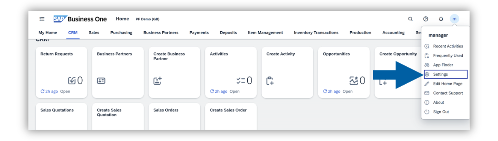
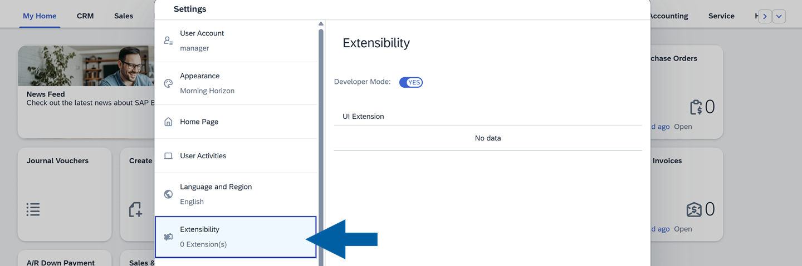
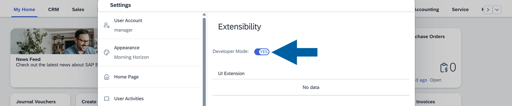

--- 

sidebar_position: 4 

--- 

# Installation and Activation

This guide walks you through installing and activating the **CompuTec WebUp extension** within the **CompuTec AppEngine Framework**.

## Overview

The **CompuTec WebUp** solution is made up of three key components:

- **CompuTec WebUp App**: Handles customization and automation logic, and it stores configuration settings.
- **CompuTec WebUp Manager**: Provides a user interface for creating, editing, and testing configurations.
- **CompuTec WebUp Client**: Extends the SAP Business One Web Client where the standard extensibility framework is limited.

## Before you start

Before installing CompuTec WebUp, make sure the following prerequisites are met:

- Check if **CompuTec AppEngine** is installed and configured. Follow the [CompuTec AppEngine installation guide](/docs/appengine/administrators-guide/configuration-and-administration/installation) and [CompuTec AppEngine configuration guide](/docs/appengine/administrators-guide/configuration-and-administration/configuration) for detailed instructions.
- Make sure that the company is **active in CompuTec AppEngine**, and the **SAP Web Client is configured**. For full instructions, [see the configuration guide.](/docs/appengine/administrators-guide/configuration-and-administration/working-with-sap-business-one-web-client).

## Step 1: Install the CompuTec WebUp App

To install the **CompuTec WebUp App** directly from the CompuTec AppEngine Store, follow the [installation instructions](/docs/appengine/administrators-guide/configuration-and-administration/plugins/plugin-installation-process).  
The installation process is fully automated and managed within CompuTec AppEngine.

## Step 2: Configure CORS in the SAP Web Client

When activating your company in CompuTec AppEngine, set up CORS (Cross-Origin Resource Sharing) for the SAP Business One Web Client:

1. In the **CompuTec AppEngine Administration Panel**, go to **Configuration** > **Advanced Configuration**.  

      

2. In the **CORS Allowed Origins** field, enter your **SAP Web Client address**.  

    

3. Restart **CompuTec AppEngine** to apply changes.

## Step 3: Set up Content Security Policy

Make sure that the Content Security Policy (CSP) configuration in the SAP Web Client includes all required entries. It’s pre-filled with basic data, and you’ll have to add your own CSP entries:

1. In the **CompuTec AppEngine Administration Panel**, navigate to **System** > **System Details**.  

      

2. Click on the **Required CSP Entries for Web Client** link.  

      

3. Here, you can find all the required entries for SAP Web Client Content Security Policy.

      

4. Copy the entries and close the window.  

5. Open **SAP Business One Web Client** and click on your **profile** icon in the upper right corner of the interface.  

      

6. Navigate to **Settings** > **General Settings**.  

      

7. Paste the copied entries to the **Content Security Policy** field.  

    

8. Refresh the **SAP Business One Web Client** page to apply the changes.

## Step 4: Enable Developer Mode

If you plan to customize the user interface using **CompuTec WebUp Manager**, you must enable **Developer Mode** in the SAP Web Client.

1. Click on your **profile icon** in the upper right corner of the SAP Web Client interface and choose **Settings**.  

    

2. Go to **Extensibility**.  

    

3. Turn on the **Developer Mode** toggle.  

    

4. Click **Save**.

## Step 5: Install browser extensions

You’ll need to install two extensions:

- **CompuTec WebUp Client** – for end users
- **CompuTec WebUp Manager** – for consultants and key users

:::info[note]
These extensions are currently **not available in public stores**.
Install them manually using the provided installation package and [this guide](./other/extension-manual-installation.md) until they are validated by Google, Mozilla and Microsoft.
:::  

## Step 6: Verify the integration

After installation, confirm that both the CompuTec AppEngine plugin and the browser extension are active and communicating.

1. Pin the **CompuTec WebUp extension** to your browser toolbar for easy access.
2. Navigate to the **SAP Web Client** page.
3. Click the **CompuTec WebUp extension** icon to activate the integration.  

    

:::info[Note]
If you were already on the SAP Web Client page before installing the CompuTec WebUp browser extension, refresh the page before activating the extension.
:::

## Updates

- Updates are delivered automatically via the CompuTec AppEngine Store.  
- All configuration profiles and assignments are preserved during updates.  
- If a new version of the browser extension is available, you’ll be prompted to update it after installation.
- Maintain your CompuTec AppEngine and CompuTec WebUp versions up to date to ensure compatibility.

:::info[Note]
For technical issues or feature requests, contact the [CompuTec Helpdesk Portal](https://support.computec.pl/servicedesk/customer/portals?q=webUp). Feedback on usability and performance is always welcome.
:::
