--- 

sidebar_position: 4 

--- 
import Tabs from '@theme/Tabs';
import TabItem from '@theme/TabItem';

# Installation and Activation

This guide walks you through installing and activating the **CompuTec WebUp extension** within the **CompuTec AppEngine Framework**.

## Overview

The **CompuTec WebUp** solution is made up of three key components:

- **CompuTec WebUp App**: Handles customization and automation logic, and stores configuration settings.
- **CompuTec WebUp Manager**: Provides a user interface for creating, editing, and testing configurations.
- **CompuTec WebUp Client**: Extends the SAP Business One Web Client where the standard extensibility framework is limited.

## Before you start

Before installing CompuTec WebUp, make sure the following prerequisites are met:

- Check if **CompuTec AppEngine** is installed and configured. Follow the [CompuTec AppEngine installation and configuration guide](/docs/appengine/administrators-guide/configuration-and-administration/installation) for detailed instructions.
- Make sure that the company is **active in CompuTec AppEngine**, and the **SAP Web Client is configured**. For full instructions, [see the configuration guide.](/docs/appengine/administrators-guide/configuration-and-administration/working-with-sap-business-one-web-client)

:::note[Video (optional)]
▶︎ **Watch**: [CompuTec WebUp Installation Step by Step](https://www.youtube.com/playlist?list=PLtT6kgaz5Ynf3ng3AKiiYoZ00_8eGH9_C)  
These short videos will walk you through the whole CompuTec AppEngine and CompuTec WebUp installation process.
:::

## Step 1: Install the CompuTec WebUp App

To install the **CompuTec WebUp App** directly from the CompuTec AppEngine Store, follow the [installation instructions](/docs/appengine/plugins-user-guide/install-plugin).  
The installation process is fully automated and managed within CompuTec AppEngine.

## Step 2: Enable Developer Mode

If you plan to customize the user interface using **CompuTec WebUp Manager**, you must enable **Developer Mode** in the SAP Web Client.

1. Click on your **profile icon** in the upper right corner of the SAP Web Client interface and choose **Settings**.  

    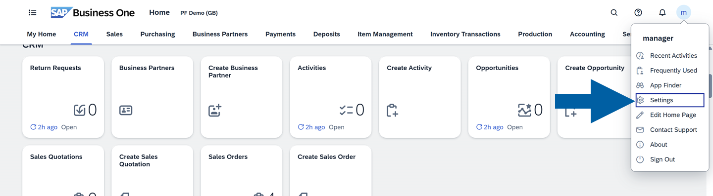

2. Go to **Extensibility**.  

    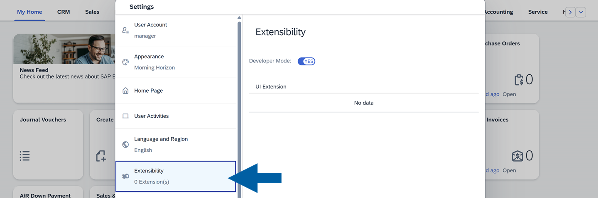

3. Turn on the **Developer Mode** toggle.  

    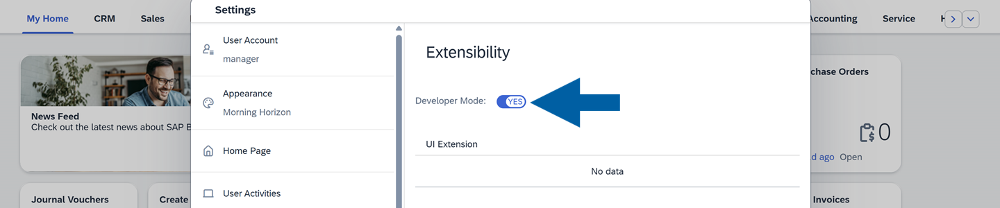

4. Click **Save**.

## Step 3: Install browser extensions

To use CompuTec WebUp, install the following browser extensions:

- **CompuTec WebUp Manager** – a browser extension used to create, edit, and test CompuTec WebUp configurations.
- **CompuTec WebUp Client** – a browser extension that extends the SAP Business One Web Client where the standard extensibility framework is limited.

:::info[note]
The **CompuTec WebUp browser extensions** are available in the **Chrome Web Store**.

For **Google Chrome** and other Chromium-based browsers, such as **Microsoft Edge**, we recommend installing the extensions directly from the Chrome Web Store. This is the **recommended installation method** and does not require enabling Developer mode or loading the extensions manually.

**CompuTec WebUp Manager** is **not available** for **Mozilla Firefox**. For consultant or key-user functionality, use **Google Chrome** or **Microsoft Edge**.

Manual installation using CompuTec installation packages is still available when required. For instructions, see [**Manual Browser Extension Installation**](/docs/webup/other/extension-manual-installation).

:::

To install CompuTec WebUp browser extensions from the Chrome Web Store, follow these steps:

<Tabs>
  <TabItem value="chrome" label="Google Chrome" default>

1. Open the CompuTec WebUp extensions in the **Chrome Web Store**:
    - [**CompuTec WebUp Manager**](https://chromewebstore.google.com/detail/computec-webup-manager/agdmmdghpkllidfeajciepkcchlijpmf)
    - [**CompuTec WebUp Client**](https://chromewebstore.google.com/detail/computec-webup-client/mgglbjhibagmkneodlhinpelnpdedfgi)

2. Click **Add to Chrome**.

    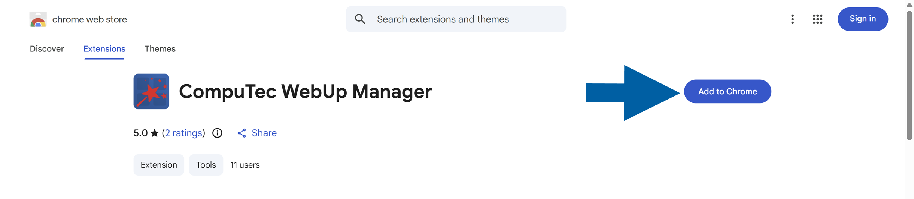

3. Review the requested permissions and confirm the installation.

    

4. Repeat these steps for both the **CompuTec WebUp Client** and **CompuTec WebUp Manager** extensions.

5. Click the **Extensions icon** and verify that both **CompuTec WebUp Manager** and **CompuTec WebUp Client** are installed and enabled.

    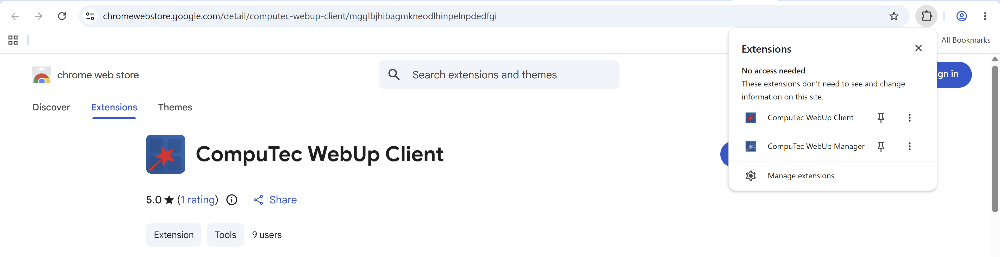

  </TabItem>

  <TabItem value="edge" label="Microsoft Edge">

1. Open the CompuTec WebUp extensions in the **Chrome Web Store**:
    - [**CompuTec WebUp Manager**](https://chromewebstore.google.com/detail/computec-webup-manager/agdmmdghpkllidfeajciepkcchlijpmf)
    - [**CompuTec WebUp Client**](https://chromewebstore.google.com/detail/computec-webup-client/mgglbjhibagmkneodlhinpelnpdedfgi)

2. Click **Get**.

    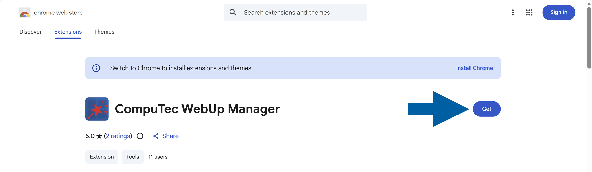

3. Review the requested permissions and confirm the installation.

    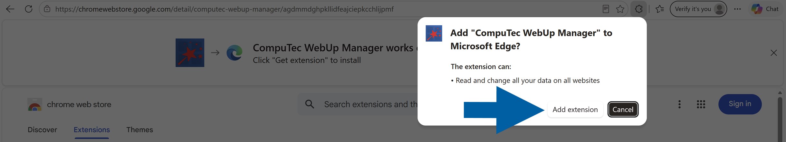

    :::info[note]
    Microsoft Edge supports extensions from the Chrome Web Store. If prompted, allow extensions from other stores before installing the WebUp extensions.

    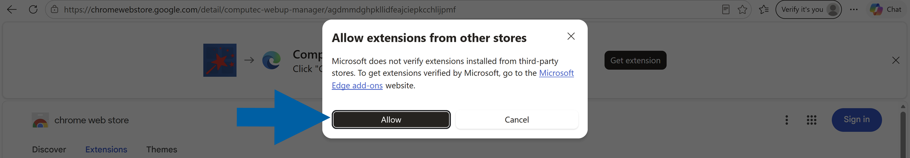
    :::

4. Repeat these steps for both the **CompuTec WebUp Client** and **CompuTec WebUp Manager** extensions.

5. Click the **Extensions icon** and verify that both **CompuTec WebUp Manager** and **CompuTec WebUp Client** are installed and enabled.

    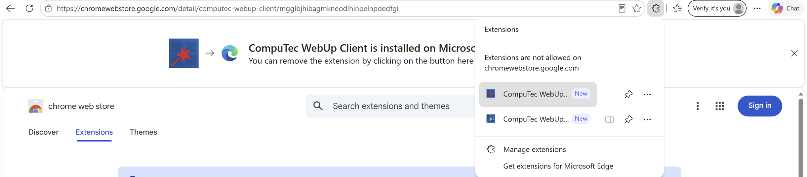

  </TabItem>

  <TabItem value="firefox" label="Mozilla Firefox">

### Step 1: Download the extension for Mozilla Firefox

1. Click [**this link**](https://download.computec.one/software/appengine/plugins/webup/extensions/firefox/CompuTecWebUpClient_1.0.14.zip) to download the **CompuTec WebUp Client** extension.

    :::info[note]
    The **CompuTec WebUp Manager** extension is not available for Mozilla Firefox. If you need consultant or key-user functionality, use Google Chrome or Microsoft Edge.
    :::

2. Extract the downloaded file.

### Step 2: Install the extension for Mozilla Firefox

1. Open the **Mozilla Firefox** browser.

2. Click the **menu icon** and choose **Extensions and themes**.

    

3. Navigate to **Extensions**.

    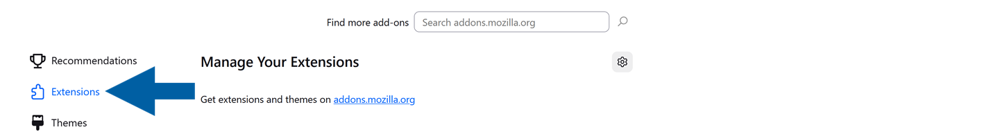

4. Click the **gear icon** and select **Debug Add-ons**.

    

5. Click **Load Temporary Add-on**.

    

6. Select your extracted folder and click **Open**.

7. Done! Now you can see the **CompuTec WebUp Client** on the extension list of your Mozilla Firefox browser.

    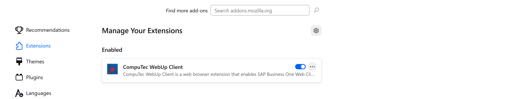

    :::info[note]  
    Firefox only supports **temporary loading** of unpacked extensions.  
    The extension must be reloaded each time you restart Firefox.
    :::

  </TabItem>
</Tabs>

## Step 4: Verify the integration

After installation, confirm that both the CompuTec AppEngine plugin and the browser extension are active and communicating.

1. Pin the **CompuTec WebUp Manager extension** to your browser toolbar for easy access.
2. Navigate to the **SAP Web Client** page.
3. Click the **CompuTec WebUp extension** icon to activate the integration.  

    

:::info[Note]
If you were already on the SAP Web Client page before installing the CompuTec WebUp browser extension, refresh the page before activating the extension.
:::

## Updates

- Updates are delivered automatically via the CompuTec AppEngine Store.  
- All configuration profiles and assignments are preserved during updates.  
- If a new version of the browser extension is available, you’ll be prompted to update it after installation.
- Maintain your CompuTec AppEngine and CompuTec WebUp versions up to date to ensure compatibility.

:::info[Note]
For technical issues or feature requests, contact us via the [CompuTec Support Portal](https://support.computec.pl/servicedesk/customer/portals?q=webUp). Feedback on usability and performance is always welcome.
:::
