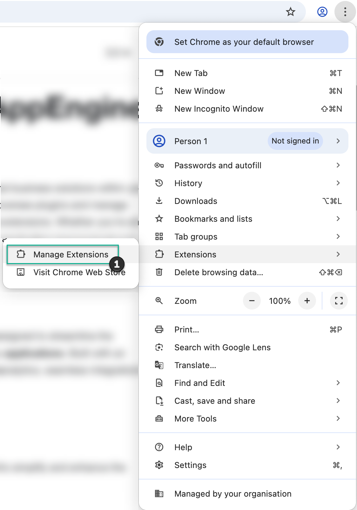
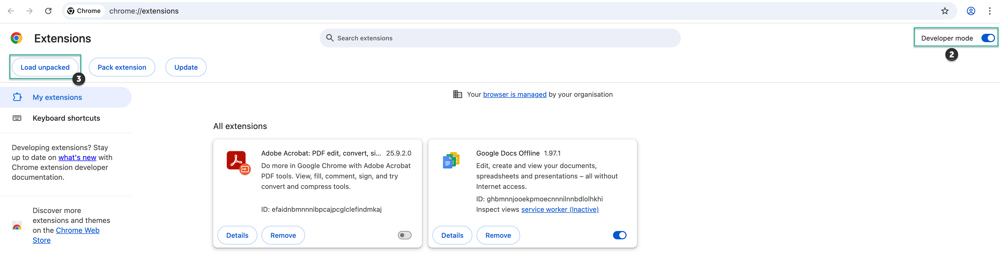
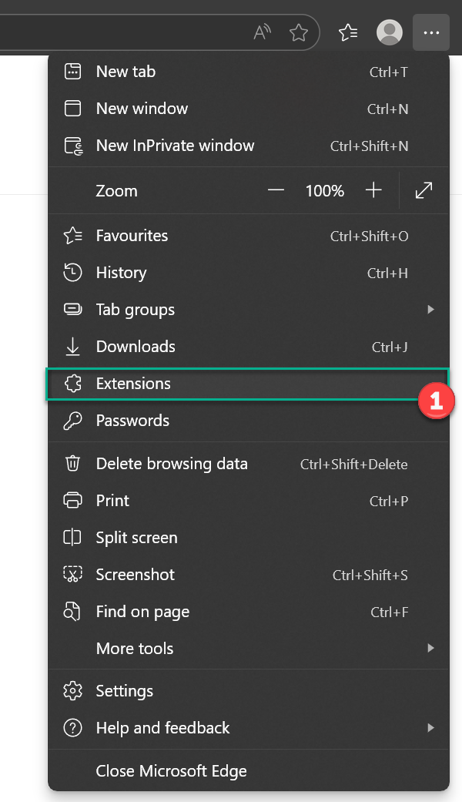
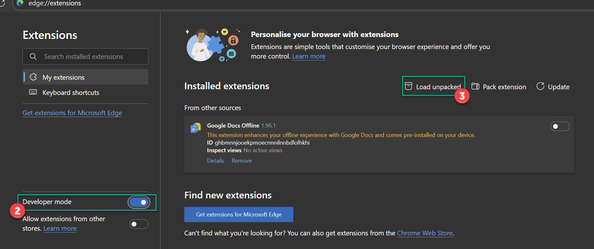

# Manual Extension Installation

## 1. Download

Please download and extract the extensions below on your hard drive.

- [CompuTec WebUp Client](https://download.computec.one/software/appengine/plugins/webup/extensions/chromium/CompuTecWebUpClient_3.0.1.zip) 3.0.1
- [CompuTec WebUp Manager](https://download.computec.one/software/appengine/plugins/webup/extensions/chromium/CompuTecWebUpManager_3.0.1.zip) 3.0.1

## 2. Installation in Chrome browser

1. Open Extension Manager.

2. Enable the Developer Mode.
3. Pick the unpacked extensions folders

4. Validate if the extensions are listed in Extension Manager.

## 2. Installation in Edge browser

1. Open Extension Manager.

2. Enable the Developer Mode.
3. Pick the unpacked extensions folders

4. Validate if the extensions are listed in Extension Manager.
