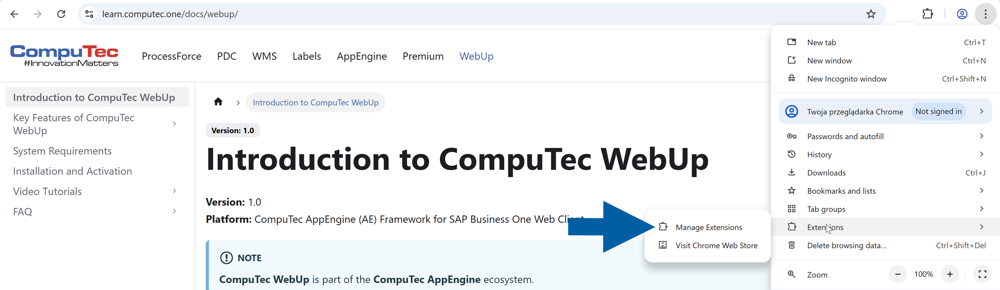
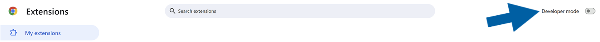
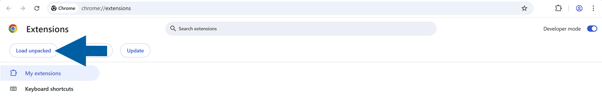
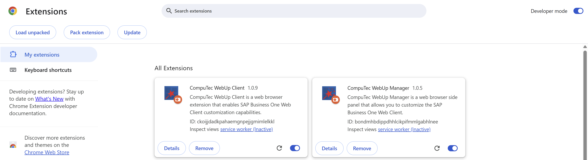
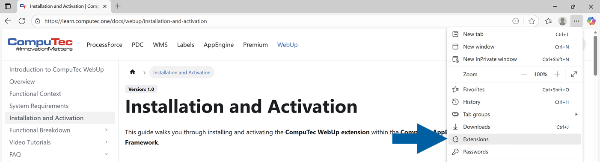
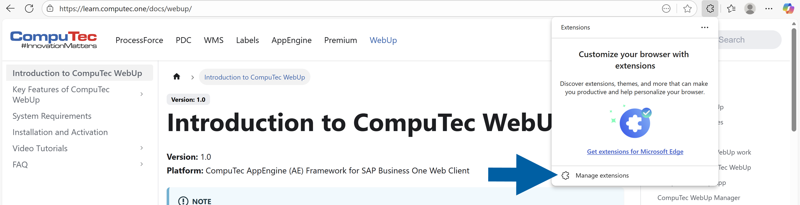
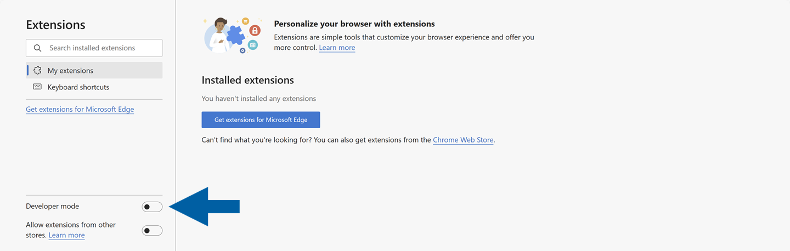
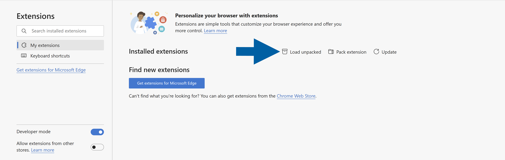
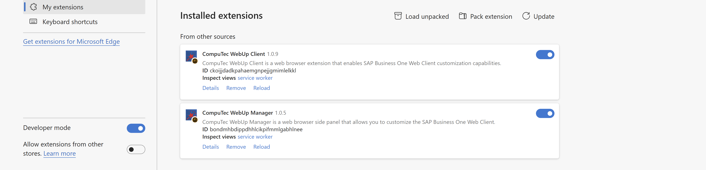
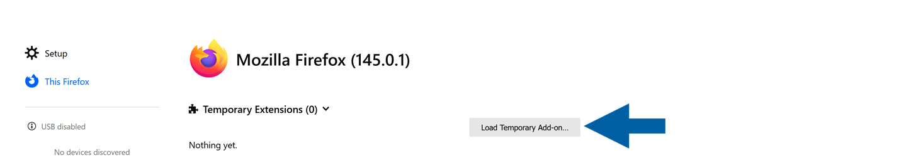

import Tabs from '@theme/Tabs';
import TabItem from '@theme/TabItem';

# Manual CompuTec WebUp Extension Installation

You’ll need to install two extensions:

- CompuTec WebUp Client – for end users
- CompuTec WebUp Manager – for consultants and key users

## Browser Extension Installation

Select your browser to see the installation steps:

<Tabs>
  <TabItem value="chrome" label="Google Chrome" default>

### Step 1: Download the WebUp extensions for the Google Chrome browser

1. Click [**this link**](https://download.computec.one/software/appengine/plugins/webup/extensions/chromium/CompuTecWebUpClient_3.0.1.zip) to download the **CompuTec WebUp Client** extension.

2. Click [**this link**](https://download.computec.one/software/appengine/plugins/webup/extensions/chromium/CompuTecWebUpManager_3.0.2.zip) to download the **CompuTec WebUp Manager** extension.

3. Extract both downloaded files.

:::info[note]
These extensions are currently not available in the public store. Install them manually using the provided installation packages until they are validated by Google.
:::

### Step 2: Install the extensions for the Google Chrome browser

1. Open the **Google Chrome** browser.

2. Click the **menu icon** and choose **Extensions** > **Manage Extensions**.

    

3. Turn on the **Developer mode** toggle.

    

4. Click **Load unpacked**.

    

5. Select your extracted **CompuTec WebUp Client** folder and click **Select Folder**.

6. Select your extracted **CompuTec WebUp Manager** folder and click **Select Folder**.

7. Done! Now you can see both **CompuTec WebUp Client** and **CompuTec WebUp Manager** extensions on the **All Extensions** list of your Google Chrome browser.

    

8. You can now return to the [main installation guide](https://learn.computec.one/docs/webup/installation-and-activation#step-6-verify-the-integration) and continue with the next steps.

  </TabItem>

  <TabItem value="edge" label="Microsoft Edge">

### Step 1: Download the WebUp extensions for the Microsoft Edge browser

1. Click [**this link**](https://download.computec.one/software/appengine/plugins/webup/extensions/chromium/CompuTecWebUpClient_3.0.1.zip) to download the **CompuTec WebUp Client** extension.

2. Click [**this link**](https://download.computec.one/software/appengine/plugins/webup/extensions/chromium/CompuTecWebUpManager_3.0.2.zip) to download the **CompuTec WebUp Manager** extension.

3. Extract both downloaded files.

:::info[note]
These extensions are currently not available in the public store. Install them manually using the provided installation packages until they are validated by Microsoft.
:::

### Step 2: Install the extensions for Microsoft Edge browser

1. Open the **Microsoft Edge** browser.

2. Click the **menu icon** and choose **Extensions**.

    

3. Click **Manage extensions**.

    

4. Turn on the **Developer mode** toggle.

    

5. Click **Load unpacked**.

    

6. Select your extracted **CompuTec WebUp Client** folder and click **Select Folder**.

7. Select your extracted **CompuTec WebUp Manager** folder and click **Select Folder**.

8. Done! Now you can see both **CompuTec WebUp Client** and **CompuTec WebUp Manager** extensions on the **Installed extensions** list of your Microsoft Edge browser.

    

9. You can now return to the [main installation guide](https://learn.computec.one/docs/webup/installation-and-activation#step-6-verify-the-integration) and continue with the next steps.

  </TabItem>

  <TabItem value="firefox" label="Mozilla Firefox">

### Step 1: Download the extension for the Mozilla Firefox browser

1. Click [**this link**](https://download.computec.one/software/appengine/plugins/webup/extensions/firefox/CompuTecWebUpClient_3.0.1.zip) to download the **CompuTec WebUp Client** extension.

2. Extract the downloaded file.

:::info[note]
This extension is currently not available in the public store. Install it manually using the provided installation package until it's validated by Mozilla.
:::

### Step 2: Install the extension for the Mozilla Firefox browser

1. Open the **Mozilla Firefox** browser.

2. Click the **menu icon** and choose **Extensions and themes**.

    

3. Navigate to **Extensions**.

    

4. Click the **gear icon** and select **Debug Add-ons**.

    

5. Click **Load Temporary Add-on**.

    

6. Select your extracted folder and click **Open**.

7. Done! Now you can see the **CompuTec WebUp Client** on the extension list of your Mozilla Firefox browser.

    

:::info[note]  
Firefox only supports **temporary loading** of unpacked extensions.  
The extension must be reloaded each time you restart Firefox.
:::

8. You can now return to the [main installation guide](https://learn.computec.one/docs/webup/installation-and-activation#step-6-verify-the-integration) and continue with the next steps.

  </TabItem>
</Tabs>
