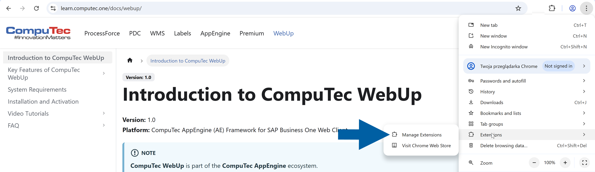
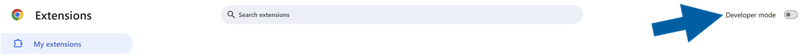
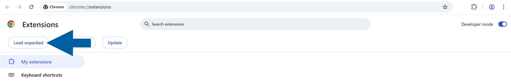
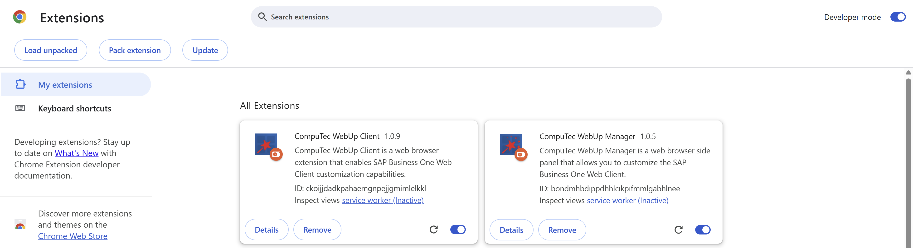
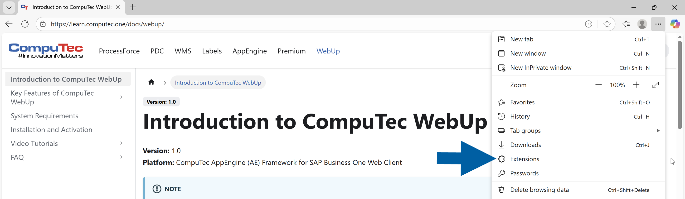
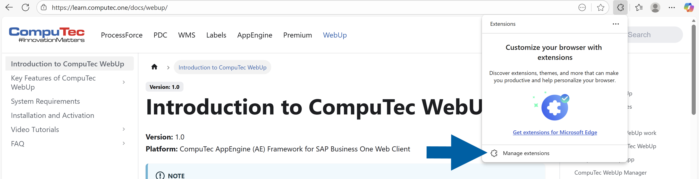
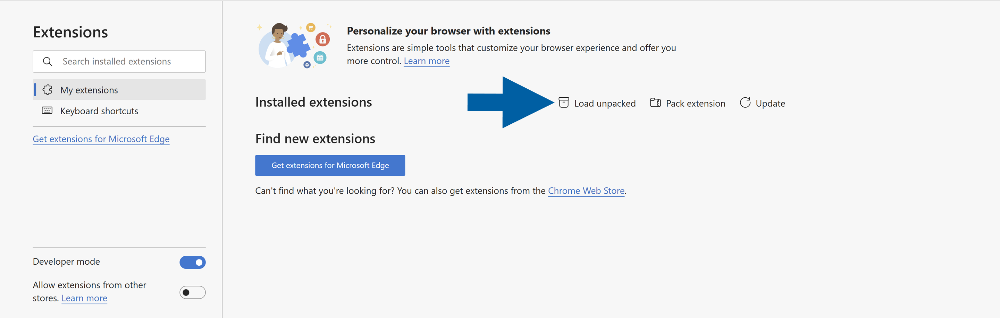
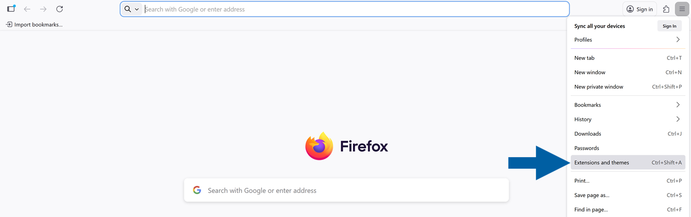
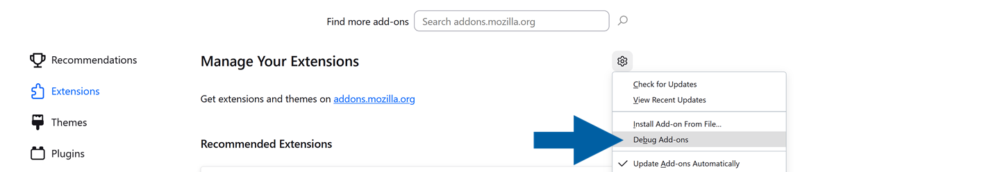
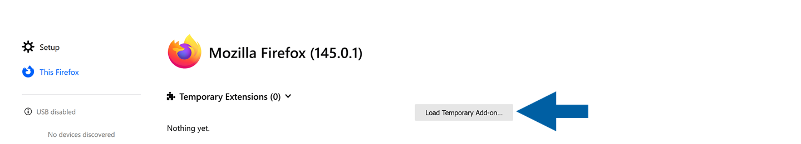

import Tabs from '@theme/Tabs';
import TabItem from '@theme/TabItem';

# Manual Installation of the CompuTec WebUp Extensions

You can install two extensions:

- **CompuTec WebUp Manager** – a browser extension used to create, edit, and test CompuTec WebUp configurations.
- **CompuTec WebUp Client** – a browser extension that extends the SAP Business One Web Client where the standard extensibility framework is limited.

:::info[note]
The **CompuTec WebUp** browser extensions are available in the **Chrome Web Store**.

For **Google Chrome** and other Chromium-based browsers, such as **Microsoft Edge**, we recommend installing the extensions directly from the Chrome Web Store. This is the **recommended installation method** and does not require enabling Developer mode or loading the extensions manually. [Read more](/docs/webup/installation-and-activation)

:::

If access to the **Chrome Web Store** is not available, you can install the extensions **manually** using the **CompuTec installation packages**.

This method may be required in environments with:

- Restricted or offline network access
- Corporate security policies that block access to public extension stores
- Other browser or environment restrictions

## Install CompuTec WebUp browser extensions manually

Select your browser to see the installation steps:

<Tabs>
  <TabItem value="chrome" label="Google Chrome" default>

### Step 1: Download the CompuTec WebUp extensions for Google Chrome

1. Click [**this link**](https://download.computec.one/software/appengine/plugins/webup/extensions/chromium/CompuTecWebUpClient_1.0.14.zip) to download the **CompuTec WebUp Client** extension.

2. Click [**this link**](https://download.computec.one/software/appengine/plugins/webup/extensions/chromium/CompuTecWebUpManager_1.0.17.zip) to download the **CompuTec WebUp Manager** extension.

3. Extract both downloaded files.

### Step 2: Install the extensions for Google Chrome

1. Open the **Google Chrome** browser.

2. Click the **menu icon** and choose **Extensions** > **Manage Extensions**.

    

3. Turn on the **Developer mode** toggle.

    

4. Click **Load unpacked**.

    

5. Select your extracted **CompuTec WebUp Client** folder and click **Select Folder**.

6. Select your extracted **CompuTec WebUp Manager** folder and click **Select Folder**.

7. Done! Now you can see both **CompuTec WebUp Client** and **CompuTec WebUp Manager** extensions on the **All Extensions** list of your Google Chrome browser.

    

  </TabItem>

  <TabItem value="edge" label="Microsoft Edge">

### Step 1: Download the CompuTec WebUp extensions for Microsoft Edge

1. Click [**this link**](https://download.computec.one/software/appengine/plugins/webup/extensions/chromium/CompuTecWebUpClient_1.0.14.zip) to download the **CompuTec WebUp Client** extension.

2. Click [**this link**](https://download.computec.one/software/appengine/plugins/webup/extensions/chromium/CompuTecWebUpManager_1.0.17.zip) to download the **CompuTec WebUp Manager** extension.

3. Extract both downloaded files.

### Step 2: Install the extensions for Microsoft Edge

1. Open the **Microsoft Edge** browser.

2. Click the **menu icon** and choose **Extensions**.

    

3. Click **Manage extensions**.

    

4. Turn on the **Developer mode** toggle.

    

5. Click **Load unpacked**.

    

6. Select your extracted **CompuTec WebUp Client** folder and click **Select Folder**.

7. Select your extracted **CompuTec WebUp Manager** folder and click **Select Folder**.

8. Done! Now you can see both **CompuTec WebUp Client** and **CompuTec WebUp Manager** extensions on the **Installed extensions** list of your Microsoft Edge browser.

    

  </TabItem>

  <TabItem value="firefox" label="Mozilla Firefox">

### Step 1: Download the extension for Mozilla Firefox

1. Click [**this link**](https://download.computec.one/software/appengine/plugins/webup/extensions/firefox/CompuTecWebUpClient_1.0.14.zip) to download the **CompuTec WebUp Client** extension.

    :::info[note]
    The **CompuTec WebUp Manager** extension is not available for Mozilla Firefox. If you need consultant or key-user functionality, use Google Chrome or Microsoft Edge.
    :::

2. Extract the downloaded file.

### Step 2: Install the extension for Mozilla Firefox

1. Open the **Mozilla Firefox** browser.

2. Click the **menu icon** and choose **Extensions and themes**.

    

3. Navigate to **Extensions**.

    

4. Click the **gear icon** and select **Debug Add-ons**.

    

5. Click **Load Temporary Add-on**.

    

6. Select your extracted folder and click **Open**.

7. Done! Now you can see the **CompuTec WebUp Client** on the extension list of your Mozilla Firefox browser.

    

    :::info[note]  
    Firefox only supports **temporary loading** of unpacked extensions.  
    The extension must be reloaded each time you restart Firefox.
    :::

  </TabItem>
</Tabs>
