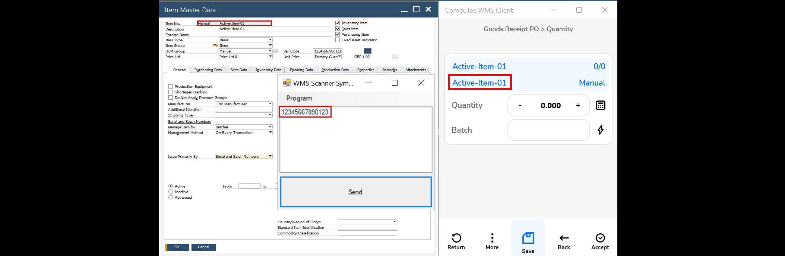

# CompuTec WMS Scanning Simulator

Use the **CompuTec WMS Scanning Simulator** to test barcode scanning behavior without access to a live **CompuTec WMS** system. You can enter item names, single barcodes, or multi-part barcodes.

The simulator supports **GS1** and **Odette** barcode standards. For more information, see [**Barcode Scanning**](../barcode-scanning/overview.md).

## Download and run the simulator

The simulator is a standalone tool and does not require installation.

1. Download the [**CompuTec WMS Scanning Simulator**](https://download.computec.one/software/wms/tools/ScanningSimulator/v_3.0.2.1/WMSScannerSimulator.exe).
2. Run the downloaded file.

:::note
Only one user can use the simulator at a time, including through Remote Desktop.
:::

## Test scanning

### Item name or single barcode

Enter an item name or barcode in the simulator to simulate a scan.

### Multi-part barcode

Enter each part of the barcode on a separate line to simulate scanning the parts one after another.

## Video examples

- [Scanning multi-part barcodes](https://www.youtube.com/watch?v=yOKS1kHo3h0)
- [Scanning single and multi-part GS1 barcodes](https://www.youtube.com/watch?v=utDZYiQYdoI)
