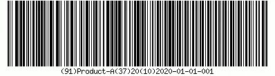

# Multi-barcodes

In modern warehouse management, efficiency and accuracy are critical. Multi-block barcodes, supported by CompuTec WMS, simplify complex workflows by embedding multiple types of data - such as Item, Batch, Quantity, and even User-Defined Fields (UDFs) - into a single scan.

To ensure smooth functionality, it is crucial to maintain consistency in the use of prefixes within a single barcode. The examples provided in this guide illustrate how to configure and utilize multi-block barcodes for various processes. The examples provided in this guide illustrate how to configure and utilize multi-block barcodes for various processes.

:::note
The barcodes in this guide were generated using a specialized [barcode generation tool](https://www.free-barcode-generator.net/ean-128/).
:::

---

## Usage of Multi-block Barcodes in Transactions

### Adding a new Item: Goods Receipt PO

    When receiving items, you can use a barcode to capture essential details like Item, Batch, and Quantity. This ensures the item is added to the document list with a single scan, eliminating the need to manually open rows and update information.

    For further configuration, you can add additional fields via [Custom Configuration](../custom-configuration/overview.md) -> Workflow Step Settings or [UDF Manager](../custom-configuration/custom-configuration-functions/manager/udf-manager.md).

    Learn more by watching the video: [Manually installing an Object in SAP Business One](https://www.youtube.com/watch?v=-1PYy9W3P3M)

    These are the minimum of the information that has to be contained in a barcode for the Item to be added to the list with one scanning (e.g. on Document Details) without additional opening its row and updating information:

    - **Example 1: Item, Quantity, Batch (GS1 prefixes)**

        ```scss
        (91)Product-A
        (37)20
        (10)2020-01-01-001
        ```

        

        A barcode can contain additional information from User-Defined Fields, e.g. Expiry Date:

    - **Example 2: Item, Quantity, Batch, Expiry Date:**

        ```scss
        (91)Product-B
        (37)20
        (10)2020-01-01-002
        (17)200501
        ```

        

### Finding an Item: Stock Transfer/Transfer Request/Pick and Pack

    To accurately identify an item and its location, the corresponding barcode must include at least the following prefixes:

    - **Example 1: Item, Quantity, Batch**
        This enables adding an item to the list with a single scan, without the need to open its row or update any information manually.

        ```scss
        (91)Product-A
        (37)20
        (10)2020-01-01-001
        ```

        

    - **Example 2: Batch and Quantity**

        It is also possible to scan it on the Warehouse selection form if the batch is unique to a single location. Enable this option via: Custom Configuration -> Scanning: general -> Identify/open items by batch/serial scanning.

        ```scss
        (10)2019-12-02-002
        (37)10
        ```

        

### Item issue: Pick Order, Goods Issue, Delivery

    Barcodes simplify the process of issuing items by capturing key details needed for transactions like Pick Orders, Goods Issues, or Deliveries.

    - **Example 1: Item, Quantity, Batch**

        ```scss
        (91)Active-Item-01
        (10)2012-04-18-4
        (95)5555600
        ```

        

    - **Example 2: Batch and Quantity**

        You can also scan the barcode on the Warehouse selection form if the unique Batch is available in only one location and the following option is enabled: (Custom Configuration -> Scanning: General -> Identify/Open Items by Batch/Serial Scanning).

        ```scss
        (10)2019-12-02-002
        (37)10
        ```

        

---
