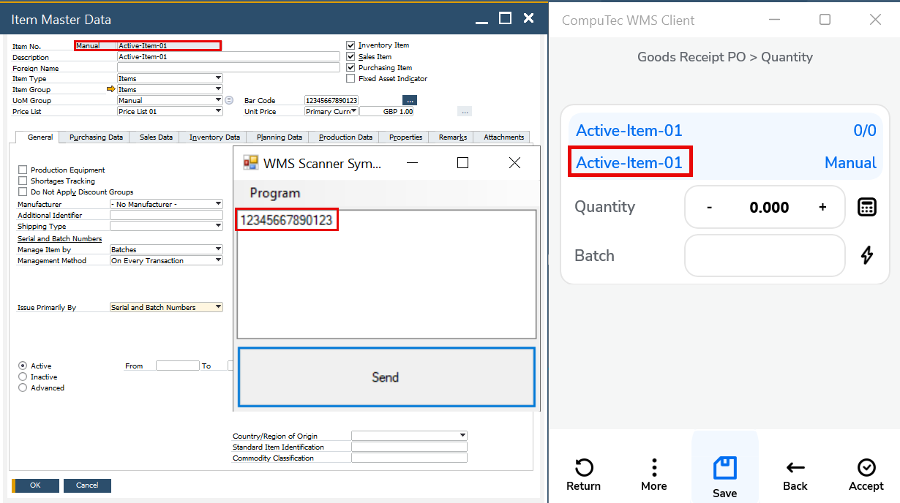
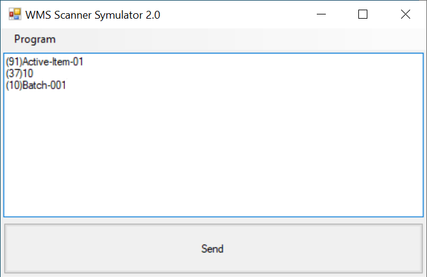

# WMS Scanning Simulator

The WMS Scanning Simulator is a straightforward yet invaluable tool designed to mimic the behavior of CompuTec WMS when scanning barcodes. It serves as an essential resource during the testing phase of CompuTec WMS, enabling users to simulate barcode scanning processes without needing access to the live system.

---

## Download

You can easily download and run the WMS Scanning Simulator on your system. It’s a standalone tool that requires no installation, allowing you to quickly start simulating barcode scans. Simply download the [WMS Scanning Simulator](https://download.computec.one/software/wms/tools/WMS_Scanning_Simulator.exe) and launch it directly on your machine.

## Usage

- The WMS Scanning Simulator is designed to be used by a single user at a time. It can be accessed through a remote desktop, although unlike CompuTec WMS, which supports multi-user simultaneous access, only one user can operate the simulator at once.
- The simulator supports the barcode standards commonly used by CompuTec WMS, including GS1 and Odette. This allows for testing a wide range of barcode types, ensuring compatibility with your system. To know more about "Barcode Scanning", click [here](../barcode-scanning/overview.md).
- You can scan an item by entering its name or barcode. The simulator also allows you to test multi-part barcodes.

    
- You can scan a single code or use a multi-part barcode by scanning each code in a separate line:

    

## Resources

- **Example of Multi-part Codes**:

    To learn more, watch the video: [An example usage of multi-part codes](https://www.youtube.com/watch?v=yOKS1kHo3h0).

- **An example usage of single and multi-part codes in GS1 standard**:

    To learn more, watch the video: [An example usage of single and multi-part codes in GS1 standard](https://www.youtube.com/watch?v=utDZYiQYdoI).

---
The WMS Scanning Simulator offers a convenient and efficient way to simulate barcode scanning and test your WMS setup. While it is intended for individual use at a time, it remains an excellent tool for ensuring your system operates smoothly, especially when preparing for a system rollout or performing quality assurance checks. Whether you're working with GS1 or Odette barcode standards, the simulator helps ensure that your CompuTec WMS performs as expected, making it an essential tool for your testing phase.
