# Delivery Settings

## New Delivery

1. **Show Warehouse selection and no default Warehouse chosen** – It is required to choose a Warehouse on creation of a document or adding Items.

    

    
Click to check the effect on the workflow

    

    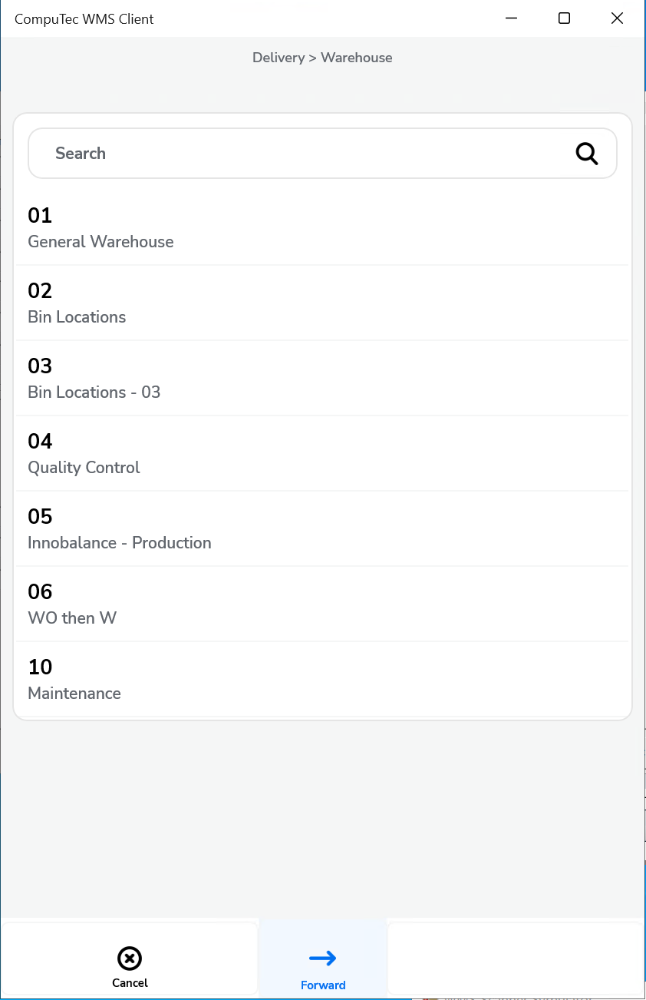 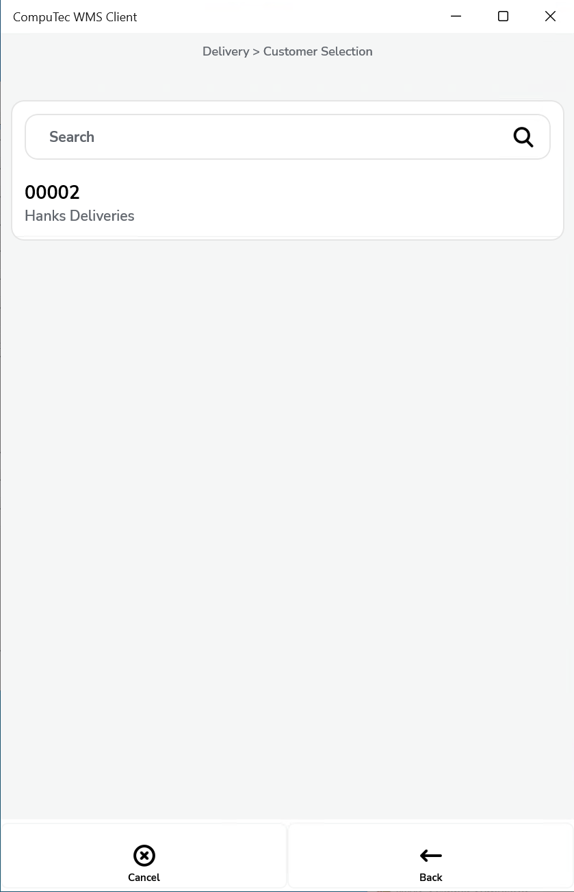 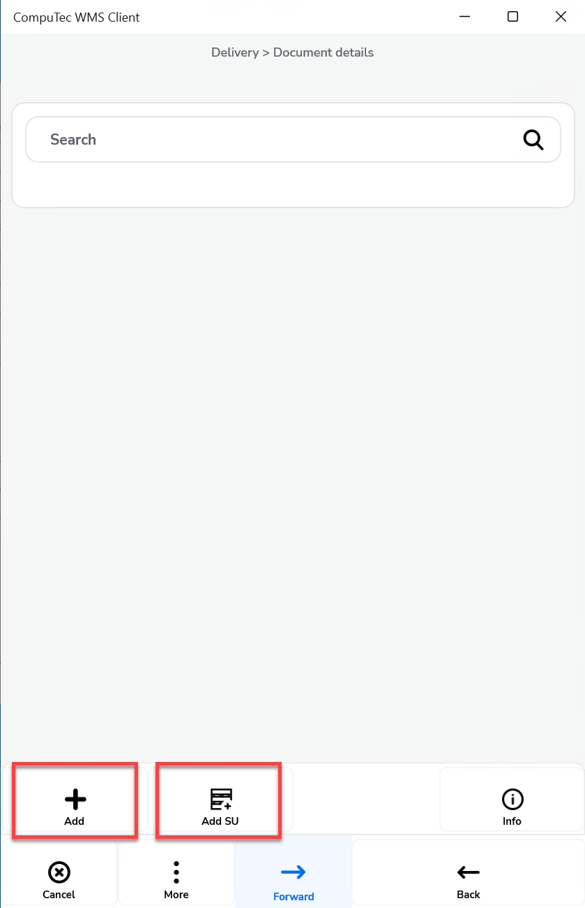 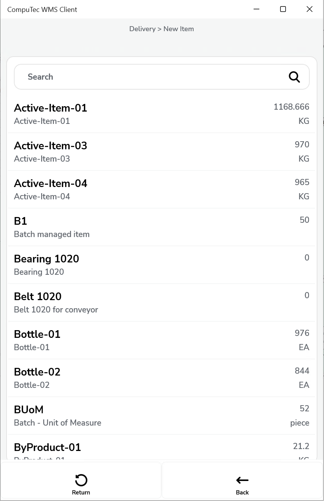 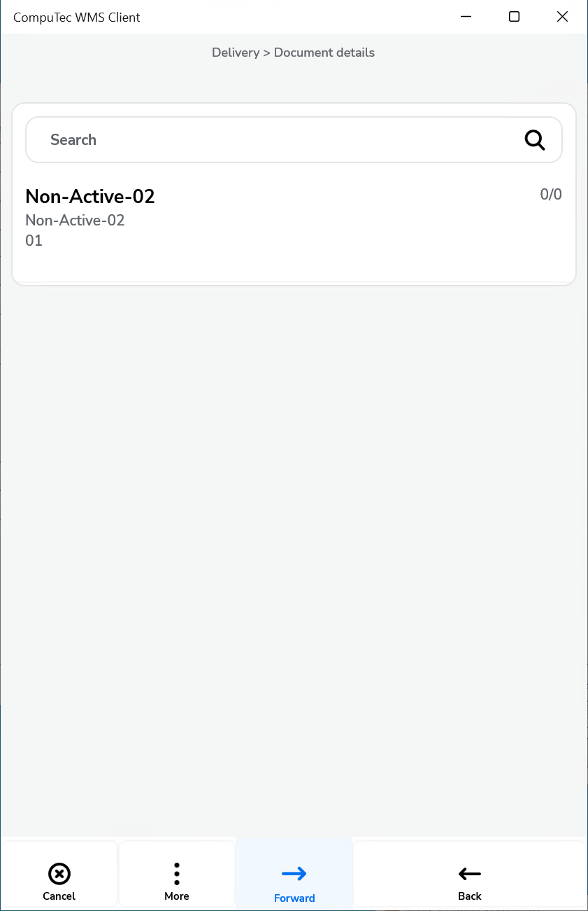 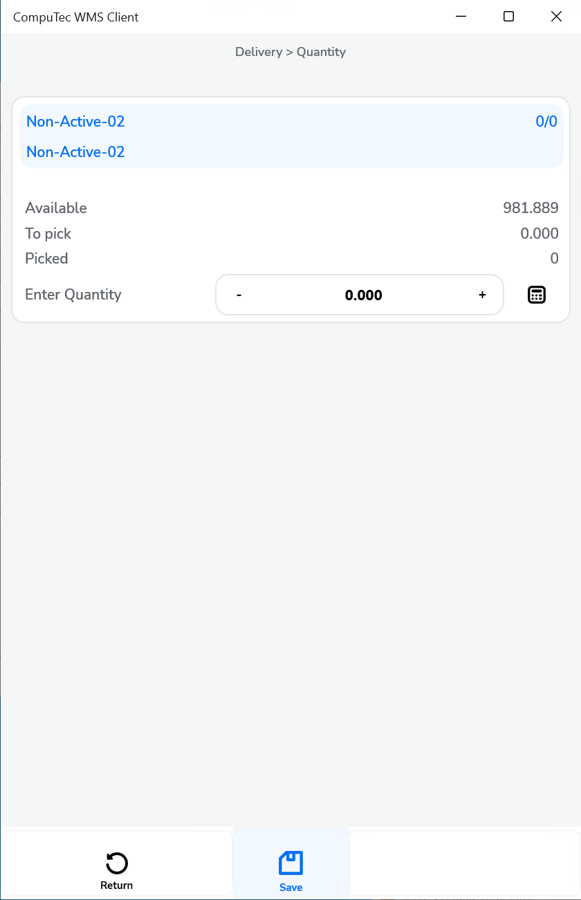 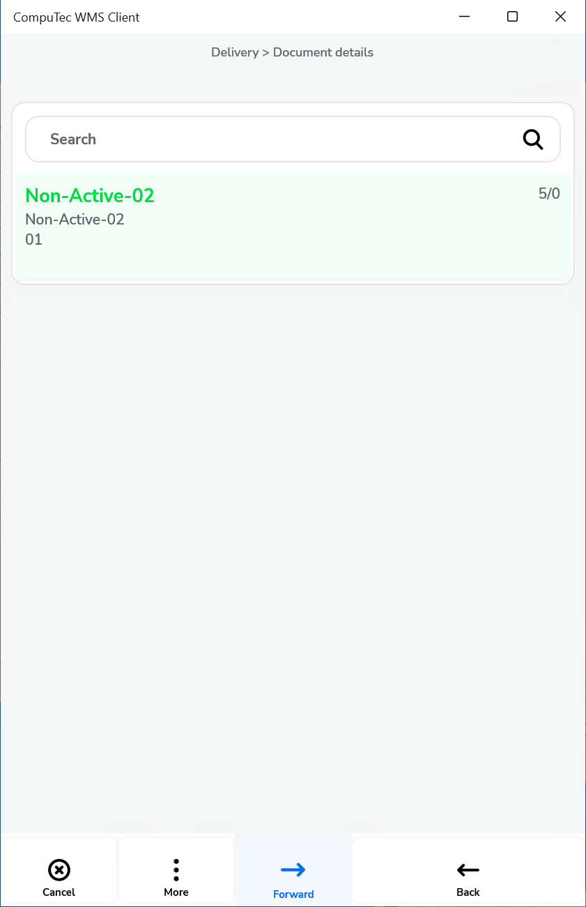 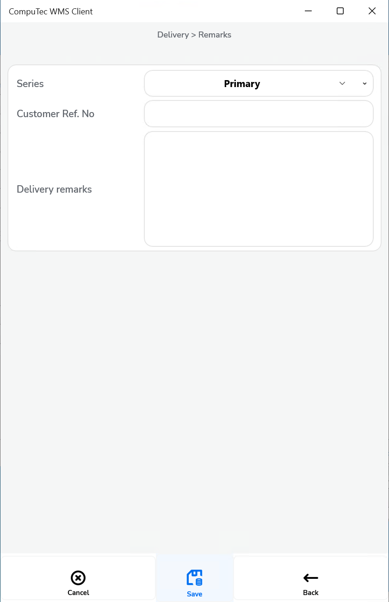
    

    

2. **Show Warehouse selection and a default Warehouse chosen** – It is required to choose a Warehouse during document creation or adding an Item

    

    
Click to check the effect on the workflow

    

    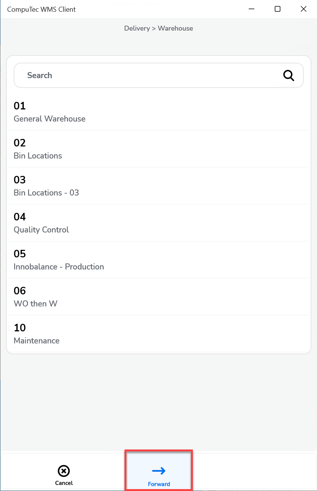       
    

    

3. **Do not show a Warehouse selection and no default Warehouse chosen** – It is required to choose a Warehouse on adding an Item.

    

    
Click to check the effect on the workflow

    

           
    

    

4. **Do not show a Warehouse and a default Warehouse chosen** – only Pick Lists for a Warehouse chosen in settings are displayed; a Warehouse is not chosen during creation of a Delivery document.

    

    
Click to check the effect on the workflow

    

           
    

    

## From Pick List

1. **Show Warehouse selection and no default Warehouse chosen** – user has to choose a Warehouse on creating a document or adding an Item.

    

    
Click to check the effect on the workflow

    

    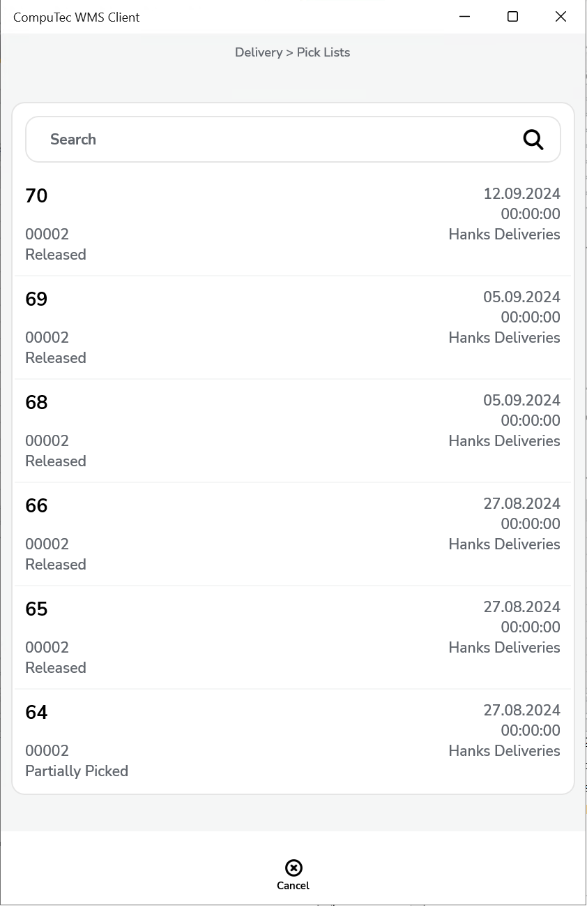 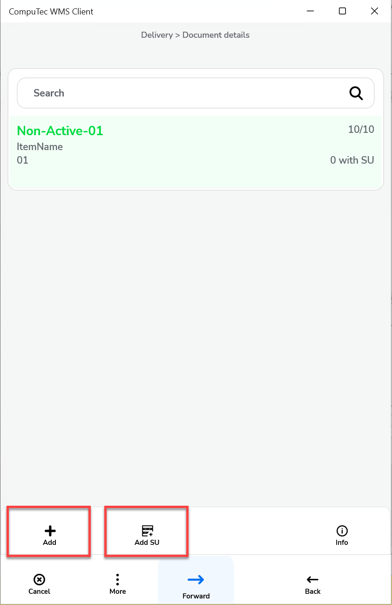   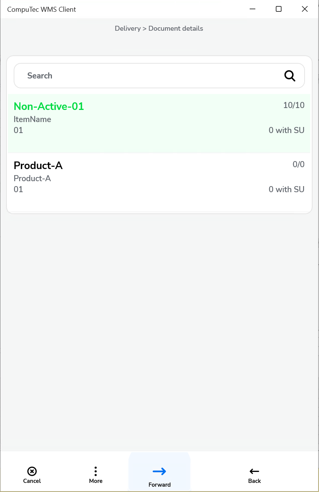  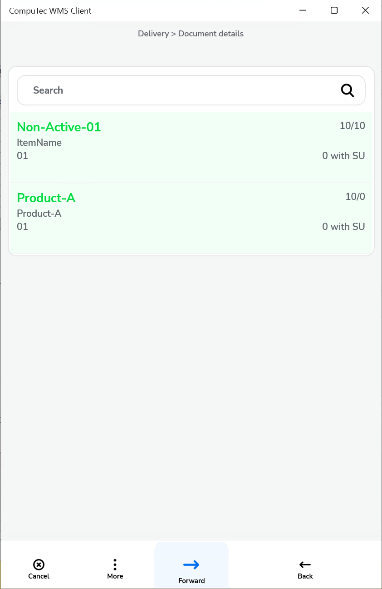 
    

    

2. **Show Warehouse selection and a default Warehouse chosen** – only Pick Lists for a Warehouse set up in settings are displayed; it is required to choose a Warehouse during document creation or adding an Item

    

    
Click to check the effect on the workflow

    

           
    

    

3. **Do not show a Warehouse selection and no default Warehouse chosen** – it is required to choose a Warehouse on adding an Item.

    

    
Click to check the effect on the workflow

    

           
    

    

4. **Do not show a Warehouse and a default Warehouse chosen** – only Pick Lists for a Warehouse chosen in settings are displayed; a Warehouse is not chosen during creation of a Delivery document.

    

    
Click to check the effect on the workflow

    

          
    

    

## From Sales Order

1. **Show Warehouse selection and no default Warehouse chosen** – it is required to choose a Warehouse during creation of a document or adding an Item.

    

    
Click to check the effect on the workflow

    

    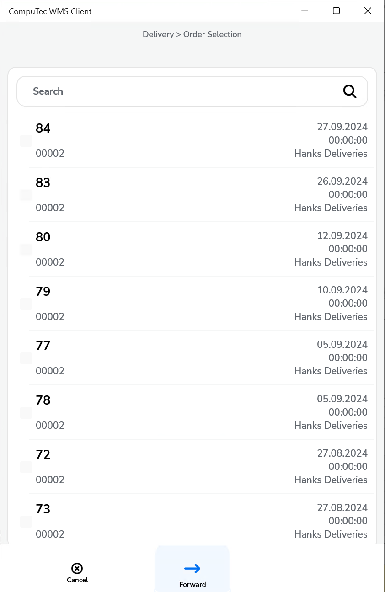       
    

    

2. **Show Warehouse selection and a default Warehouse chosen** – only documents for a Warehouse chosen in settings are displayed; it is required to choose a Warehouse on adding Items.

    

    
Click to check the effect on the workflow

    

           
    

    

3. **Do not show Warehouse selection and no default Warehouse chosen** – it is required to choose a Warehouse on adding Items.

    

    
Click to check the effect on the workflow

    

           
    

    

4. **Do not show Warehouse selection and a default Warehouse is chosen** – only documents for a Warehouse chosen in settings are displayed; during creation of Delivery document a Warehouse is not chosen at all.

    

    
Click to check the effect on the workflow

    

          
    

    

## From Draft Delivery

A Warehouse is already defined in a Draft document.

## From A/R Reserve Invoice

1. **Show Warehouse selection and no default Warehouse chosen** – it is required to choose a Warehouse on adding Items. Items that are not present in this Warehouse are highlighted red.

    

    
Click to check the effect on the workflow

    

    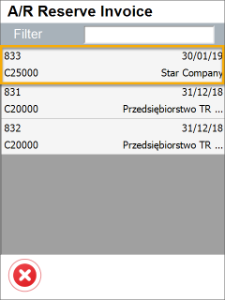 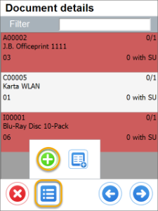   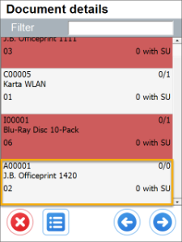 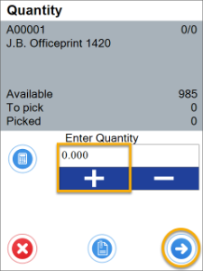 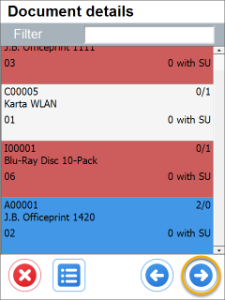
    

    

2. **Show Warehouse selection and a default Warehouse chosen** – only documents for a Warehouse chosen in settings are displayed, it is required to choose a Warehouse on adding Items.

    

    
Click to check the effect on the workflow

    

    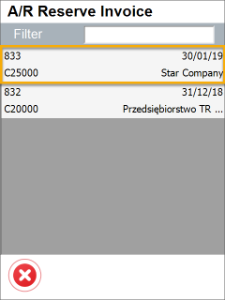      
    

    

3. **Do not show Warehouse selection and no default Warehouse chosen** – it is required to choose a Warehouse on adding Items.

    

    
Click to check the effect on the workflow

    

      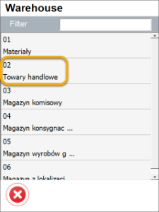     
    

    

4. **Show Warehouse selection and a default Warehouse chosen** – only documents for a Warehouse chosen in settings are displayed; during creation of Delivery document a Warehouse is not chosen at all.

    

    
Click to check the effect on the workflow

    

          
    

    

