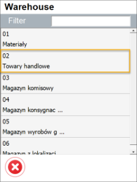
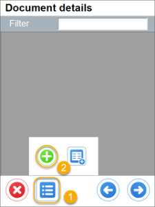
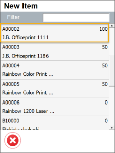
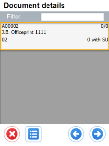
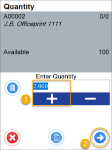
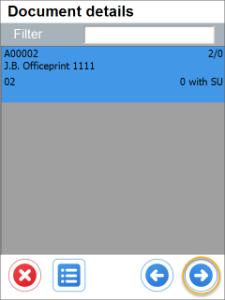
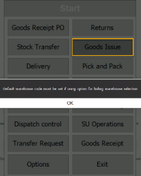
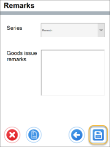

# Goods Issue Settings

1. **Show Warehouse Selection and no default Warehouse or Bin Location chosen** – it is required to choose a Warehouse on document creation of adding Items.

    

    
Click to check the effect on the workflow

    

          
    

    

2. **Show Warehouse Selection, default Warehouse and Bin Location are chosen** – if Warehouse selection step is skipped, user is not asked about it on adding Items (a default will be added).

    

    
Click to check the effect on the workflow

    

          
    

    

3. **Do not show Warehouse Selection and no default Warehouse or Bin Location chosen** – cannot open Goods Issue transaction

    

4. **Do not Show Warehouse Selection and default Warehouse or Bin Location are chosen** - on creation of Goods Receipt, user is not asked for a Warehouse at all.

    

    
Click to check the effect on the workflow

    

         
    

    

