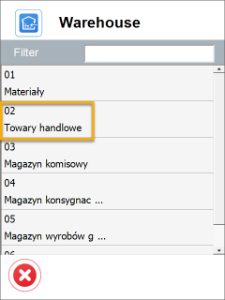
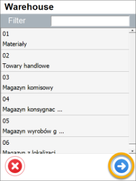
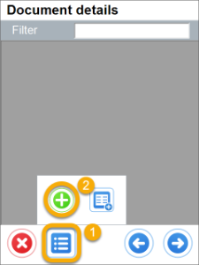
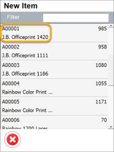
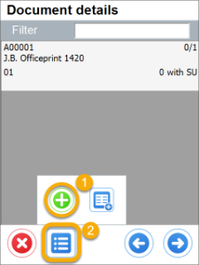
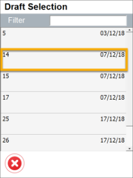
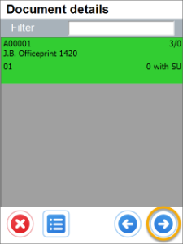

# Goods Receipt Settings

## New Goods Receipt

    1. **Show Warehouse Selection and no default Warehouse or Bin Location chosen** – it is required to choose a Warehouse on document creation or adding Items.

        

        
Click here to expand

        

              
        

        

 
    2. **Show Warehouse Selection, default Warehouse and Bin Location are chosen** – if Warehouse selection step is skipped, user is not asked about it on adding Items (a default will be added).

        

        
Click here to expand

        

             
        

        

    3. Do not show Warehouse Selection and no default Warehouse and Bin Location chosen – no Warehouse selection on creation of a document, but on adding an Item.

        

        
Click here to expand

        

             
        

        

    
    4. **Do not Show Warehouse Selection and default Warehouse or Warehouse and Bin Location are chosen** – no Warehouse selection step at all during creation of a document.

        

        
Click here to expand

        

            
        

        

## From Draft Goods Receipt

    1. Show Warehouse Selection and no default Warehouse or Bin Location chosen – it is required to choose a Warehouse on document creation or adding Items.

        

        
Click here to expand

        

             
        

        

    2.  **Show Warehouse Selection, default Warehouse and Bin Location are chosen** – if Warehouse selection step is skipped, user is not asked about it on adding Items (a default will be added).

        

        
Click here to expand

        

             
        

        

    3. Do not show Warehouse Selection and no default Warehouse and Bin Location chosen – no Warehouse selection on creation of a document, but on adding an Item.

        

        
Click here to expand

        

             
        

        

    4. Do not Show Warehouse Selection and default Warehouse or Warehouse and Bin Location are chosen - no Warehouse selection step at all during creation of a document.

        

        
Click here to expand

        

             
        

        

