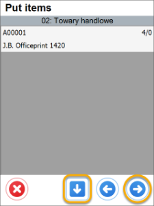
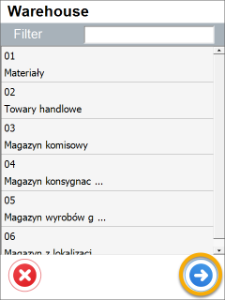
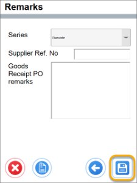
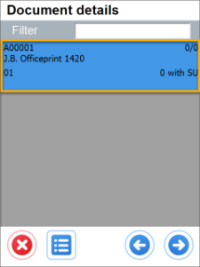
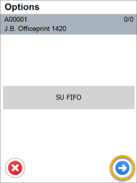
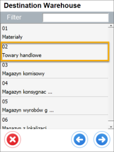
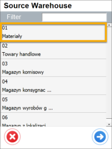

# Inventory Transfer Settings

## New Inventory Transfer

    1A. **Show a Source Warehouse selection and no default Warehouse set up** – it is required to choose a Warehouse on document creation or adding Items.

        

        
Click here to expand

        

                 
        

        

    1B. **Show a Destination Warehouse selection and no default Warehouse set up** – it is required to choose a Warehouse on document creation or adding Items.

        

        
Click here to expand

        

                 
        

        

    2A. **Show a Source Warehouse selection and a default Warehouse is chosen **– if a Source Warehouse selection is skipped, a default Warehouse is chosen.

        

        
Click here to expand

        

                 
        

        

    2B. **Show a Destination Warehouse selection and a default Warhouse or Bin location are chosen** – if a Destination Warehouse selection is skipped, a default Warehouse is chosen.

        

        
Click here to expand

        

                 
        

        

        
    3A. **Do not show a Source Warehouse selection and no default Warehouse and Bin location are chosen** – a Source Warehouse selection on adding an Item (not on adding a document).

        

        
Click here to expand

        

                 
        

        

    3B. **Do not show a Destination Warehouse selection and no default Warehouse and Bin location are chosen** – a Destination Warehouse selection on adding an Item (not on adding a document).

        

        
Click here to expand

        

                 
        

        

    4A. **Do not show a Source Warehouse selection and a default Source Warehouse chosen** – no Source Warehouse selection (a default one is chosen automatically).

        

        
Click here to expand

        

                
        

        

    4B. **Do not show a Destination Warehouse selection and a default Destination Warehouse chosen** – no Destination Warehouse selection (a default one is chosen automatically).

        

        
Click here to expand

        

                
        

        

    5. **Do not show a Warehouse selection and a default Warehouse is chosen (both Source and Destination)** – no Warehouse selection at all during creation of a document.

        

        
Click here to expand

        

               
        

        

## From Transfer Request

Both Source and Destination Warehouses are defined in a base document: Inventory Transfer Request.
