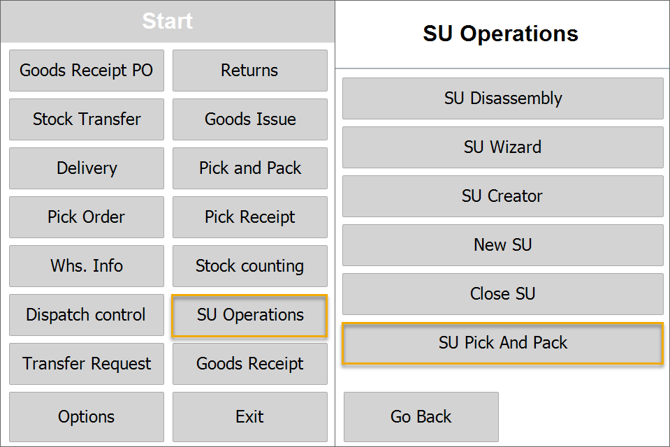
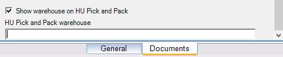
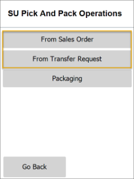
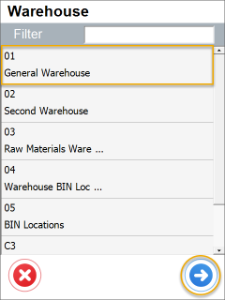
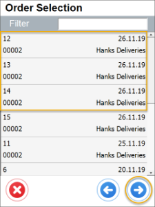
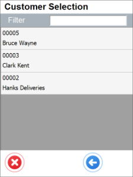

# SU Pick and Pack Settings

1. **Show Warehouse on SU Pick and Pack and no default SU Pick and Pack Warehouse is chosen**

    It is possible to choose or skip Warehouse selection during creation of SU Pick and Pack based on Sales Order or Transfer Request. If a Warehouse is not chosen, transactions for all Warehouse will be displayed.

        

        
Click here to expand

        

          
        

        

2. **Show Warehouse on SU Pick and Pack and default SU Pick and Pack Warehouse is chosen**

    If a different Warehouse is chosen in the first step, only transaction for this Warehouse will be displayed. If choosing a Warehouse step is skipped in the first step, only transactions for a Warehouse chosen in the settings are displayed.

        

        
Click here to expand

        

           
        

        

3. **Do not show Warehouse on SU Pick and Pack and no default SU Pick and Pack Warehouse is chosen**

    Choosing a transaction (From Sales Order or From Transfer Request) leads directly to Customer Selection from.

        

        
Click here to expand

        

          
        

        

4. **Do not show Warehouse selection on SU Pick and Pack and default SU Pick and Pack Warehouse is chosen**

    No Warehouse selection at all. A Warehouse is chosen automatically from the settings.

    

    
Click here to expand

    

      
    

    

