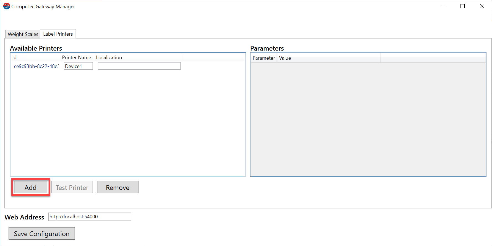
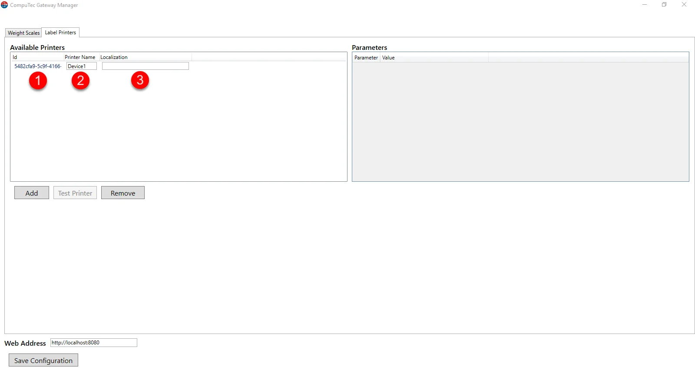

# Label Printers Configuration

This document provides a step-by-step guide on configuring the CompuTec WeightScale manager Label Printing tab.

---

:::warning
    For the program to work correctly, configure your firewall to make the 54001 port available.
:::

:::note
    .Net Framework 4.7 is required.
:::

1. The application is installed automatically during CompuTec Gateway Service installation.

2. Go to the WeightScale configuration manager installation folder and run the file "WeightScaleConfigurationManager."

    It is placed in an installation folder, which is by default in the following location: C:\Program Files (x86)\CompuTec\CompuTec Weight Service\.

    
3. Select the "Label Printers" tab.

    
4. Click "Add" to add a new Printer with a unique identifier.

    
5. Available Printers tab columns:

    - **Id** - Unique identifier of the scale (automatically generated)
    - **Printer name** - the name of the printer (e.g., manufacturer)
    - **Localization** - location of our device.

    
6. Now click on the printer identifier. As you can see, the setup window opened in the Parameters tab.

    
7. Expand the driver tab to select an available device. There are five possibilities (drivers) to connect the printers:

    

    1. BixolonDriver - We can set the Physical Name of the printer.

        
    2. CrystalDriver - We can set up the Physical Name of the printer and whether it should be saved as a PDF file.

        

    3. MockDriver - We can set a Physical Name and a Mock Parameter.

        
    4. PdfDriver - We can set up the Physical Name of the printer.

        
    5. ZebraDriver - We can set up the Physical Name and CodePage format.

        
8. Now, we can save the configuration and make a test of the printer. Remember to put the web address (We must put the IP address or Machine name where AppEngine was installed).

    
