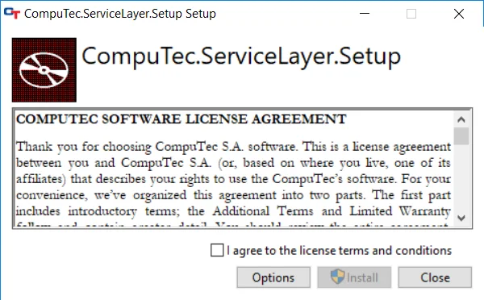
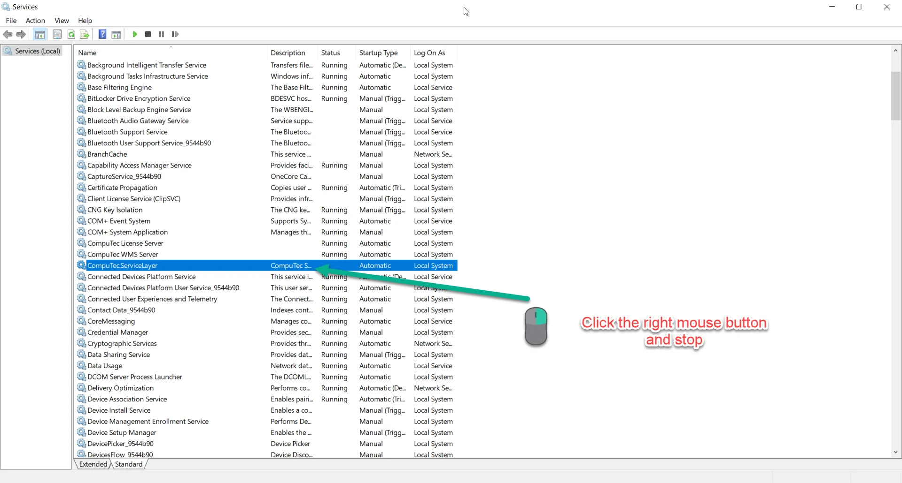

# Service Layer Installation

This document provides a step by step guide on how to install CompuTec Service Layer client.

:::warning
Important! For the program to work properly, configure your firewall to make the 8080 port available
:::

:::caution
Net Framework 4.7 is required.
:::

---

## Installation

1. To install Computec Service Layer client download and run its installation file - you can find it here
2. In the window that appears click the "I agree to the license...." button after reading the message about installation preparation:

    

3. Click the "Install" button to start the installation. A default path is "C:\Program Files\CompuTec\CompuTec Service Layer\

    

4. Click the “Close” button after reading the message to finish installation:

    

5. After the installation is completed, go to system services and find a service called "CompuTec.ServiceLayer" if it is enabled then turn it off.

    

6. Then go the CompuTec Service Layer installation folder and copy the "Plugins" directory -  that you can find it here

    

7. Next you can turn on service called "CompuTec.ServiceLayer"  
Service is ready to run. You can start it by clicking the shortcut created in the Windows program list.
