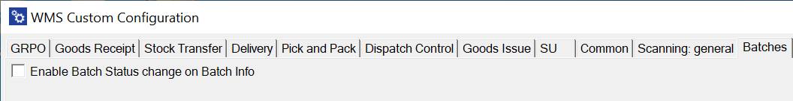
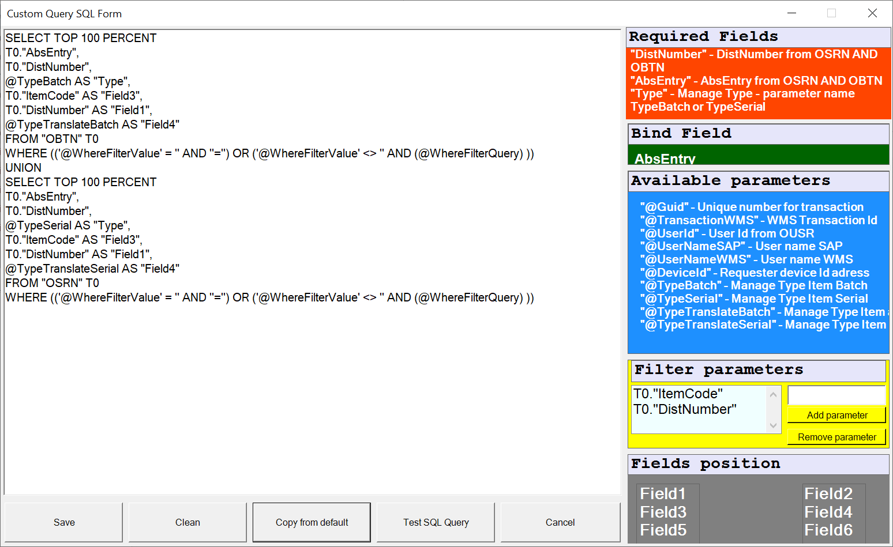

# Batches

**Enable Batch Status change on Batch Info** – checking this option adds the Status field (with a drop-down list) to the Batch Details / UDF form on the Batch/Serial Info workflow. Unchecking the option removes the field and prevents changing the Batch status from the application. **This option is available only for a database with ProcessForce installed**.
    

    
Click here to find out more

    

        
    

    

## Changes

Old Batches tab:
    

New Batches form view: BatchSerial info: Show additional fields for batches and Extra field in Batch/Serial Info query options were removed:
    

To be able to use the removed option it is required to created related SQL queries in Custom Query Manager: Manager tab > Enable Custom Query Manager > [choose required transaction]:
    

**Batch Serial Info: Show additional fields for batches equivalent**

Choose an option to be changed:
    

Put in required changes and save the document:
    

The default query has three fields. In this example another three are added (SysNumber, Batch type and SAP user login). The left screenshot shows the window before the changes, the right one - the window after adding two fields.
     

The query for the window on the left:
    

The query for the window on the right:
    

**Extra field in Batch/Serial Info query equivalent**

Open Custom Query Manager, choose Batch/Serial Info from the list.

Otwieramy Custom Query Manager, wybieramy z listy Batch/Serial Info. In this example we operate on the following two fields:
    1. BatchInfoDetailsList
    2. SerialInfoDetailsList

    

    1. BatchInfoDetailsList

    There are no additional fields here, but we can add columns that are going to be find based on a specific query put in SQL Manager:
        
        

    2. SerialInfoDetailsList

    The same situation as in the example above, but this time choose columns from OSRN table:
        
