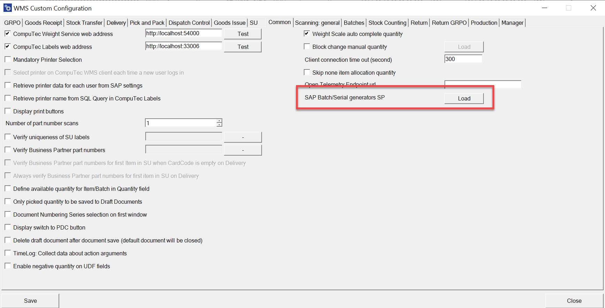
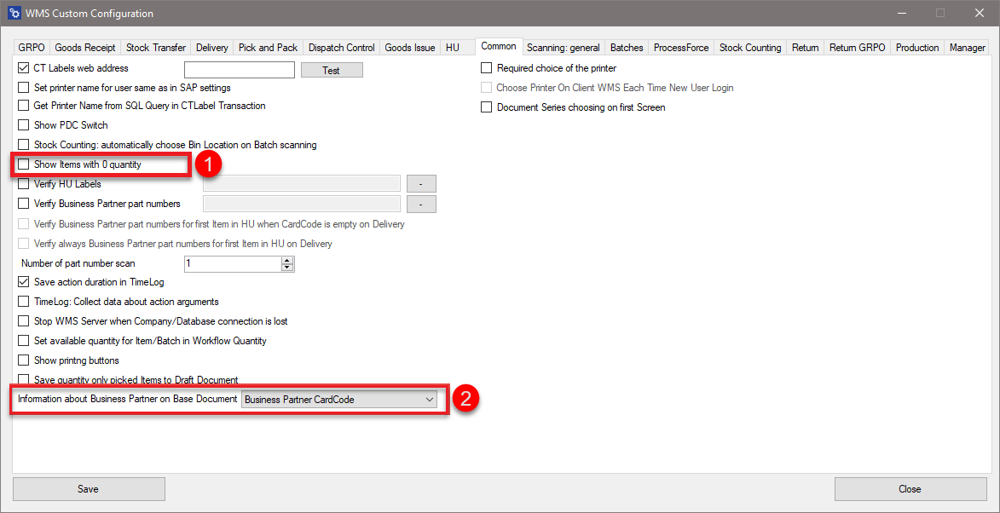
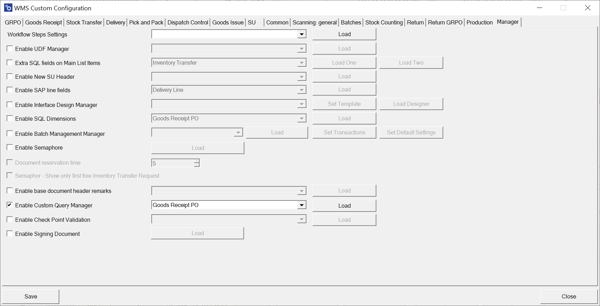
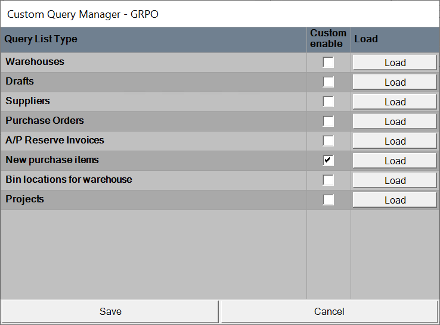
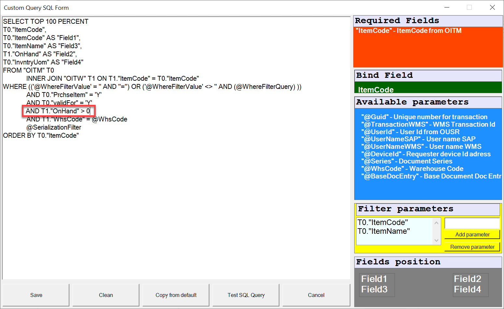
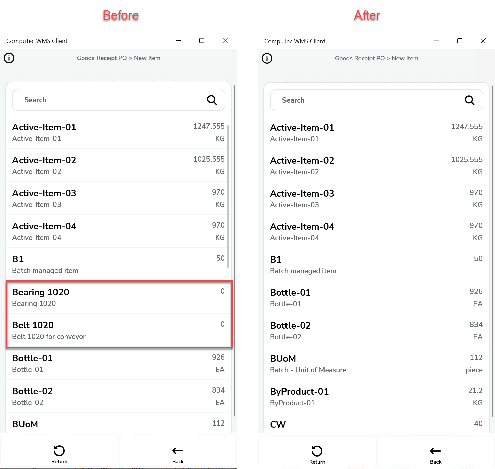
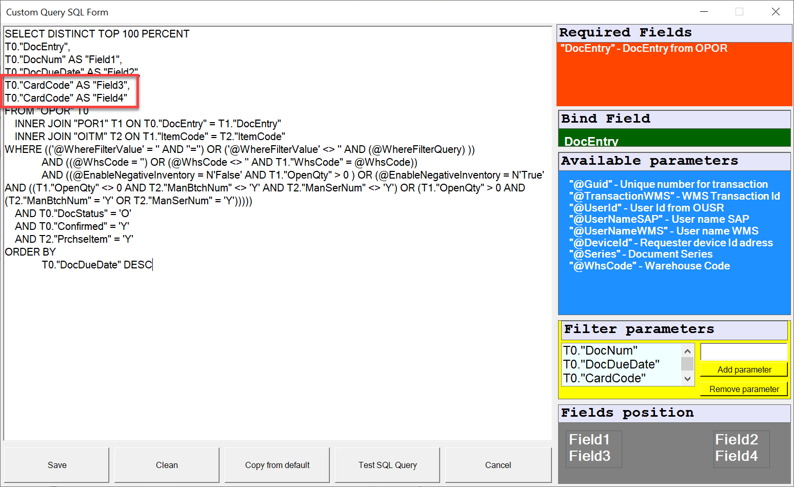

# Common

This guide provides an overview of the available settings in the Common tab, explaining their functionality and how they can be leveraged to streamline operations.

---

**CompuTec Weight Service web address** – This option enables CompuTec Weight integration. After enabling the checkbox, enter the CompuTec Weight web address (found in General options in CompuTec Weight). Test the connection using the "Test" button.

**CompuTec Labels web address** – This option activates CompuTec Labels integration. Use the "Test" button to verify the connection. After enabling the checkbox, enter the CompuTec Labels web address (found in the CompuTec WMS Client options).

**Mandatory printer selection** – Checking this option prevents opening any CompuTec WMS transaction without previously choosing a printer in the client settings.

**Select printer on CompuTec WMS client each time a new user logs in** – Each user is required to select a printer in the CompuTec WMS options upon logging into the WMS client.

**Retrieve printer data for each user from SAP settings** – This option is related to CompuTec Labels and is available only when the 'CT Labels web address' option is enabled. By default, printers can be selected from the options provided in the CompuTec WMS client. However, if this checkbox is selected, printer information will be retrieved from SAP Business One settings.

**Retrieve printer name from SQL Query in CompuTec Labels** – the name of a printer is taken from SQL query set up in CompuTec Labels settings instead of taking it from SAP Business One or CompuTec WMS

**Display printing buttons** – Shows label printing buttons for specific functions.

**Number of part number scan** – Defines the number of times a Business Partner part number must be verified during a transaction.

**Verify uniqueness SU Labels** – Verifies whether an SU number already exists in the system, ensuring that each SU number for a specific delivery is unique.

**Verify Business Partner part numbers** – Verifies Business Partner delivery documents by comparing the base document’s Business Partner to the one scanned or added during the delivery transaction. Clicking a button next to this option leads to a list of Business Partners that can be selected.

**Verify Business Partner part numbers for the first Item in SU when CardCode is empty on Delivery** – this option is related to the one above. It defines an additional Business Partner part number verification for the first position in an SU.

**Always verify Business Partner part numbers for the first Item in SU on Delivery** – It defines an additional Business Partner part number verification for the first position in an SU.

**Define available quantity for Item/Batch in Quantity field** – Automatically populates the Quantity field with the available quantity of a specific item or batch when checked.

**Only picked quantity to be saved to Draft Documents** – Ensures only the picked quantity is saved in document draft.

**Document Numbering Series selection on the first window** – Allows document series selection on the first screen of a transaction.

**Display switch to PDC button** – Displays a button to switch to the PDC module.

**Delete draft document after document save (default document will be closed)** – This options causes deleting the draft document once the final document is saved.

**TimeLog: Collect data about action arguments** – Logs detailed information by saving the full object sent to the server. It is an extension of the TimeLog option: Increases log file size with this option turned on, but it provides richer data for analysis.

**Enable negative quantity on UDF fields** –  Allows users to enter negative quantities in the UDF fields

**Weight Scale auto-complete quantity** – Automatically fills quantity fields with weight scale measurements upon saving.

**Block change manual quantity** – Defines the inactivity period (in seconds) after which users are logged out.

**Client connection time out (second)** – time of inactivity after which a user is logged off

**Skip none item allocation quantity** – when the checkbox is checked, quantity of Items managed by neither Batch nor Serial Numbers is not detracted by the already allocated (e.g., on Pick Lists) quantity. To work correctly on, the option required related options to be checked for needed transactions (Delivery – skip SAP Allocation Quantity, Stock Transfer – skip SAP Allocation Quantity).

**Open Telemetry Endpoint URL** – Specifies an address for sending diagnostic data from the Android application.

**SAP Batch/Serial generators SP** - Enables administrators to define templates for batches or serials directly in the database without using CompuTec ProcessForce.

    

## Changes

The old Common tab:

    

Show Items with 0 quantity and Information about Business Partner on Base Document options have been removed.

The option can be realized by a specific query in Query Manager.

    

    

**Show Items with 0 quantity on Base Document option**

By default the application displays Items with zero quantity. Adding the following line to a query **AND T1."OnHand" > 0**  results in displaying Items with quantity greater than 0. The following example shows Delivery transaction.

    

On the left you can see a list before adding the mentioned line. The right screenshot show the same list after adding the line:

    

**Information about Business Partner on Base Document option**

Details about the Business Partner are already included in the default query using the `CardCode` and `CardName` fields, which provide the BP's code and name respectively.

The following example illustrates a query for Goods Receipt PO transaction:

    

---
By understanding and configuring these options, businesses can improve accuracy, automate processes, and achieve seamless integration across platforms. For any advanced requirements, the use of Query Manager ensures that unique operational challenges can be met with precision and efficiency.
