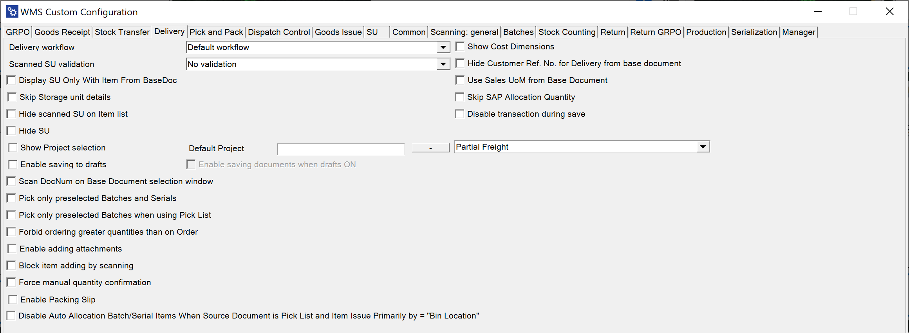

# Delivery

The Delivery Workflow in SAP Business One allows businesses to streamline the order fulfillment process by offering various options.

---



1. **Delivery workflow** - Allows you to choose one of three workflows for Pick Lists:Default Workflow, Customer-Date Workflow, and Date-Customer Workflow.

    <details>
    <summary>Click here to expand</summary>
    <div>
    1. Default Workflow

        

    2. Customer-Date Workflow

         

    3. Date-Customer Workflow

         
    </div>
    </details>

2. **Scanned SU validation** – There are three options available: 'Match selected Warehouse,' 'Match any base document, Line,' and 'No validation.'

    When the "Match selected warehouse" option is chosen, it will prevent the addition of Storage Units (SUs) from a different warehouse than the one specified in the document. For instance, if a new Delivery document is created and a warehouse is selected, only SUs from that warehouse will be allowed.

    However, when a Delivery document is generated from a base document, such as a Sales Order, there is no warehouse selection, meaning this option will not have any effect in that case.

3. **Show Project selection** – Choosing this option causes displaying a window with Project selection before proceeding to the Remarks window during the transaction.

4. **Default project** – Select a project to be automatically assigned to the document.

5. **Enable saving to drafts** – Enable the ability to save transactions as draft documents before finalizing.

    

6. **Enable saving documents when drafts ON** – Selecting this option allows the transaction to be saved as either a document or a draft document.

    

7. **Scan DocNum on Base Document select workflow** – When enabled, this option allows scanning the DocNum on the Base Document selection form (instead of using DocEntry).

8. **Pick only preselected Batches and Serials** – This option restricts the selection of Batches and Serial Number items to those preselected in the Delivery transaction. Preselection only applies to Pick Lists, so users can select these items only when creating a Delivery document from a Pick List (or from a Sales Order where Batches/Serial numbers are assigned).

9. **Pick only preselected Batches when using Pick List** – When checked, only the Batches and Serial Numbers preselected for the Pick List will be displayed.

10. **Copy the packed Items from the Pick List** – This option copies the packed items directly from the Pick List.

11. **Forbid ordering greater quantities than on Order** – Enabling this option prevents issuing a quantity that exceeds the amount specified in the base document.

    

12. **Hide scanned SU on Item list** – By default, scanning a Storage Unit (SU) adds its quantity to the respective item line and includes the SU as a separate line in the list. When this option is checked, the item quantities are added to the corresponding item lines, but the SU itself is not added as a separate line.

13. **Block item adding with scanning** – This option prevents adding an item by scanning its barcode, allowing only manual picking of the item.

14. **Force manual quantity confirmation** – When enabled, this option requires users to manually confirm the quantity entered, as barcode scanning will not automatically confirm the quantity.

15. **Enable scanning and adding Items from distinct Warehouses** – This setting defines whether items for a single Delivery document can be picked from multiple warehouses.

16. **Stay on Existing SU List after picking/scanning a SU** – When unchecked, scanning an SU barcode in the List of SUs screen will navigate to the Document Details screen, highlighting the scanned SU. If checked, scanning remains on the List of SUs screen.

17. **New Delivery: Customer-Warehouse workflow** – Enabling this option requires the user to first select the Customer, which then leads to the Warehouse selection form (instead of the default Warehouse-Customer workflow). With this setting, scanning a Serial or Batch number during the Warehouse selection will trigger a "Fast Scan," automatically selecting the warehouse, item, and serial/batch with the quantity, adding it to the document.

18. **Show Cost Dimensions** – This option adds a button next to the "Back" button on the Quantity form, leading to the Cost Dimensions form.

19. **Hide Customer Ref. No. for Delivery from the base document** – Checking this option hides the Customer Ref. No. field in the Remarks form when creating a Delivery document from a base document. If multiple base documents are used, the first non-empty Customer Ref. No. is used.

20. **Use Sales UoM from Base Document** – When enabled, this option displays quantities using the Unit of Measure from the Base Document, while still operating on the actual quantities. Document drafts cannot be saved when this option is activated. Click [this link](../../../user-guide/managing-uom-in-computec-wms.md) to find out more.

21. **Display SU Only With Item From Base Document** – self-explanatory

22. **Skip SAP Allocation Quantity** – allows disabling SAP Business One Batch/Serial Numbers allocation (if needed for some custom changes). The Delivery works within a Warehouse with Bin locations for allocated Batches and Serial Numbers Items.

23. **Freight (Sales Order field) cost options**:

    - **Partial** - This is the default option for CompuTec WMS and SAP Business One when created from a Pick List.
    - **Full freight for first Delivery only** - The total freight cost is applied only to the first Delivery, with no freight cost assigned to subsequent Deliveries (this follows SAP Business One's behavior when creating a Delivery from a Sales Order).
    - **Always charge full freight** - The total freight cost from the base document is applied to all Deliveries.

24. **Disable Auto Allocation Batch/Serial Items When Source Document is Pick List and Item Issue Primarily by = "Bin Location"** – When enabled, automatic batch and serial number allocation is disabled in the Delivery transaction created from a Pick List, if the item’s ``Issue Primarily By`` setting is configured as **Bin Location**. In this case, the user must manually select the required batch or serial numbers during the Delivery process.

## Changes

Old View of the Delivery tab:

    

The following checkboxes have been removed from the Delivery tab:
    - Show document drafts
    - Extra field in Order query
    - Sales Orders sorting order
    - Issue only Batches from MOR for selected BPs
    - Show only Pick Lists with Picked status.

To access the previously available options, you now need to create a custom SQL query using the Custom Query Manager.

    

Below is an overview of how to replace the removed functions (refer to the numbered points in the screenshots):

    

    

**Example for Show document drafts option (1)**

Changing T0."CardName" AS "Field4" line to T0."DocStatus" AS "Field4" (instead of customer name there will be a document status - if it is open or closed).

    

    

**Examples for Sales Orders sorting order and Extra field in Orders query options (2, 3)**

It is possible to use the option in four ways:

    | Previous sorting order options | Related commands |
    | --- | --- |
    | creationdate ascending | `"DocDate" ASC` |
    | creationdate descending | `"DocDate" DESC` |
    | duodate ascending | `"DocDuoDate" ASC` |
    | duodate descending | `"DocDuoDate" DESC` |

To adjust the sorting order, modifications are needed in the ORDER BY line. In the example below, the sorting was changed from creation date to document number (changing T0."DocDueDate" to T0."DocNum"). You can view the previous state and the outcome of this change here:

    

**Example for Issue only Batches from MOR for selected BPs option (4)**

In this case, lines need to be added in two specific locations (highlighted in the screenshot below):

A line must be included to ensure the filter functions correctly:

    ```
    AND (((@BaseDocEntry <= 0 AND @BaseDocLineNum < 0) AND ''='') OR ((@BaseDocEntry > 0  AND @BaseDocLineNum >= 0) AND (T0."U_MnfDocEntry" = (SELECT "U_DocEntry" FROM RDR1 WHERE "DocEntry" = @BaseDocEntry and "LineNum" = @BaseDocLineNum))))
    ```


**Example usage scenario**

1. Create a Sales Order.
2. Create a related Manufacturing Order.
3. Change the status of Manufacturing Order to Released.
4. Go to CompuTec WMS, choose Pick Receipt > New Production Receipt and choose the Manufacturing Order.
5. Generate a Batch and save progress, by this creating a Batch for the Manufacturing Order.

Here you can check the process on screenshots:

    
    
    
    
    

Going to Delivery > From Sales Order, choosing the required document number (757 in this case). In Item details we add Batches assigned to the Manufacturing Order:

    

The only Batches available are the ones that were generated on receiving from Manufacturing Order.

**Example for Show only Pick Lists with Picked status option (5)**

In the default query it is required to find this line: `T0."Status" <> 'C'  and change it to T0."Status" = 'Y'`

The following screenshots illustrate an example query, the necessary changes, and the resulting output in CompuTec WMS:

    

`T0."Status" <> 'C' changed to T0."Status" = 'Y'`

    

The result:


This checkbox has been removed because the option to choose document drafts is now integrated directly into the application interface.

---
In summary, this guide outlines essential changes and customization options in the Delivery Tab of CompuTec WMS. users can achieve greater control and efficiency, ensuring a smooth transition to the updated system functionality.
