# Delivery

The **Delivery** settings allow you to configure how the **Delivery** transaction behaves in **CompuTec WMS**. You can customize document creation workflows, scanning behavior, batch and serial number handling, Storage Unit processing, document dates, and other transaction options.

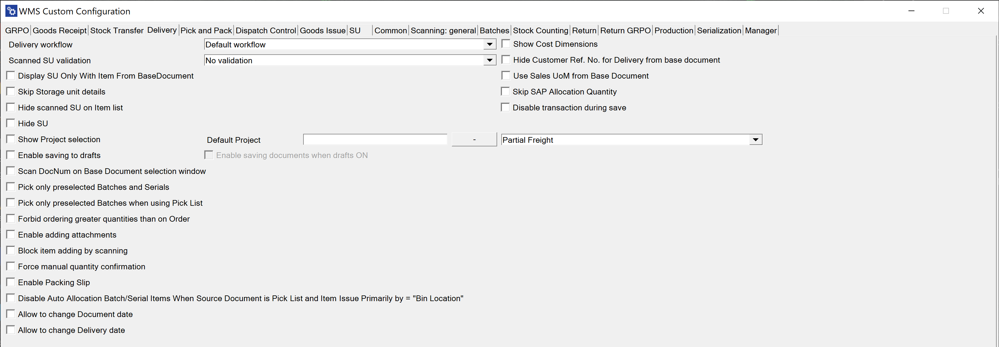

## Available settings

The following sections describe each available setting and its effect on the **Delivery** process.

1. **Delivery workflow**: Select the workflow used when creating **Delivery** documents from **Pick Lists**.

    <details>
    <summary> Available options</summary>
    <div>
    - **Default Workflow**

        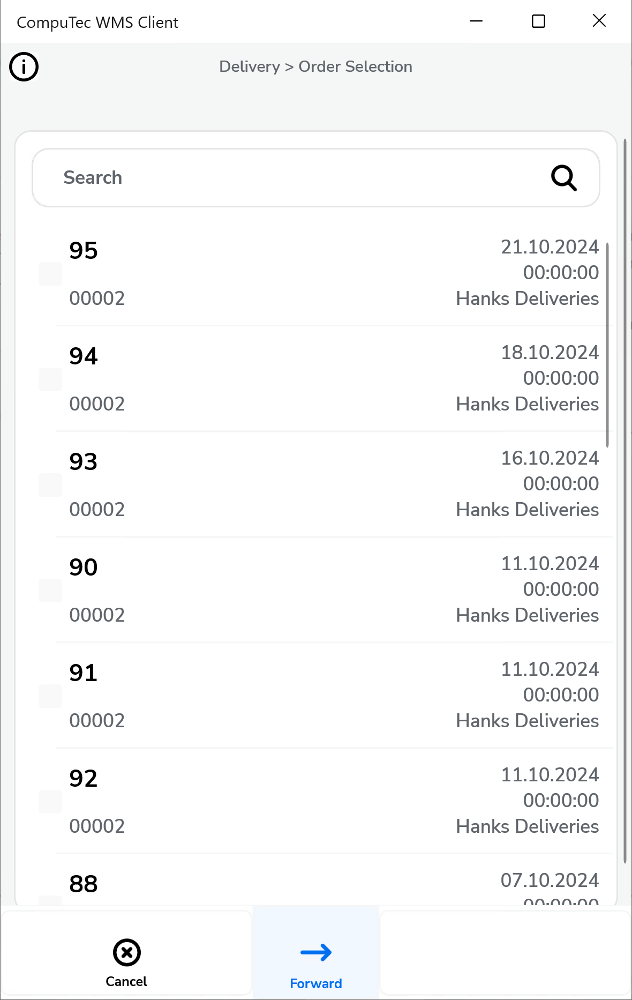

    - **Customer-Date Workflow**

        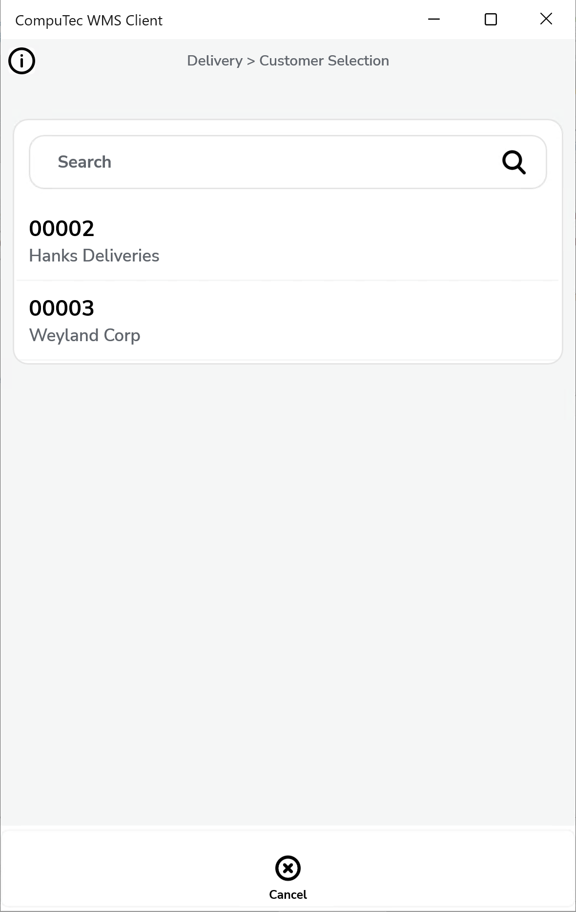 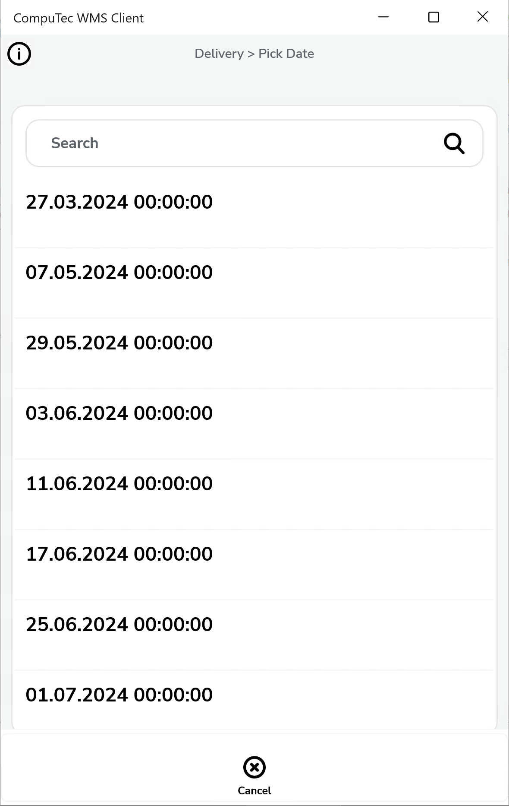

    - **Date-Customer Workflow**

         
    </div>
    </details>

2. **Scanned SU validation**: Controls how scanned **Storage Units** (**SUs**) are validated.

     <details>
    <summary> Available options</summary>
    <div>
    - **Match selected Warehouse** – Only Storage Units from the selected warehouse can be scanned.
    - **Match any base document Line** – Allows scanning only Storage Units that belong to the base document.
    - **No validation** – No validation is performed.

    :::info[Note]
    When creating a **Delivery** from a base document (for example, a **Sales Order**), the warehouse is inherited from the base document. In this case, the **Match** selected **Warehouse** option has no effect.
    :::
     </div>
    </details>

3. **Display SU Only With Item From Base Document**: Displays only **Storage Units** that contain items included in the selected base document.

4. **Skip Storage unit details**: Skips the **Storage Unit Details** screen after scanning a **Storage Unit** and proceeds directly to the next step.

5. **Hide scanned SU on Item list**: By default, scanning a **Storage Unit** adds both the item quantity and a separate **Storage Unit** line to the item list. When enabled, only the item quantity is updated and the **Storage Unit** line is hidden.

6. **Hide SU**: Hides **Storage Unit** information in the **Delivery** transaction.

7. **Show Project selection**: Displays the **Project Selection** window before the **Remarks** window.

8. **Default Project**: Selects the project automatically assigned to newly created **Delivery** documents.

9. **Enable saving to drafts**: Allows users to save **Delivery** transactions as draft documents.

    

10. **Enable saving documents when drafts ON**: When drafts are enabled, allows users to choose whether to save the transaction as a draft or as a final document.

    

11. **Scan DocNum on Base Document selection window**: Allows scanning the document number (**DocNum**) on the **Base Document** selection window instead of scanning the internal document entry (**DocEntry**).

12. **Pick only preselected Batches and Serials**: Restricts batch and serial number selection to values already assigned in the source document. This option applies only when creating a **Delivery from a Pick List** or from a **Sales Order** with preassigned batches or serial numbers.

13. **Pick only preselected Batches when using Pick List**: Displays only batches preselected in the **Pick List**.

14. **Forbid ordering greater quantities than on Order**: Prevents issuing a quantity greater than the quantity defined in the base document.

    

15. **Enable adding attachments**: Allows users to attach files to **Delivery** documents.

16. **Block item adding by scanning**: Prevents adding new item lines by scanning item barcodes. Items must be selected manually.

17. **Force manual quantity confirmation**: Requires users to manually confirm the entered quantity. Scanning a barcode does not automatically confirm the quantity.

18. **Enable Packing Slip**: Enables **Packing Slip** support for **Delivery** documents.

19. **Disable Auto Allocation Batch/Serial Items When Source Document is Pick List and Item Issue Primarily by = "Bin Location"**: Disables automatic batch and serial number allocation when the source document is a **Pick List**, and the item is configured with ``Issue Primarily By = Bin Location``. Users must manually select the required batches or serial numbers during Delivery creation.

20. **Allow to change Document date**: Allows users to modify the **Document Date** before saving the Delivery document. When disabled, the **Document Date** cannot be changed in the **Delivery** transaction.

21. **Allow to change Delivery date**: Allows users to modify the **Delivery Date** before saving the **Delivery** document. When disabled, the **Delivery Dat**e cannot be changed in the **Delivery** transaction.

22. **Show Cost Dimensions**: Displays a **Cost Dimensions** button on the **Quantity** screen, allowing users to assign cost dimensions during the transaction.

23. **Hide Customer Ref. No. for Delivery from base document**: Hides the **Customer Ref. No. field** on the **Remarks** screen when creating a **Delivery** from a base document. If multiple base documents are used, the first available **Customer Reference Number** is still copied to the document.

24. **Use Sales UoM from Base Document**: Displays quantities using the **Sales Unit of Measure** defined in the base document while processing actual inventory quantities.

    :::info[Note]
    Saving **Delivery** drafts is not supported when this option is enabled.
    :::

25. **Skip SAP Allocation Quantity**: Disables **SAP Business One** automatic **Batch and Serial Number** allocation. This option is intended for custom allocation scenarios.

26. **Disable transaction during save**: Locks the transaction while it is being saved to prevent additional user actions until the save process is complete.

27. **Freight cost handling**: Defines how freight costs are copied from the base document.

    <details>
    <summary> Available options</summary>
    <div>
    - **Partial Freight** – Copies freight proportionally. This is the default behavior.
    - **Full freight for first Delivery only** – Applies the full freight amount only to the first Delivery.
    - **Always charge full freight** – Applies the full freight amount to every Delivery created from the base document.
    </div>
    </details>

## Legacy configuration (version 1.00)

:::info[Note]

The information below applies only to customers migrating from **CompuTec WMS 1.00**.

Starting with **version 2.00**, the **Delivery** configuration was redesigned. Most options from version 1.00 were removed and can now be implemented using the **Custom Query Manager**.

Expand the section below to see how to recreate the previous functionality.
:::

<details>
<summary>Show migration examples</summary>

Old View of the Delivery tab:

    

The following checkboxes have been removed from the Delivery tab:
    - Show document drafts
    - Extra field in Order query
    - Sales Orders sorting order
    - Issue only Batches from MOR for selected BPs
    - Show only Pick Lists with Picked status.

To access the previously available options, you now need to create a custom SQL query using the Custom Query Manager.

    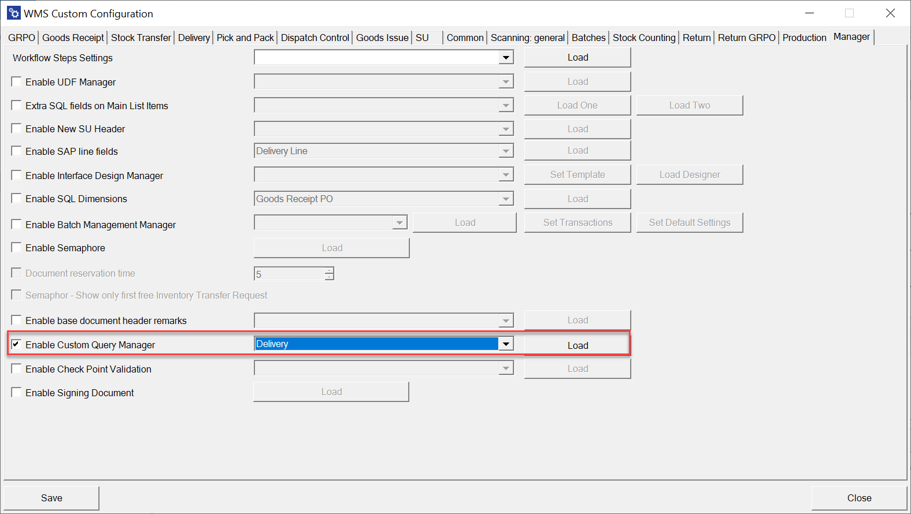

Below is an overview of how to replace the removed functions (refer to the numbered points in the screenshots):

    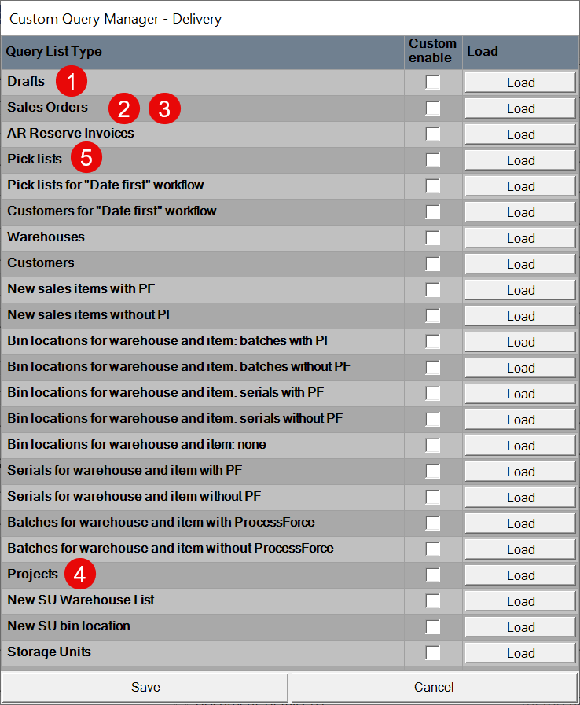

    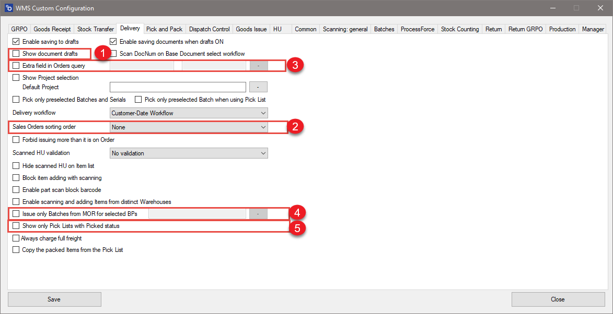

**Example for Show document drafts option (1)**

Changing T0."CardName" AS "Field4" line to T0."DocStatus" AS "Field4" (instead of customer name there will be a document status - if it is open or closed).

    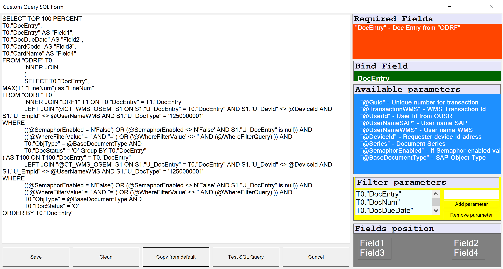

    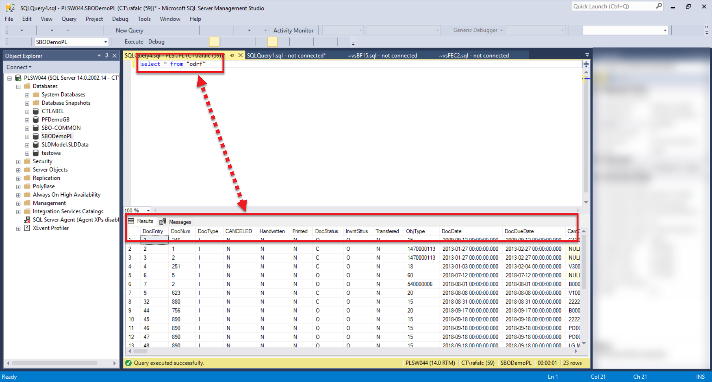

**Examples for Sales Orders sorting order and Extra field in Orders query options (2, 3)**

It is possible to use the option in four ways:

    | Previous sorting order options | Related commands |
    | --- | --- |
    | creationdate ascending | `"DocDate" ASC` |
    | creationdate descending | `"DocDate" DESC` |
    | duodate ascending | `"DocDuoDate" ASC` |
    | duodate descending | `"DocDuoDate" DESC` |

To adjust the sorting order, modifications are needed in the ORDER BY line. In the example below, the sorting was changed from creation date to document number (changing T0."DocDueDate" to T0."DocNum"). You can view the previous state and the outcome of this change here:

    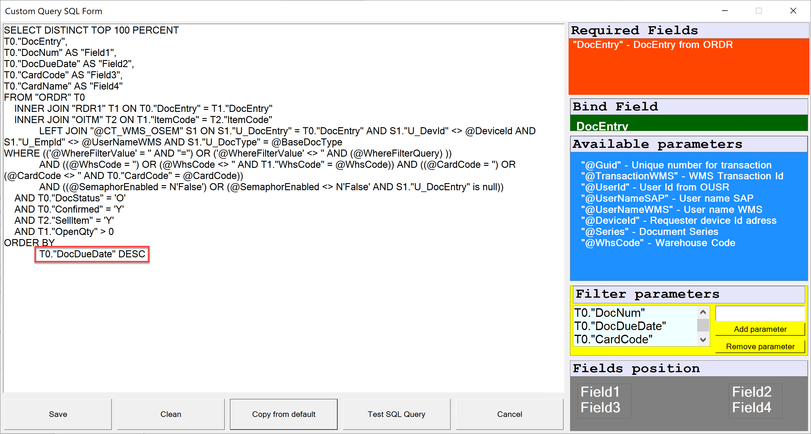

**Example for Issue only Batches from MOR for selected BPs option (4)**

In this case, lines need to be added in two specific locations (highlighted in the screenshot below):

A line must be included to ensure the filter functions correctly:

    ```
    AND (((@BaseDocEntry <= 0 AND @BaseDocLineNum < 0) AND ''='') OR ((@BaseDocEntry > 0  AND @BaseDocLineNum >= 0) AND (T0."U_MnfDocEntry" = (SELECT "U_DocEntry" FROM RDR1 WHERE "DocEntry" = @BaseDocEntry and "LineNum" = @BaseDocLineNum))))
    ```


**Example usage scenario**

1. Create a Sales Order.
2. Create a related Manufacturing Order.
3. Change the status of Manufacturing Order to Released.
4. Go to CompuTec WMS, choose Pick Receipt > New Production Receipt and choose the Manufacturing Order.
5. Generate a Batch and save progress, by this creating a Batch for the Manufacturing Order.

Here you can check the process on screenshots:

    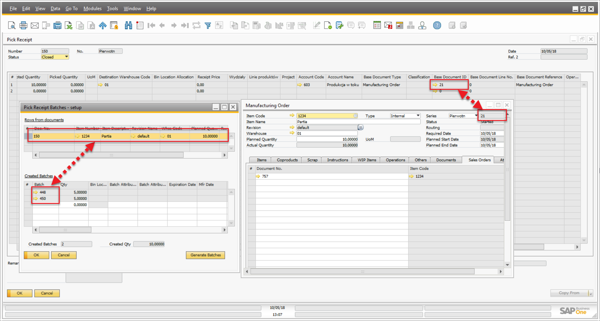
    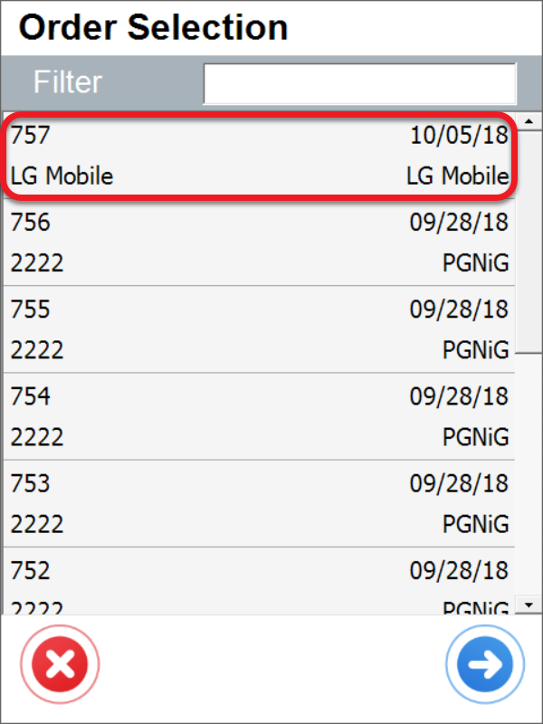
    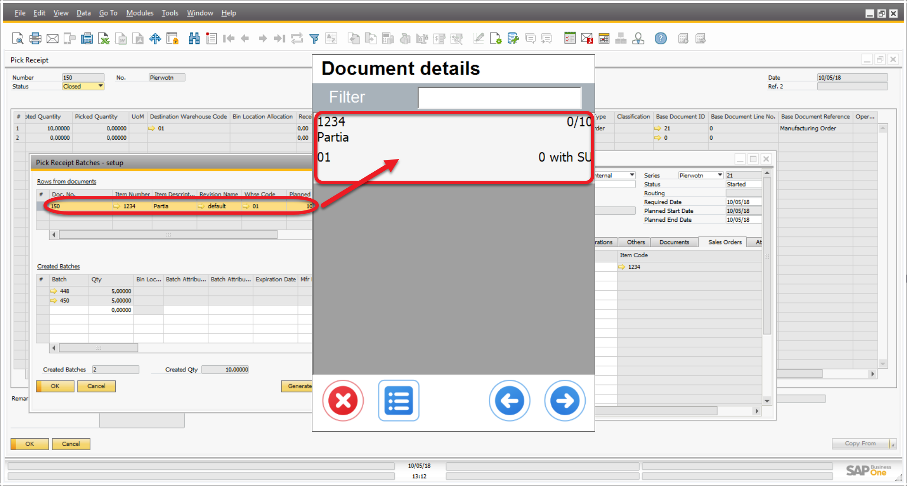
    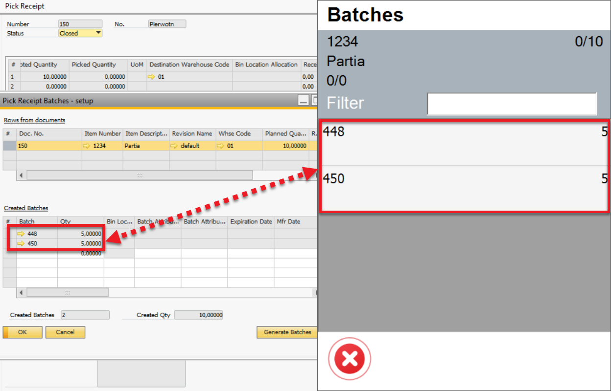
    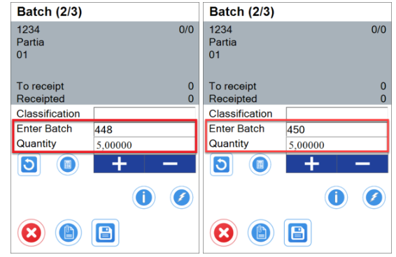

Going to Delivery > From Sales Order, choosing the required document number (757 in this case). In Item details we add Batches assigned to the Manufacturing Order:

    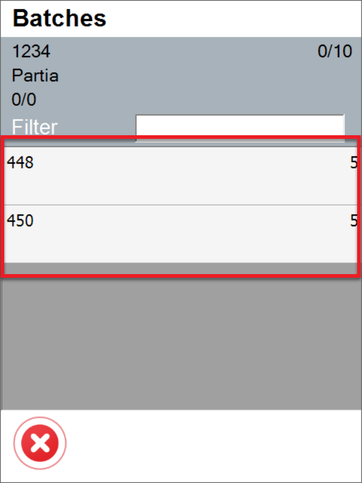

The only Batches available are the ones that were generated on receiving from Manufacturing Order.

**Example for Show only Pick Lists with Picked status option (5)**

In the default query it is required to find this line: `T0."Status" <> 'C'  and change it to T0."Status" = 'Y'`

The following screenshots illustrate an example query, the necessary changes, and the resulting output in CompuTec WMS:

    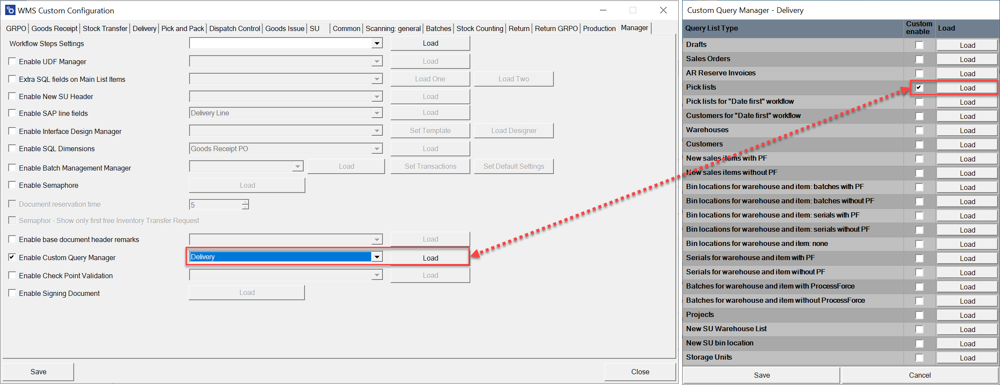

`T0."Status" <> 'C' changed to T0."Status" = 'Y'`

    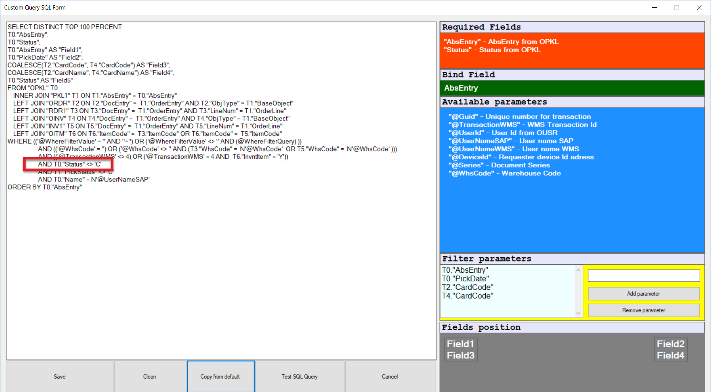

The result:

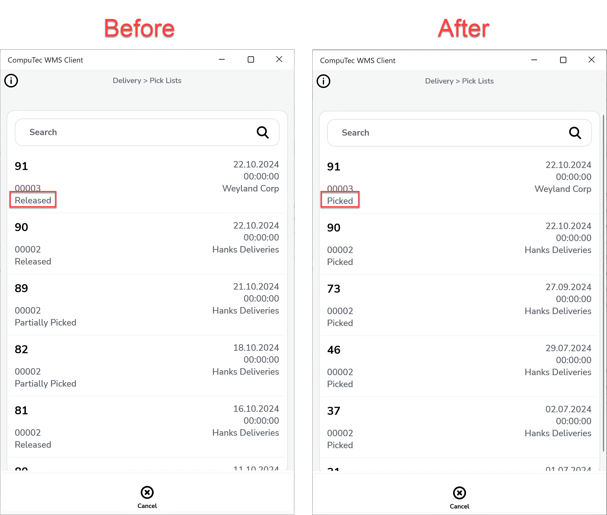

This checkbox has been removed because the option to choose document drafts is now integrated directly into the application interface.

</details>
