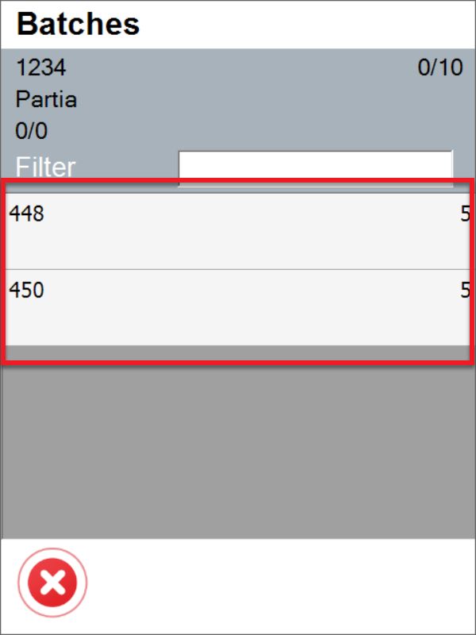
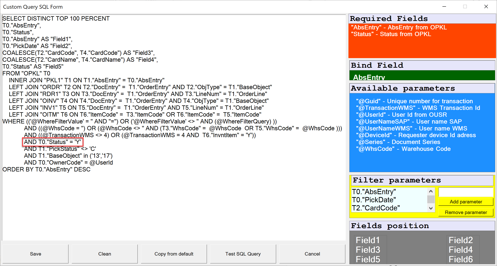

# Delivery

The Delivery Workflow in SAP Business One allows businesses to streamline the order fulfillment process by offering various options.

---


1. **Delivery workflow** - Allows you to choose one of three workflows for Pick Lists:Default Workflow, Customer-Date Workflow, and Date-Customer Workflow.

    <details>
    <summary>Click here to expand</summary>
    <div>
    1. Default Workflow

        

    2. Customer-Date Workflow

         

    3. Date-Customer Workflow

         
    </div>
    </details>

2. **Scanned SU validation** – There are three options available: 'Match selected Warehouse,' 'Match any base document, Line,' and 'No validation.'

When the "Match selected warehouse" option is chosen, it will prevent the addition of Storage Units (SUs) from a different warehouse than the one specified in the document. For instance, if a new Delivery document is created and a warehouse is selected, only SUs from that warehouse will be allowed.

However, when a Delivery document is generated from a base document, such as a Sales Order, there is no warehouse selection, meaning this option will not have any effect in that case.

**Show Project selection** – Choosing this option causes displaying a window with Project selection before the Remarks window during the transaction.

**Default project** – choose a project that will be assigned to the document by default.

**Enable saving to drafts** – checking this option causes saving transactions as a draft document.
    <details>
    <summary>Click here to expand</summary>
    <div>
    
    </div>
    </details>

**Enable saving documents when drafts ON** – checking this option causes saving the transaction as a document or a document draft.
    <details>
    <summary>Click here to expand</summary>
    <div>
    
    </div>
    </details>

**Scan DocNum on Base Document select workflow** – if the option is checked, it is possible to scan DocNum on a Base Document selection form (instead of DocEntry)

**Pick only preselected Batches and Serials** – disables picking Batches and Serial Numbers Items not preselected on the Delivery transaction – preselection works only on Pick Lists. Thus a user can select those only when creating a Delivery document from a Pick List (also works from Delivery from Sales Order when Batches/Serial numbers are assigned to the Sales Order).

**Pick only preselected Batches when using Pick List** – when the option is checked, only Batches and Serial Numbers chosen for Pick List are displayed.

**Copy the packed Items from the Pick List** – self-explanatory.

**Forbid ordering greater quantities than on Order** – checking this checkbox blocks the possibility of issuing a higher quantity than on a base document.

    

**Hide scanned SU on Item list** – by default, scanning SU adds quantities of Item on it to a specific Item on the Item list and additionally SU as a line on the list. When the checkbox is checked, Item quantities are added to respective Item lines, but SU is not added as a separate line.

**Block item adding with scanning** – block the possibility of adding an Item by scanning a barcode (only picking it manually is available)

**Force manual quantity confirmation** – with this option checked, it is required to manually confirm the quantity previously set up (scanning a barcode does not confirm it automatically)

**Enable scanning and adding Items from distinct Warehouses** – defines whether Items for one Delivery document may or may not be picked from more than one Warehouse.

**Stay on Existing SU List after picking/scanning a SU** – when the checkbox is unchecked, scanning an SU barcode in the List of SUs screen leads to the Document Details screen (with the scanned SU highlighted). Scanning does not move from the List of SUs screen when the checkbox is checked.

**New Delivery: Customer-Warehouse workflow** – after checking this option on New Delivery, first you have to choose Customer, which leads to Warehouse form (instead of default Warehouse-Customer workflow). With this setting, scanning a Serial number or a Batch number on the Warehouse selection window will use the "Fast Scan," i.e., select warehouse, item, and serial/batch with the quantity provided in the scanned barcode and add it to the document.

**Show Cost Dimensions** – checking this checkbox adds a button (next to the Back button) on the Quantity form that leads to the Cost Dimensions form.

**Hide Customer Ref. No. for Delivery from the base document** – checking this option causes the customer Ref. No. field to be hidden in the Remarks form. (On Delivery transactions, when a user creates a document from a base document, a Customer Ref. No. on the document is filled in from the base documents. If more than one base document is used for a transaction, then the first non-empty Customer Ref. No. is used).

**Use Sales UoM from Base Document** – checking this option displays quantities in Unit of Measure from the Base Document (while still operating on the actual quantities). Saving as document drafts is not possible when this option is turned on. Click [here](../../../user-guide/managing-uom-in-computec-wms.md) to find out more.

**Display SU Only With Item From Base Document** – self-explanatory

**Skip SAP Allocation Quantity** – allows disabling SAP Business One Batch/Serial Numbers allocation (if needed for some custom changes). The Delivery works within a Warehouse with Bin locations for allocated Batches and Serial Numbers Items.

**Freight (Sales Order field) cost options**:

- **Partial** - default option for CompuTec WMS and SAP Business One (when created from a Pick List)

- **Full freight for first Delivery only** - total Freight cost added only to the first Delivery. The following Deliveries have no freight cost assigned (SAP Business One behavior with Delivery from Sales Order).

- **Always charge full freight** - total freight cost from the base document.

## Changes

The old Delivery tab view:

    

The following checkoboxes have been removed: Show document drafts, Extra field in Order query, Sales Orders sorting order, Issue only Batches from MOR for selected BPs, Show only Pick Lists with Picked status.

To used the previously available option, it is required to create a specific SQL query by using Custom Query Manager:

    

On the following screenshot you can check were to find replacements for the removed functions (compare the numbers with the first screenshot on this page):

    

    

**Example for Show document drafts option (1)**

Changing T0."CardName" AS "Field4" line to T0."DocStatus" AS "Field4" (instead of customer name there will be a document status - if it is open or closed).

    

    

**Examples for Sales Orders sorting order and Extra field in Orders query options (2, 3)**

It is possible to use the option in four ways:

    | Previous sorting order options | Related commands |
    | --- | --- |
    | creationdate ascending | `"DocDate" ASC` |
    | creationdate descending | `"DocDate" DESC` |
    | duodate ascending | `"DocDuoDate" ASC` |
    | duodate descending | `"DocDuoDate" DESC` |

To change sorting order it is required to make changes in ORDER BY line. In the example below the sorting order was changed from sorting by creation date to sorting by document number (T0."DocDueDate" changed to T0."DocNum"). Here you can check the previous state and result of the change:

    

**Example for Issue only Batches from MOR for selected BPs option (4)**

In this case it is required to add lines in two places (marked on the screenshot below):

A line that have to be added for filter to work properly:

    ```
    AND (((@BaseDocEntry <= 0 AND @BaseDocLineNum < 0) AND ''='') OR ((@BaseDocEntry > 0  AND @BaseDocLineNum >= 0) AND (T0."U_MnfDocEntry" = (SELECT "U_DocEntry" FROM RDR1 WHERE "DocEntry" = @BaseDocEntry and "LineNum" = @BaseDocLineNum))))
    ```


**Example usage scenario**

1. Create a Sales Order.
2. Create a related Manufacturing Order.
3. Change the status of Manufacturing Order to Released.
4. Go to CompuTec WMS, choose Pick Receipt > New Production Receipt and choose the Manufacturing Order.
5. Generate a Batch and save progress, by this creating a Batch for the Manufacturing Order.

Here you can check the process on screenshots:

    
    
    
    
    

Going to Delivery > From Sales Order, choosing the required document number (757 in this case). In Item details we add Batches assigned to the Manufacturing Order:

    

The only Batches available are the ones that were generated on receiving from Manufacturing Order.

**Example for Show only Pick Lists with Picked status option (5)**

In the default query it is required to find this line: `T0."Status" <> 'C'  and change it to T0."Status" = 'Y'`

The following screenshots present an example query, changes required to be made and the result in CompuTec WMS:

    

`T0."Status" <> 'C' changed to T0."Status" = 'Y'`

    

The result:


Show document drafts checkbox has been removed due to the fact of adding an option to choose document drafts in application.
