# Dispatch Control

The Dispatch Control feature enables enhanced management of the dispatch process by allowing the configuration of various settings that control how items and package numbers are validated, scanned, and processed. By customizing the dispatch settings, businesses can ensure smoother, more accurate transactions and better control over inventory movement.

---

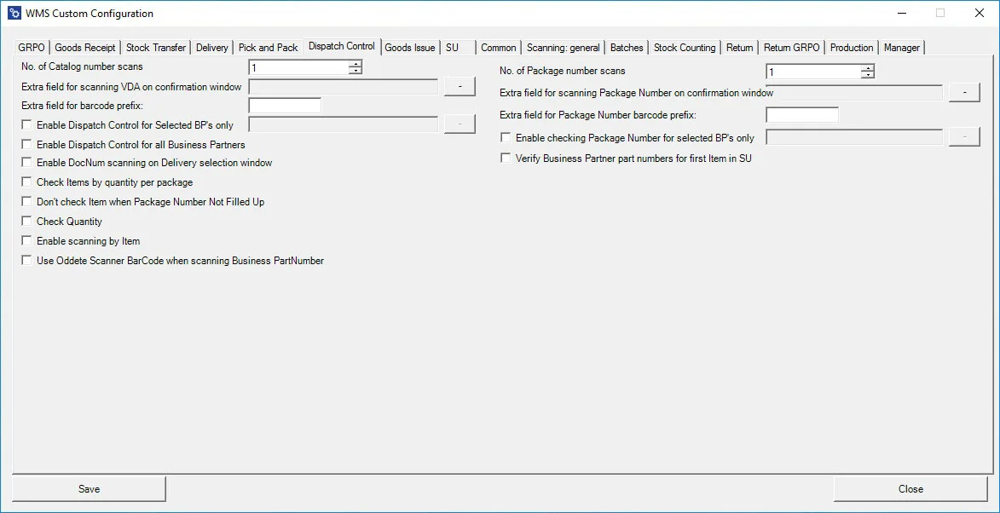

**No. of Catalog numbers scans** – Defines the number of catalog number scans after which the application moves to the next step.

**Extra field for scanning VDA on confirmation window** – Allows the definition of a user-defined field for VDA scanning during the confirmation process.

**Extra Field for barcode prefix** – This option allows defining a prefix. Scanning a barcode with this prefix enables the user to proceed to the next step in the transaction.

**Enable Dispatch Control for Selected BPs only** – This option allows the definition of Dispatch Control exclusively for the selected Business Partners.

**Enable Dispatch Control for all Business Partners** – Activates Dispatch Control for every Business Partner.

**Enable DocNum scanning on the Delivery selection window** – Allows scanning by document number (when unchecked, scanning is based on content).

**Check Items by quantity per package** – Allows checking items by quantity per package. For example, if there are four packages of 25 pieces each, the user will be required to scan 25 pieces four times, not 100 pieces in one scan.

**Don't check Item when Package Number Not Filled Up** – When checked, a row is not validated if the package number is incomplete.

**Check Quantity** – Validates the quantity by scanning a barcode. Moving to the next step is not allowed unless the correct quantity is scanned. If an error occurs, the user must click the "x" button and restart the process. Manual entry of quantity is disabled; it works only through scanning.
    

    
 to expand

    

    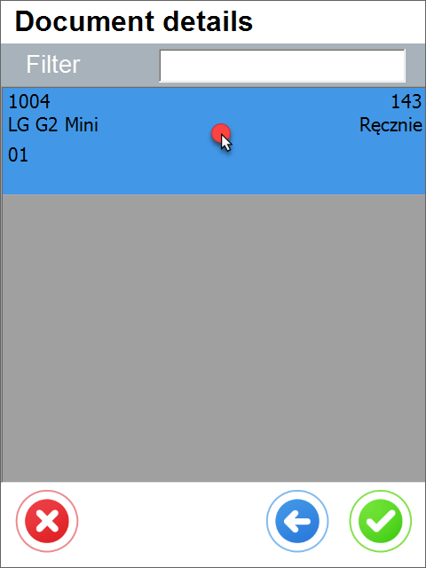 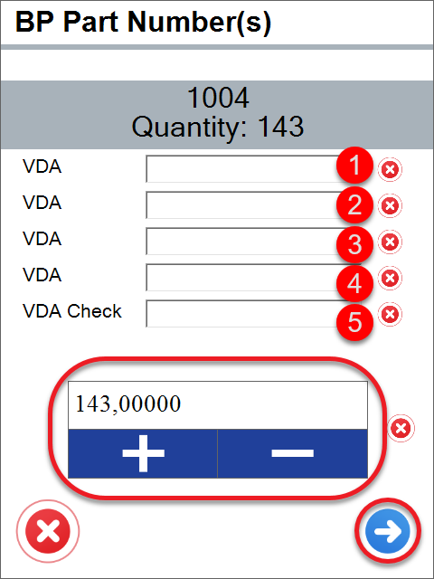
    

    

**Enable scanning by Item** – Allows scanning by item (applies when batches do not manage an item).

**Use Oddete Scanner BarCode when scanning Business PartNumber** – Enables adjusting batch number scanning according to the Odette standard for Business Partner part numbers.

**No. of Package numbers scans** – Defines the number of package number scans after which the application moves to the next step
    

    
Click here to expand

    

        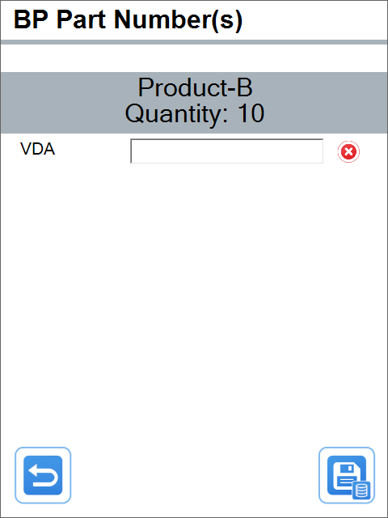 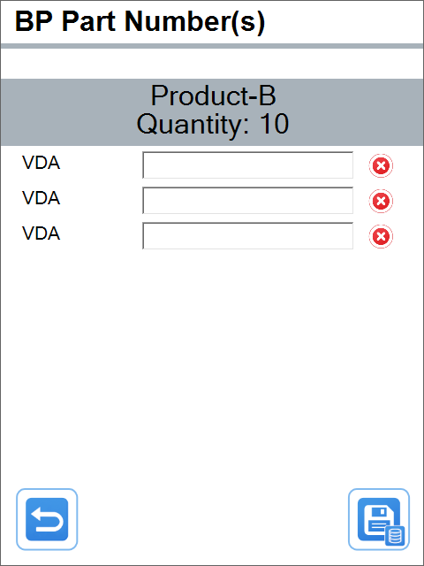
    

    

**Extra field for scanning Package Number on confirmation window** – Allows defining a user-defined field for scanning the package number during the final form of the transaction.

**Extra field for Package Number barcode prefix** – This option allows defining a prefix for the package number barcode.

**Enable checking Package Number for selected BP's only** – This option Allows checking the package number only for the selected Business Partners.

**Verify Business Partner part numbers for the first Item in SU** – This option checks the U_PackageNumber and Business Partner part number only for the first item in the Stock Unit (SU).

## Changes

The old view of the Dispatch Control tab no longer includes the Extra Field Query checkbox.

    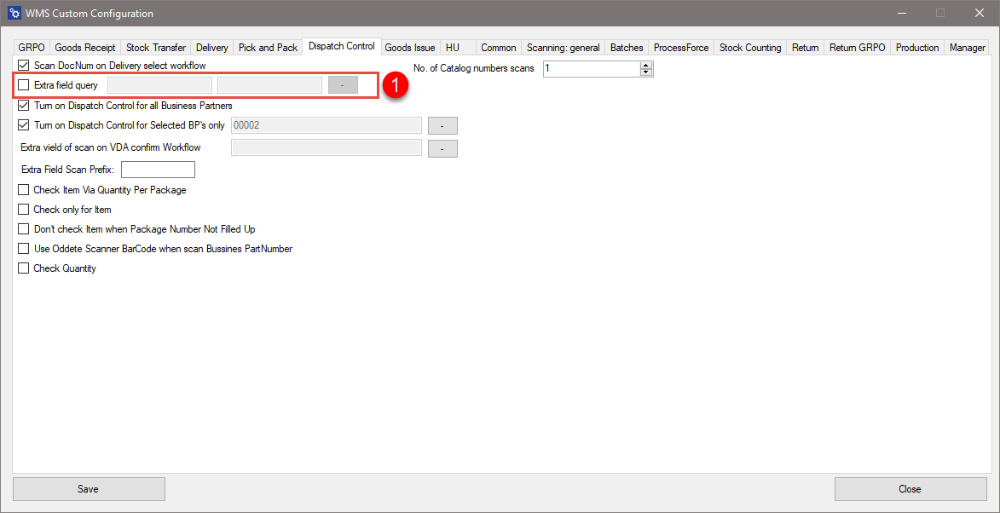

To enable this functionality, a specific SQL query needs to be created in the Custom Query Manager.

    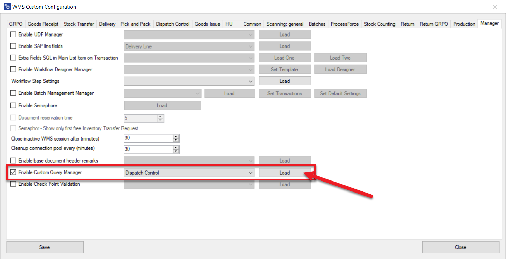

Click Load to select the window you want to modify.

    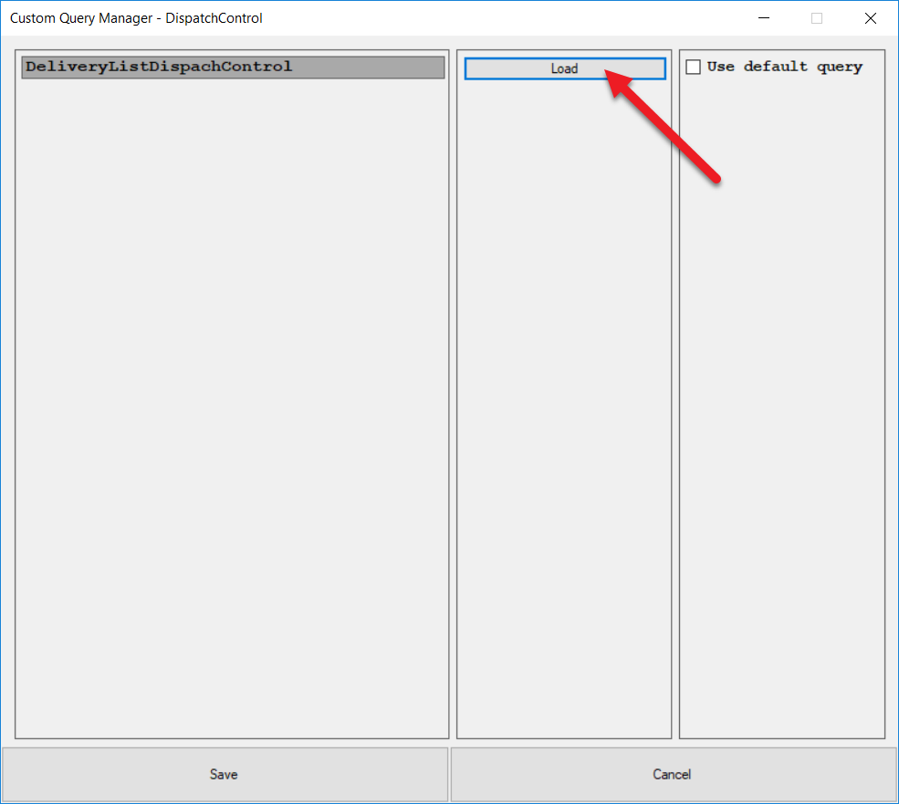

On the right side, you'll see the following sections: Required Fields, Available Parameters, Filter Parameters, and available CompuTec WMS fields.

    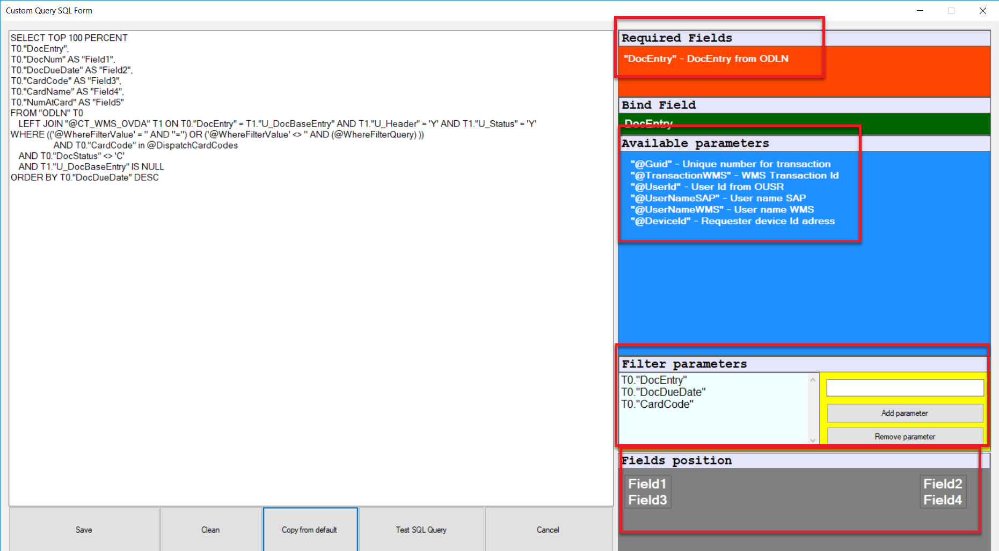

The basic data for the change will be retrieved from the SQL Query Manager.

    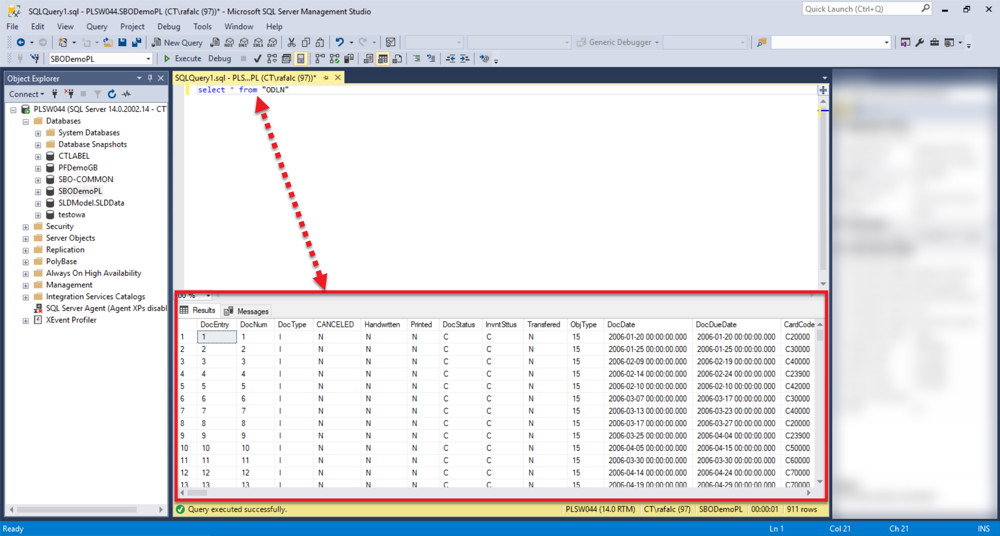

In this example, data from the Address and TransId columns will be inserted into the Field5 and Field6 fields, respectively.

    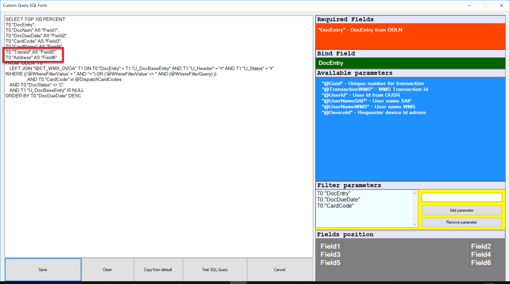

The screenshots below show the CompuTec WMS window before and after the change.

    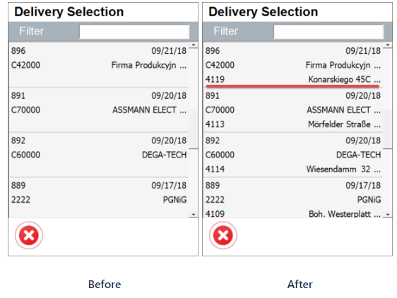

---
The Dispatch Control feature offers businesses a flexible and streamlined way to manage the dispatch process, allowing for customizations that ensure accurate item tracking and package validation. The updates to the Dispatch Control tab simplify the process, making it easier to implement changes and optimize dispatch management.
