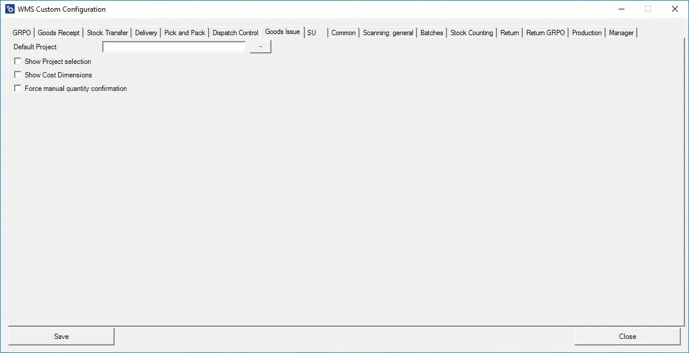
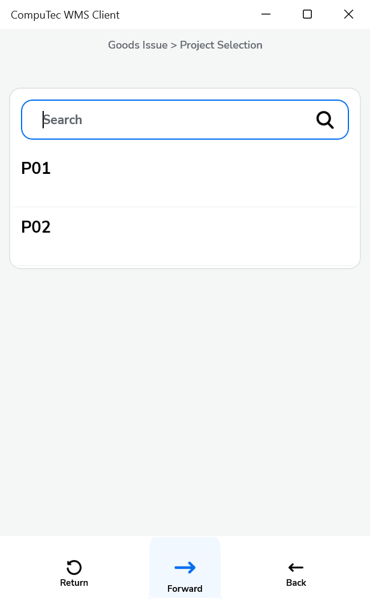

# Goods Issue

A Goods Issue process is essential for managing inventory when goods are issued from stock to fulfill a request or transfer. This section covers key configuration options that can be set during the Goods Issue process to optimize project management, cost tracking, and quantity confirmations.

---

**Default Project** – If a default project is selected, you can click the right arrow icon on the Project selection form. The default project set up here will be automatically selected.

**Show Project Selection** – Enabling this option displays the Project Selection form before the Remarks form when creating a document that requires adding receiving items. If a default project is configured in Custom Config, the project selection step can be skipped by clicking the right arrow on the Project selection screen, and the default project will be selected automatically.
    

    
Click here to expand

    

    
    

    

**Show Cost Dimensions** – Enabling this checkbox adds the Cost Dimension form to the transaction.

**Force manual quantity** – Enabling this checkbox forces manual quantity confirmation. The scanned quantity will be entered into the quantity field. If the checkbox is not checked, the scanned quantity is automatically approved but still requires confirmation by pressing an on-screen button.

---
By configuring the relevant options for Goods Issue, you can streamline processes such as project selection, cost tracking, and quantity confirmation. These settings enhance flexibility, ensuring that the Goods Issue process aligns with your organization’s needs for efficiency and accuracy. Adjust these configurations to improve the handling of inventory transactions and ensure seamless operations in your system.
