# Goods Receipt

**After picking an Item, auto return to** – the option allows you to choose to which window the application goes after picking an Item.
    

    
Click here to expand

    

    **Main Document Workflow**

    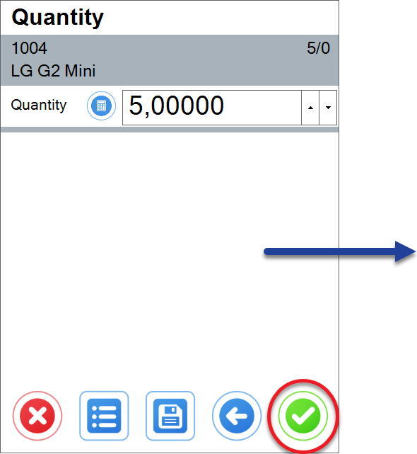 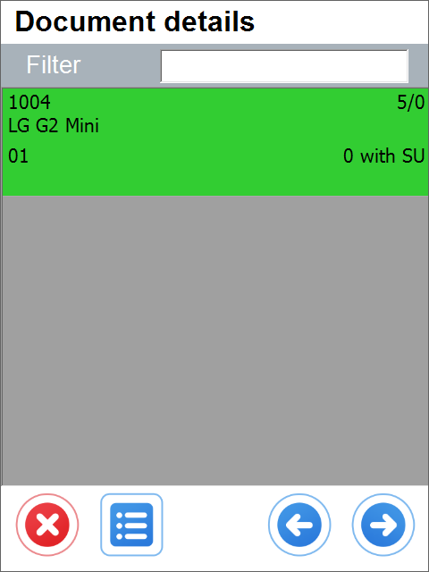

    **Item Details WorkFlow**
    
     
    

    

**Show Project selection** – choosing this option results in displaying the Project Selection form before the Remarks form when creating a document (to which it is required to add receiving Items).
    

    
Click here to expand

    

    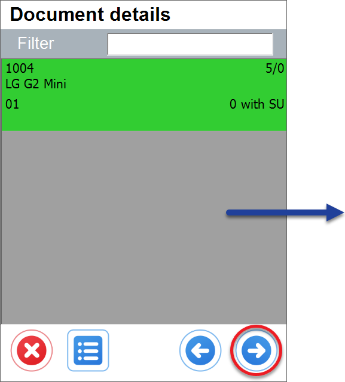 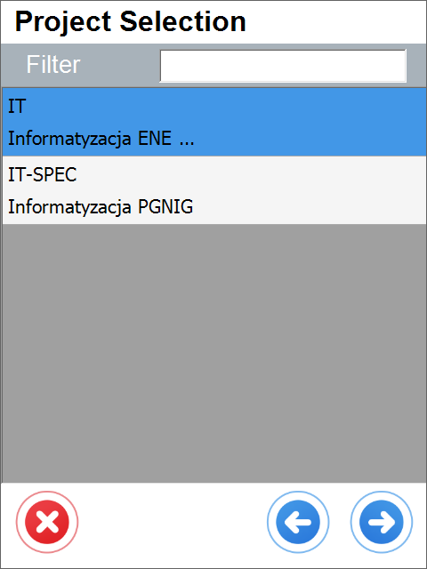
    

    

**Default Project** – if a default project is chosen, clicking the right arrow icon on the Project selection form is possible. A default project set up here will be chosen automatically.
     

    
Click here to expand

    

    
    

    

**Enable saving to drafts** – allows saving documents as document drafts.

    

    
Click here to expand

    

    By default, this option is turned off. In this case, the Remarks windows look like this:
        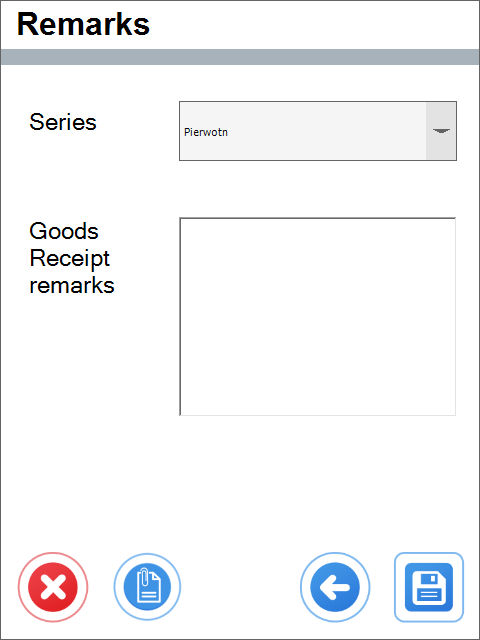

    
    When the option is turned on, a new option is added (highlighted in the screenshot below):
        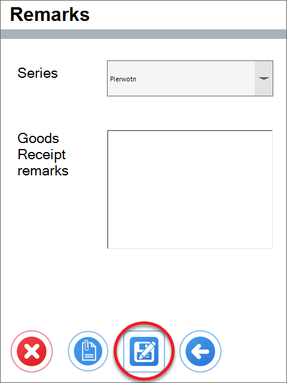
    

    

**Enable saving documents when drafts ON** – allows deciding on the Remarks form whether to save a transaction as a document or a document draft.

    

    
Click here to expand

    

        When the option is checked, two function buttons are available:
        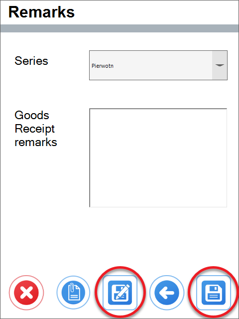
    

    

**Force manual quantity confirmation** – with this option checked, it is required to manually confirm previously set up quantity (scanning a barcode does not confirm it automatically)

**Enable adding Items from multiple Warehouses** – if the option is checked, adding Items from different Warehouses is possible, and the Warehouse window will be displayed during the transaction.

    

    
Click here to expand

    

    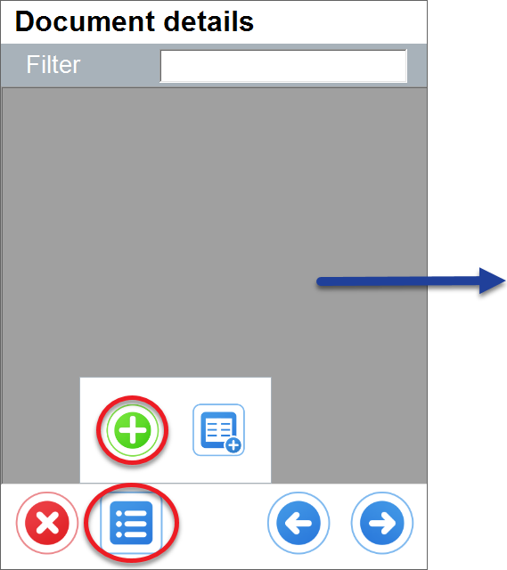 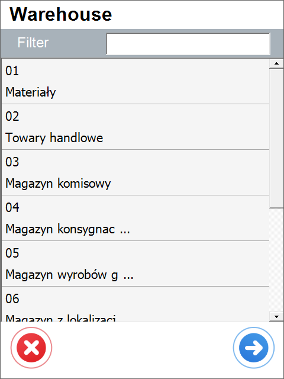
    

    

**Enable adding Items with empty Bin Code field** – it allows to add Items without Bin Code to a Warehouse with Bin Locations. An Item with an empty Bin Code will be assigned to the first available bin if enabled.

    

    
Click here to expand

    

        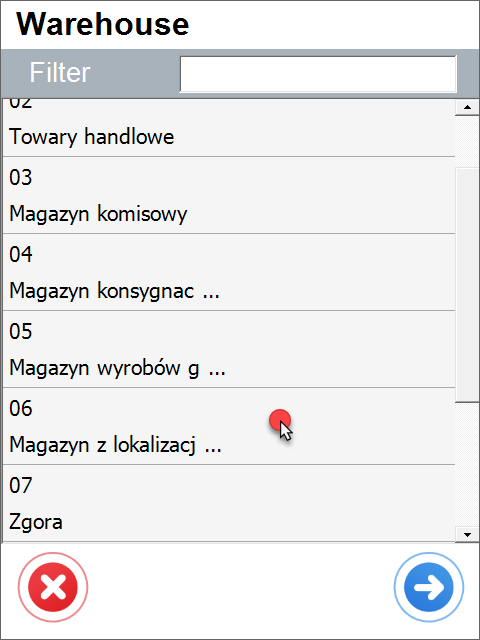 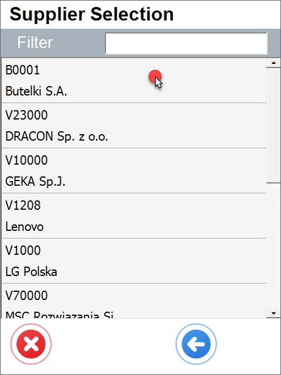 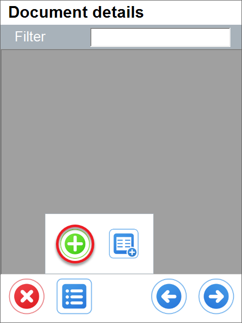 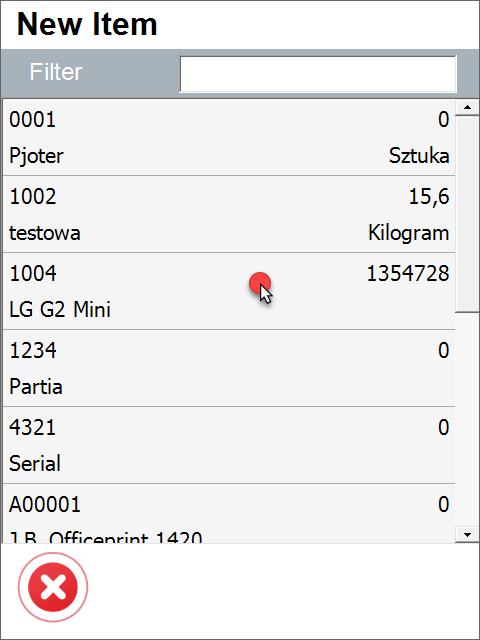 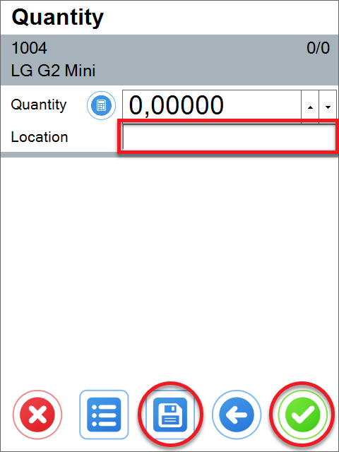
    

    

**Show Cost Dimensions** – checking this checkbox adds a button (next to the Back button) on the Quantity form that leads to the Cost Dimensions form.

**Keep selected Bin Location after adding an item** – after picking an Item, the Bin Location field will not be cleared (keeping the same Bin Location).
