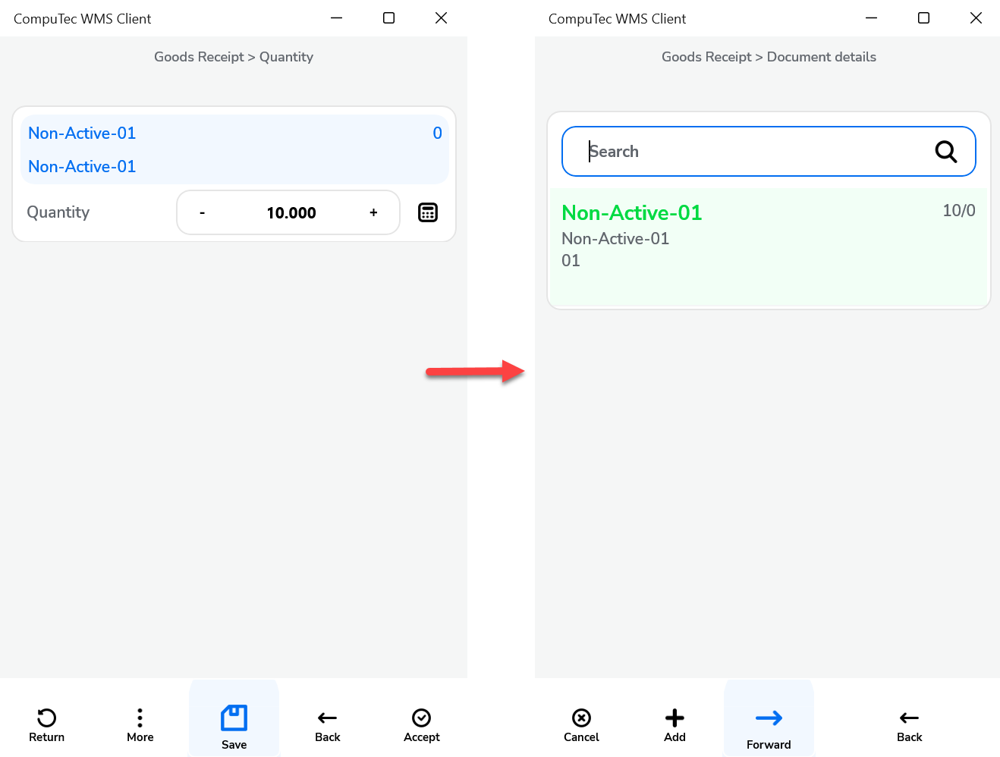
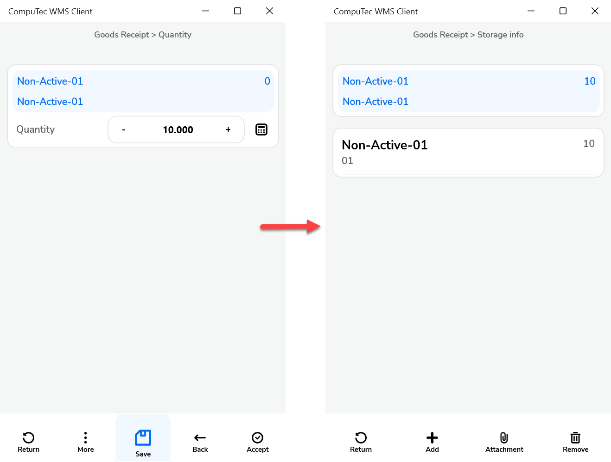
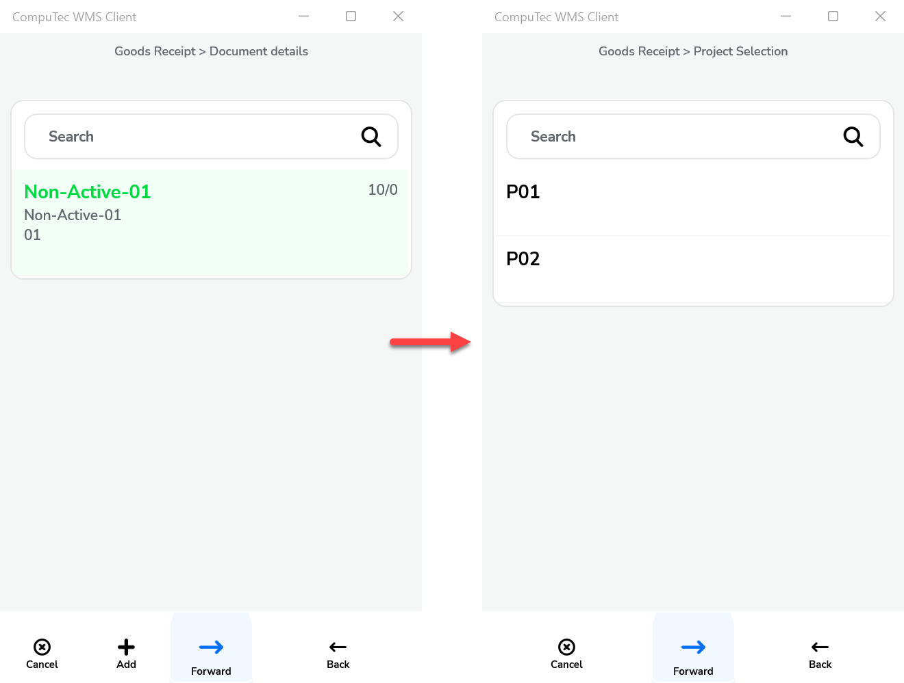
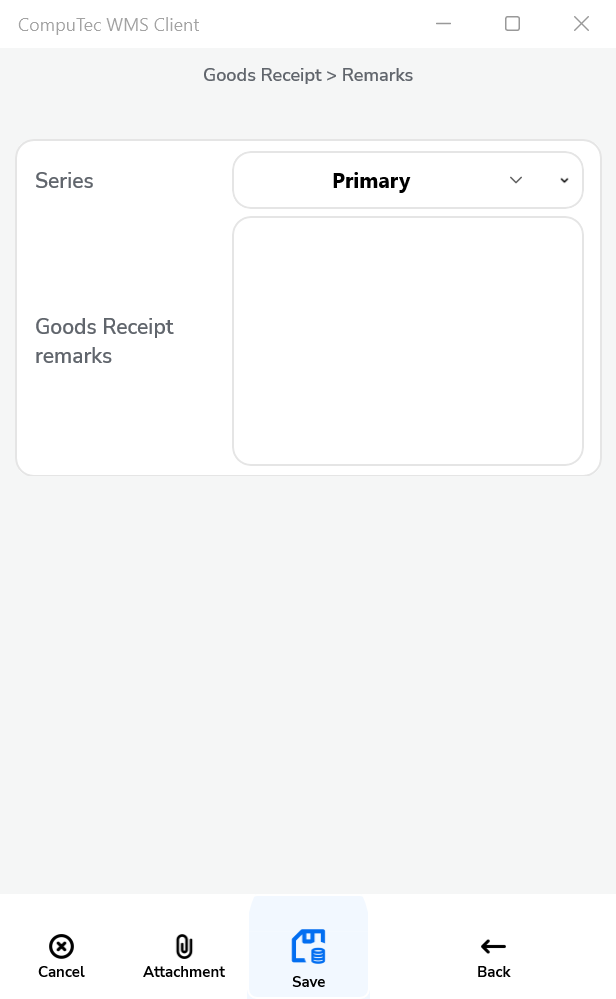
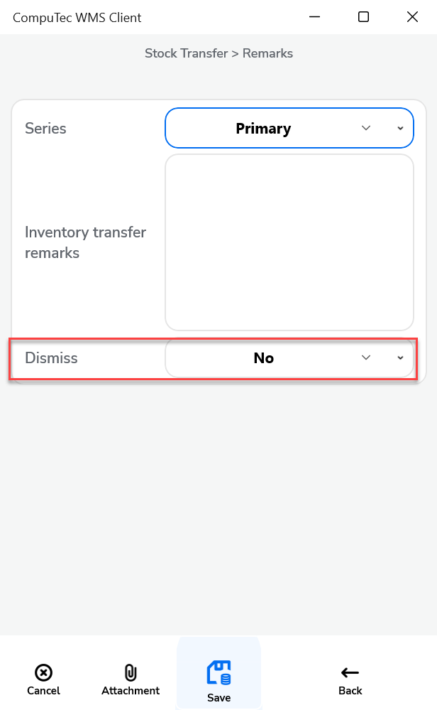
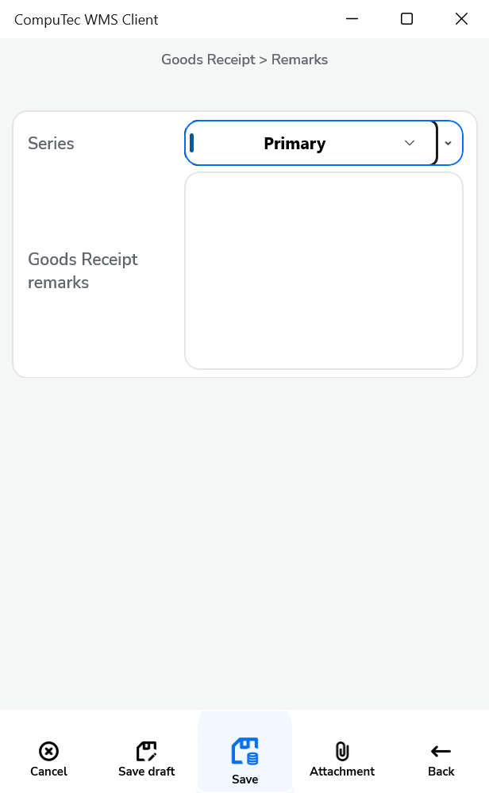

# Goods Receipt

This guide explains the settings and options available for configuring the Goods Receipt process. Each configuration point below provides flexibility and is designed to meet various business requirements.

---

1. **After picking an Item, auto return to** – After picking an item, this option lets you choose the window to which the application should return.
    

    
Click here to expand

    

    **Main Document Workflow**

    

    **Item Details WorkFlow**

    
    

    

2. **Show Project selection** – When enabled, this setting displays the Project Selection form before the Remarks form during document creation, required for adding received items to a specific project.

    

3. **Default Project** – Set a default project to automatically appear on the Project Selection form, allowing quick selection by clicking the right arrow icon.

    

4. **Enable saving to drafts** – Allows users to save documents as drafts, ideal for partially completed transactions or documents pending final review.

    

    
Click here to expand

    

    By default, the option is switched off, and the Remarks window looks like this:

        

    When the option is enabled, the Remarks window will appear as shown below:

        
    

    

5. **Enable saving documents when drafts ON** – This option gives users the choice, on the Remarks form, to save a transaction either as a completed document or a draft. When the option is checked, two options are available in the Remarks field:

    

6. **Force manual quantity confirmation** – When this setting is enabled, users must manually confirm the quantity even if scanned, ensuring accuracy before finalizing.

7. **Enable adding Items from multiple Warehouses** – This option allows the addition of items from various warehouses. If enabled, a warehouse selection window appears during the transaction.

8. **Enable adding Items with empty Bin Code field** – This option allows adding items without specifying a Bin Code. Such items are assigned to the first available bin within a warehouse using bin locations.it allows to add Items without Bin Code to a Warehouse with Bin Locations. An Item with an empty Bin Code will be assigned to the first available bin if enabled.

9. **Show Cost Dimensions** – This option lets you add a button on the Quantity form leading to the Cost Dimensions form, giving visibility and control over item cost details.

10. **Keep selected Bin Location after adding an item** – after picking an Item, the Bin Location field will not be cleared (keeping the same Bin Location).

---
These Goods Receipt settings provide flexible options to optimize the item intake process. Configuring these options allows users to tailor the experience to specific needs, enhancing control over project allocation, warehouse management, and documentation accuracy.
