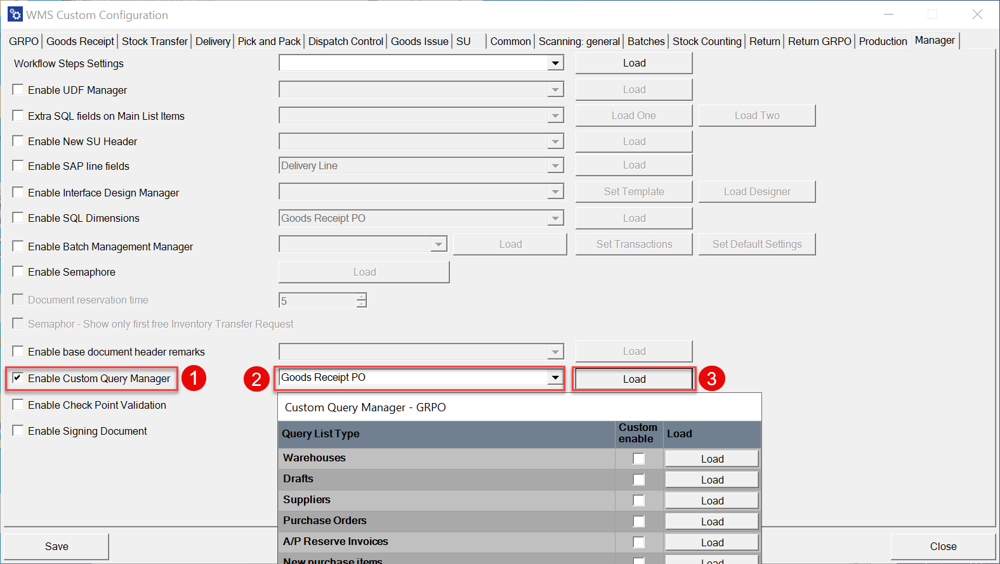

# GRPO


**After picking an item, auto return** – this option allows you to change the window to which the application will go after setting and confirming the quantity for an Item.

    <details>
    <summary>Click here to expand</summary>
    <div>
    **Main Document Workflow**
    
    

    **Item Details Workflow**
    
    
    </div>
    </details>

**Show Project Selection** – choosing this option results in displaying the Project Selection form before the Remarks form when creating a document (to which it is required to add receiving Items).

    <details>
    <summary>Click here to expand</summary>
    <div>
    
    </div>
    </details>

**Default Project** – if a default project is chosen, clicking the right arrow icon on the Project selection form is possible. A default project set up here will be selected automatically.

    <details>
    <summary>Click here to expand</summary>
    <div>
    
    </div>
    </details>

**Enable saving to drafts** – allows saving documents as document drafts.

    <details>
    <summary>Click here to expand</summary>
    <div>
    By default, the option is switched off, and the Remarks window looks like this:
        
    
    When the option is switched on, the Remarks window looks like this:
        
    </div>
    </details>

**Enable saving documents when drafts ON** – allows deciding on the Remarks form whether to save a transaction as a document or a document draft.

    <details>
    <summary>Click here to expand</summary>
    <div>
    When the option is checked, two options are available in the Remarks field:
        
    </div>
    </details>

**GRPO SU creator: Allow selection of only one item per SU** – this option prevents the user from picking more than one Item from a base document for an SU when creating it by using SU Creator in Goods Receipt PO transaction. For example, this option can be used, e.g., when we want to create pallets with a single type of Item.

    <details>
    <summary>Click here to expand</summary>
    <div>
    Example
        
    </div>
    </details>

**Scan DocNum on the Base Document selection window** – checking this option allows you to scan a document by Docm, not by DocEntry.

**Force manual quantity confirmation** – with this option checked, it is required to manually confirm the quantity previously set up (scanning a barcode does not confirm it automatically).

**Enable adding Items from multiple Warehouses** – if the option is checked, adding Items from different Warehouses is possible, and the Warehouse window will be displayed during the transaction.

    <details>
    <summary>Click here to expand</summary>
    <div>
    
    </div>
    </details>

**Enable adding Items with Empty Bin Code field** – it allows to add Items without Bin Code to a Warehouse with Bin Locations. If enabled, an Item with an empty Bin Code will be assigned to the first available Bin.

    <details>
    <summary>Click here to expand</summary>
    <div>
        
    </div>
    </details>

**Enable negative quantities for Items not managed by batch/serial number** – allows using negative quantities for Items managed neither by Batches nor Serial Numbers.

    <details>
    <summary>Click here to expand</summary>
    <div>
        - This function works only with Items managed neither by Batch, nor Serial Numbers
        - Scanner barcode does not support negative quantity
        - Line with 0 quantity will not be added to the SAP document
        - Draft document with negative quantity is not supported
        - Storage Unit does not support negative quantity. 
        
        
        
    </div>
    </details>

**Enable adding attachments** – allows adding attachments to documents. If a scanner device is used, the option automatically turns on a camera to take a picture and add it as an attachment.

**Enable setting Tax Date** – allows selecting a Tax Date on the Remarks form.

    <details>
    <summary>Click here to expand</summary>
    <div>
    When the option is enabled:
        
    
    The Tax Date is saved to the highlighted field of a document:
        
    </div>
    </details>

**Show Cost Dimensions** – checking this checkbox adds a button (next to the Back button) on the Quantity form that leads to the Cost Dimensions form

**Keep selected Bin Location after adding an item** – after picking an Item, the Bin Location field will not be cleared (keeping the same Bin Location)

**Hide Supplier Ref. No. for GRPO from the base document** – checking this option causes the Supplier Ref. No. field to be hidden in the Remarks form (related to base documents: Purchase Order, A/P Reserve Invoice). (On GRPO transactions, when a user creates a document from a base document, a Supplier Ref. No. on the document is filled in from the base documents. If more than one base document is used for a transaction, then the first non-empty Supplier Ref. No. is used).

    <details>
    <summary>Click here to expand</summary>
    <div>
    
    </div>
    </details>

**Use Purchase UoM from Base Document** – checking this option displays quantities in Unit of Measure from the Base Document (while still operating on the actual quantities). Saving as document drafts is not possible when this option is turned on. Click [here](../../../user-guide/managing-uom-in-computec-wms.md) to find out more.

**Skip Storage Unit details**

**Hide SU**

**Do not clear batch** – when checked, the application stays in the Quantity screen after adding a Batch.

**Automatically populate the Quantity field with the value from the base document** – self-explanatory.

    <details>
    <summary>Click here to expand</summary>
    <div>
    
    </div>
    </details>

**PopUp Date from Base Doc with today's date** – an application message with a warning about the receive date of the document being older than today

**PopUp adding new Item when using base document** – an application message with a warning about adding an Item to a Base Document.

**Item Quantity PopUp from Base Document** – an application message with a warning about exceeding Up Quantity from the related Purchase Order. It is possible to either display a warning with a continue button or to block the action (please note that for A/P reserve Invoice, it is only possible to block the action)

**PopUp validation Expiry Date Item** – an application message with a warning about the Item expiration date. It is based on ProcessForce Item Details (Batches tab > Expiry Date) or MS SQL query (in case of using the MS SQL query: if the query is empty, validation is not displayed)

**Move CatchWeight quantity difference to** - This option saves the differences to the specified field in SAP Business One.
    <details>
    <summary>Click here to expand</summary>
    <div>
    
        1. **No action** - No action is performed
        2. **Quantity** - The difference is recorded in the quantity field
        (In No. of Packages, the number of packages is an integer)
        
        3. **Inventory Quantity** - The difference is recorded in the Qty(Inventory UoM) field
        
    </div>
    </details>

## Changes

Old view of the tab:  Goods Receipt PO.

The following options have been removed: Extra field in Purchase Orders query (1) and Purchase Orders sorting order (2). Functionalities of both of these options can now be used through Custom Query Manager.
    

To set up the options go to Manager tab, check Enable Custom Query Manager checkbox and log in using SAP Business One credentials.
    

Next, choose Goods Receipt PO option and click Load.
    

**AD.1 Extra field in Purchase Orders query**

Choose Purchase Order List and click Load button next to it:
    

Now you can see the information on:

- required fields
- available parameters
- filter parameters
    

You can create your own query, use a default one (by clicking Copy from default button) or modify the default one.
    

An example query:

In this example it is required to display a currency code in the 4 field. It will be done in Goods Receipt PO --> from Purchase Order window, on choosing a purchase document.

Here, you can check the default query:
    

and a query modified for this example:
    

The following lines have been changed:

| Old Line | New Line |
| --- | --- |
| `T0."CardName" AS "Filed4"` | `coalesce(cast(T0."DocCur" AS nvarchar(4000)), '')+'//'+coalesce(cast(T0."CardName" AS nvarchar(4000)), '')) AS "Field4"` |

The new line takes the following information from the table: a values of a currency code, a sign that will separate the values and on which field it will be displayed.

The screenshots below presents the difference in results between the default and modified for this example queries:
    

Here you can check from where the data is taken for this example:
    
    

Please also note:

    ```SQL
    For MS SQL: (coalesce(cast(T0."DocCur" AS nvarchar(4000)), '')+'//'+coalesce(cast(T0."CardName" AS nvarchar(4000)), '')) AS "Field4" (nowa linijka) - Jeśli mamy środowisko SQL

    For HANA: (coalesce(cast(T0."DocCur" AS nvarchar(4000)), '')||'//'||coalesce(cast(T0."CardName" AS nvarchar(4000)), '')) AS "Field4"
    ```
**AD.2 Purchase Orders sorting order**

There are four sorting options. On the left side there are options from the old view, on the right side related commands that can be used now:
    | Old View | New View |
    | --- | --- |
    | creationdate ascending | `"DocDate" ASC` |
    | creationdate descending | `"DocDate" DESC` |
    | duodate ascending | `"DocDuoDate" ASC` |
    | duodate descending | `"DocDuoDate" DESC` |

    
