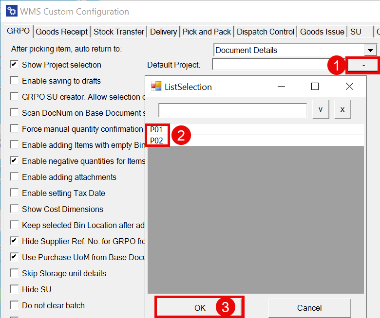
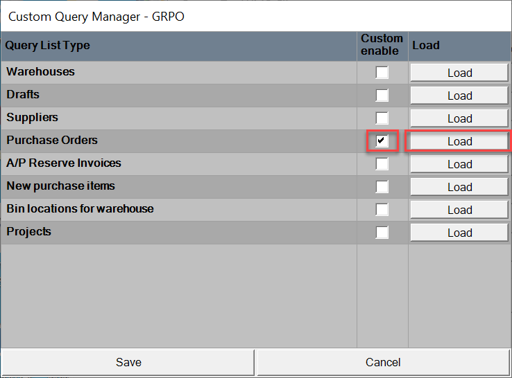
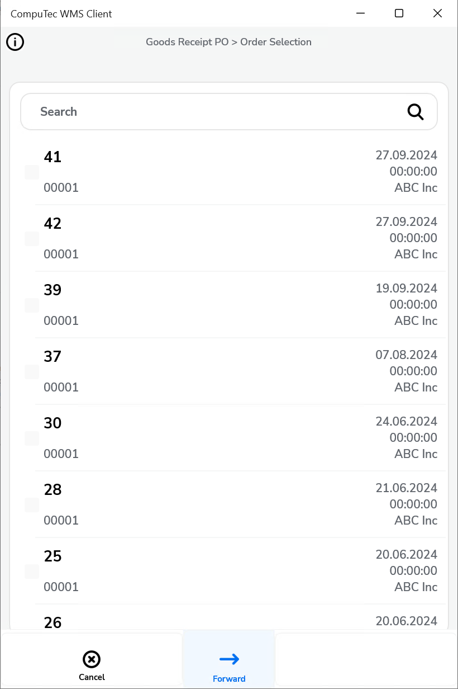

# GRPO

This guide provides an overview of recent updates to the Goods Receipt PO (GRPO) tab in SAP. These enhancements are designed to improve user experience and allow for tailored query and sorting configurations, making purchase order management more efficient.

---


1. **After picking an item, auto return**: This option allows the system to redirect to a different window after confirming the quantity of an item during the picking process.

    <details>
    <summary>Click here to expand</summary>
    <div>
        - Main Document Workflow

            

        - Item Details Workflow

            
    </div>
    </details>

2. **Show Project Selection**: Enabling this option will display the Project Selection form before the Remarks form when creating a document that requires adding receiving items.

    

3. **Default Project**: If a default project is selected, you can click the right arrow icon on the Project Selection form to automatically select the default project.

    

4. **Enable saving to drafts**: This option allows you to save documents as drafts before finalizing them.
    - By default, the option is switched off, and the Remarks window looks like this:

        

    - When the option is enabled, the Remarks window will appear as shown below:

        

5. **Enable saving documents when drafts ON**: With this option, you can choose to save a document as a draft or a finalized document on the Remarks form. When the option is checked, two options are available in the Remarks field:

    

6. **GRPO SU creator: Allow selection of only one item per SU**: When this option is enabled, selecting more than one item in the SU Wizard will trigger an error message: "Only one item per SU is allowed."

    

7. **Scan DocNum on the Base Document selection window**: Enabling this option allows you to scan a document using the DocNum (document number) instead of DocEntry.

8. **Force manual quantity confirmation**: With this option checked, you must manually confirm the quantity, even if a barcode is scanned (automatic confirmation is disabled).

9. **Enable adding Items with empty Bin Code field**: This option allows you to add items without a Bin Code to warehouses with Bin Locations. If enabled, items without a Bin Code will be assigned to the first available bin.

10. **Enable negative quantities for Items not managed by batch/serial number**: This setting allows using negative quantities for items that are not managed by batch or serial numbers.

    <details>
    <summary>Click here to expand</summary>
    <div>
        - This function works only with Items managed neither by Batch, nor Serial Numbers
        - Scanner barcode does not support negative quantity
        - Line with 0 quantity will not be added to the SAP document
        - Draft document with negative quantity is not supported
        - Storage Unit does not support negative quantity.
      </div>
    </details>

11. **Enable adding attachments**: Allows you to add attachments to documents. If a scanner is used, this option automatically activates the camera to capture and attach a photo.

12. **Enable setting Tax Date**: This option allows you to select a tax date on the Remarks form.

    <details>
    <summary>Click here to expand</summary>
    <div>
    When the option is enabled:

        

    The Tax Date is saved to the highlighted field of a document:

        
    </div>
    </details>

13. **Show Cost Dimensions**: When enabled, a button will appear on the Quantity form (next to the Back button) leading to the Cost Dimensions form.

14. **Keep selected Bin Location after adding an item**: This option ensures the Bin Location field is not cleared after selecting an item, keeping the same Bin Location.

15. **Hide Supplier Ref. No. for GRPO from the base document**: This option hides the Supplier Ref. No. field in the Remarks form for GRPO transactions created from a base document (such as Purchase Order or A/P Reserve Invoice). (On GRPO transactions, when a user creates a document from a base document, a Supplier Ref. No. on the document is filled in from the base documents. If more than one base document is used for a transaction, then the first non-empty Supplier Ref. No. is used).

    

16. **Use Purchase UoM from Base Document**: When checked, quantities will be displayed in the Unit of Measure from the Base Document, while still using the actual quantities. Drafts cannot be saved if this option is enabled. Click [here](../../../user-guide/managing-uom-in-computec-wms.md) to find out more.

17. **Skip Storage unit details**: The Storage Unit details screen will not appear if a warehouse has been selected.

18. **Hide SU**: This option hides the options related to creating a Storage Unit (SU).

19. **Do not clear batch**: When enabled, the application stays on the Quantity screen after adding a Batch.

20. **Automatically populate the Quantity field with the value from the base document**: When saving the batch, the system will automatically populate the Quantity field with the value from the base document and stay on the Quantity screen.

    

21. **PopUp Date from Base Doc with today's date**: A warning message appears if the receive date of the document is older than today's date.

22. **PopUp adding new Item when using base document**: A warning message appears if you try to add a new item to a base document.

23. **Item Quantity PopUp from Base Document**: A warning appears if the item quantity exceeds the ordered quantity in the related Purchase Order. You can either continue or block the action (for A/P Reserve Invoice, the action can only be blocked).

24. **PopUp validation Expiry Date Item**: A warning will appear if the item has an expiration date that needs validation. This is based on the ProcessForce Item Details or an MS SQL query.

25. **Move CatchWeight quantity difference to**: This option saves any quantity differences in the specified field in SAP Business One.
    <details>
    <summary>Click here to expand</summary>
    <div>
    
        1. **No action** - No action is performed.
        2. **Quantity** - The difference is recorded in the quantity field.
        (In No. of Packages, the number of packages is an integer)

            

        3. **Inventory Quantity** - The difference is recorded in the Qty(Inventory UoM) field.

            
    </div>
    </details>

26. **Do not set default Bin Code**: The Location field is left blank. The user must select it manually or scan the barcode.

    

## Changes

Old View of the Goods Receipt PO Tab

The following options have been removed from the Goods Receipt PO tab:

1. Extra field in Purchase Orders query, and
2. Purchase Orders sorting order

The functionalities of these options can now be managed through the Custom Query Manager.

    

To configure these options, follow these steps:

1. Go to the "Manager tab".
2. Check the "Enable Custom Query Manager" checkbox.
3. Choose the "Goods Receipt PO" option.
4. Click "Load".


**AD.1 Extra field in Purchase Orders query**

To manage the Extra Field in Purchase Orders Query, follow these steps:

1. Choose the "Purchase Order List" and click the "Load" button next to it:

    

2. You will now see details on:
    - required fields
    - available parameters
    - filter parameters

        

You can create a custom query, use a default query (by clicking Copy from Default), or modify the default query.

    

**Example query:**

In this example, you need to display the currency code in the 4th field in the Goods Receipt PO from the Purchase Order window when selecting a purchase document.

Here, you can view the default query:

    

Or, you can use a modified query for this example:

    

The following changes were made in the query:

| Old Line | New Line |
| --- | --- |
| `T0."CardName" AS "Filed4"` | `(coalesce(cast(T0."DocCur" AS nvarchar(4000)), '')\|\|'//'\|\|coalesce(cast(T0."CardName" AS nvarchar(4000)), '')) AS "Field4"`|

The new line combines the currency code and supplier name, separating them with a double slash, and displays it in the Field4 column.

Here’s the difference in results between the default and modified queries:

     

Here, you can check where the data comes from for this example:

    
    

Please also note:

    ```SQL
    For MS SQL: (coalesce(cast(T0."DocCur" AS nvarchar(4000)), '')+'//'+coalesce(cast(T0."CardName" AS nvarchar(4000)), '')) AS "Field4" (nowa linijka) - Jeśli mamy środowisko SQL

    For HANA: (coalesce(cast(T0."DocCur" AS nvarchar(4000)), '')||'//'||coalesce(cast(T0."CardName" AS nvarchar(4000)), '')) AS "Field4"
    ```
**AD.2 Purchase Orders sorting order**

There are four sorting options. The sorting order for Purchase Orders has changed. Here are the previous and new sorting options:
    | Old View | New View |
    | --- | --- |
    | creationdate ascending | `"DocDate" ASC` |
    | creationdate descending | `"DocDate" DESC` |
    | duodate ascending | `"DocDuoDate" ASC` |
    | duodate descending | `"DocDuoDate" DESC` |

    

---
With the improvements outlined in this document, SAP users can now exercise greater control over their purchase order processes in the GRPO tab. By using the Custom Query Manager to set up custom fields and sorting options, users can create more precise data views, enhancing workflow efficiency. These changes support better data access and customization, enabling users to align GRPO functionalities with their unique business requirements.
