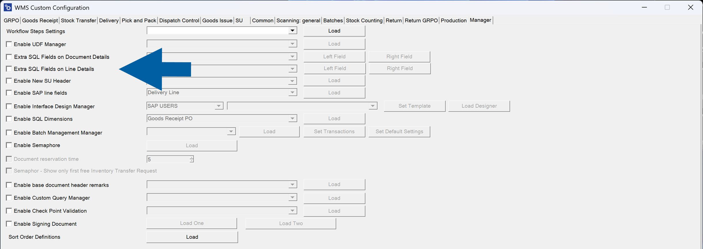
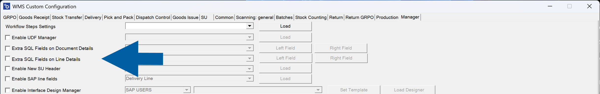
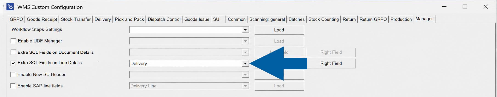
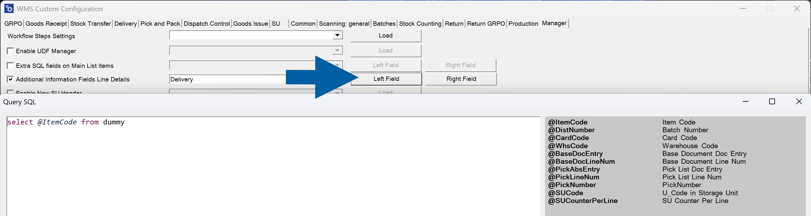
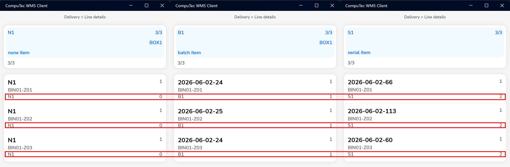

# Additional Information Fields Line Details

**Additional Information Fields Line Details** allows you to display custom SQL-based information in selected **CompuTec WMS** screens.

Each field is populated using an SQL query, making it possible to display additional business information directly in the WMS client.

## Enable the feature

1. Go to **Manager**.
2. Select **Additional Information Fields Line Details**.

    

3. Select the transaction.

    

4. Configure the required fields:

    Each supported screen can display two custom fields:

    - **Left Field**
    - **Right Field**

    

    For each field:

    - Select **Left Field** or **Right Field**.
    - Enter an SQL query.

        :::info[note]
        The SQL editor includes a list of available variables that you can use when building queries.

        Available variables depend on the selected transaction.
        :::

5. Click **Save**.

## Example

The following example displays custom information below each delivery line.

The values are generated dynamically using SQL queries configured for the **Left Field** and **Right Field**, and are displayed below each line in the **Line Details** view.

This allows operators to see additional information, such as batch-related data, warehouse information, customer-specific values, or other business data, without opening additional screens.
