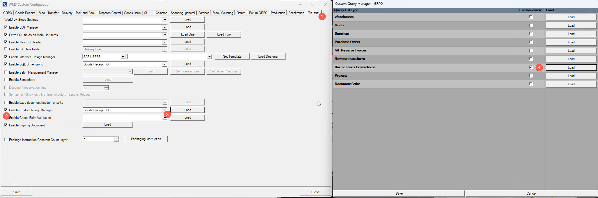
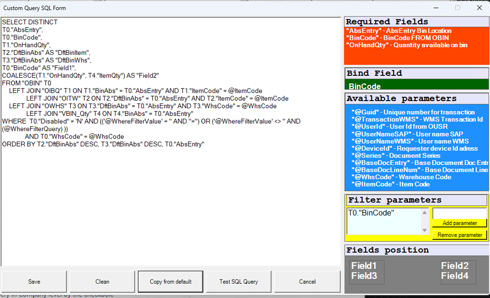
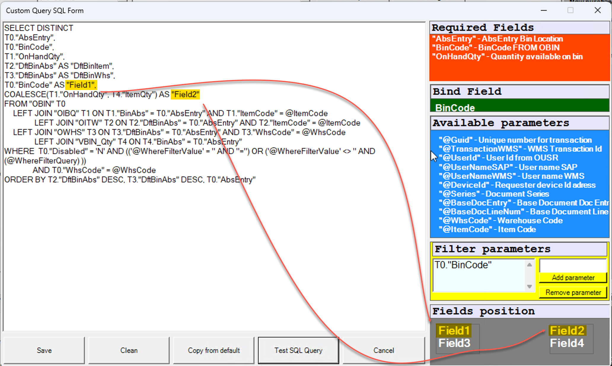

# Overview

## Introduction

The Custom Query Manager allows administrators to tailor the SQL queries behind various WMS transaction screens. This means you can:

- Enable customized data listings for specific transaction types,
- Add, remove, or adjust fields that appear on screens,
- And adapt the interface to better fit your operational needs.

It’s like having an advanced filter-and-display tool that lets you control which columns or data elements show up in WMS workflows.

---

:::caution
From WMS 2.0 version, parameters for database queries should no longer be written between inverted commas/single quotation marks.
:::

<details>
<summary>Click here to find out more</summary>
<div>
Obsolete usage:
```text
'@ItemCode'
```
From WMS 2.0 version
```text
@ItemCode
```
</div>
</details>

## Enable Custom Query by Screen

To access Manager tab, navigate to:

:::info Path
Custom Configuration > Manager tab
:::

1. Enable Custom Query in Company level by the checkbox.
2. Select transaction and click on Load.
3. Select screen/list you would like to modify, check "Custom enable" column and click on "load".



## Overview of SQL Form

SQL form allows user to manipulate default query and add/remove/update preformatted fields, order records and add additional fields to be filtered by given keyword on user interface.



- **Required Fields**: List of required fields that query should return,
- **Bind Field**: This is field system will return as a value back to the next screen.
- **Query body**: You can manipulate default query in this section.
- **Available parameters**: You can use this parameters within your query. System will pass the values during the execution.
- **Filter parameters**: You can see what are the columns system will include in search on WMS UI. You can add or remove fields here.
- **Fields position**: This is visual representation of fields in WMS UI.



:::caution
    When you upgrade WMS, system doesn't overwrite new queries on your custom query. System only updates default queries. Please bear in mind that you may need to re-apply your query updates to newly added queries to get some fixes and improvements.
:::

---

➡️ To know more about Use Cases, visit [this page](../custom-query-manager/use-cases/batch-serial-info-example.md).
