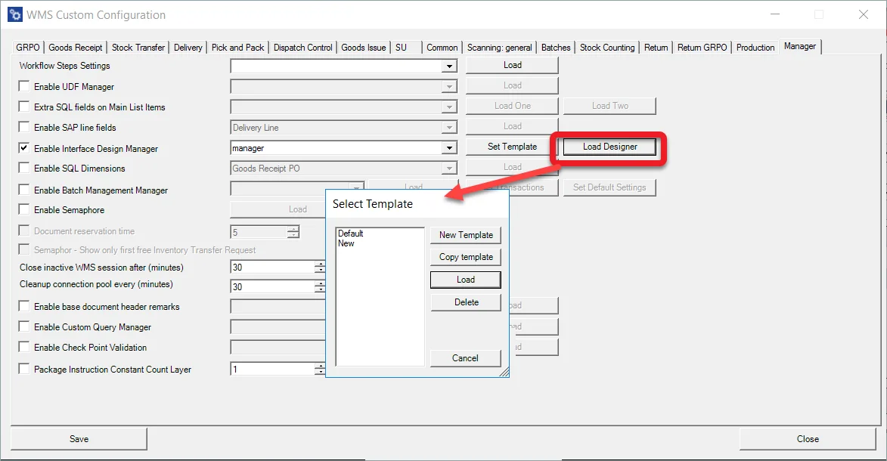
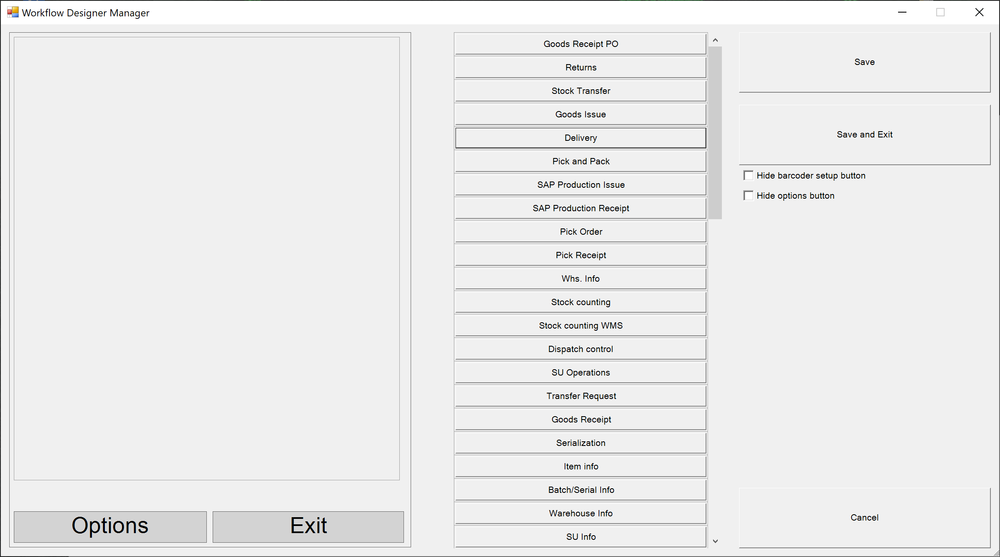
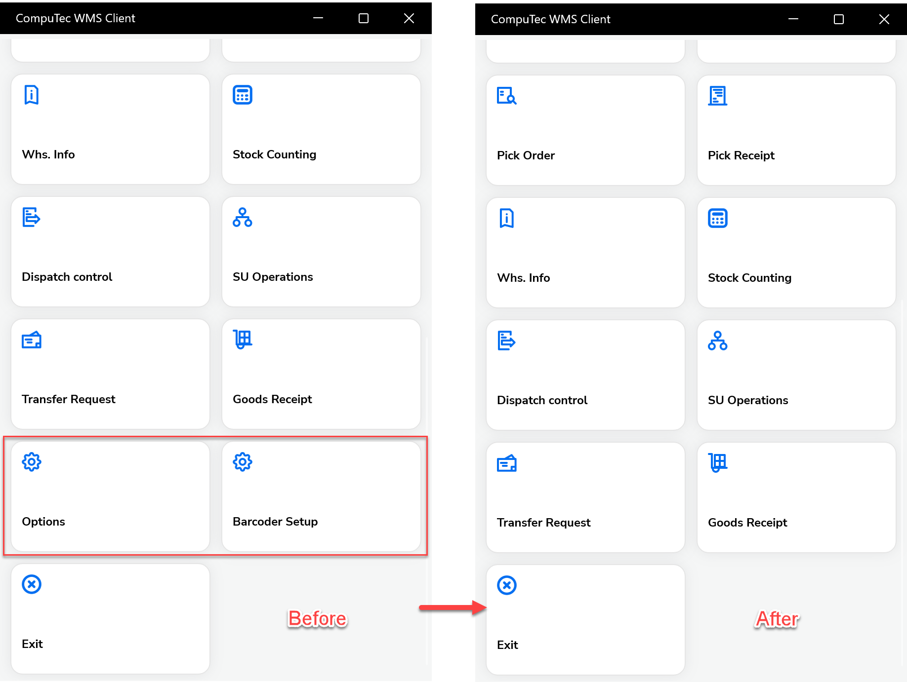
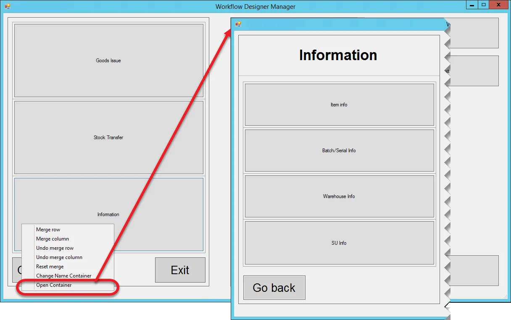
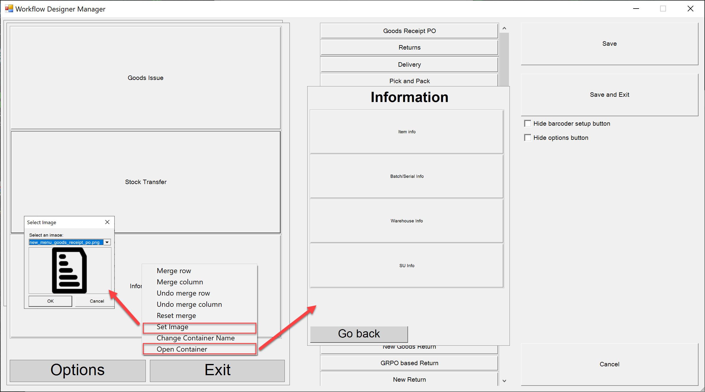
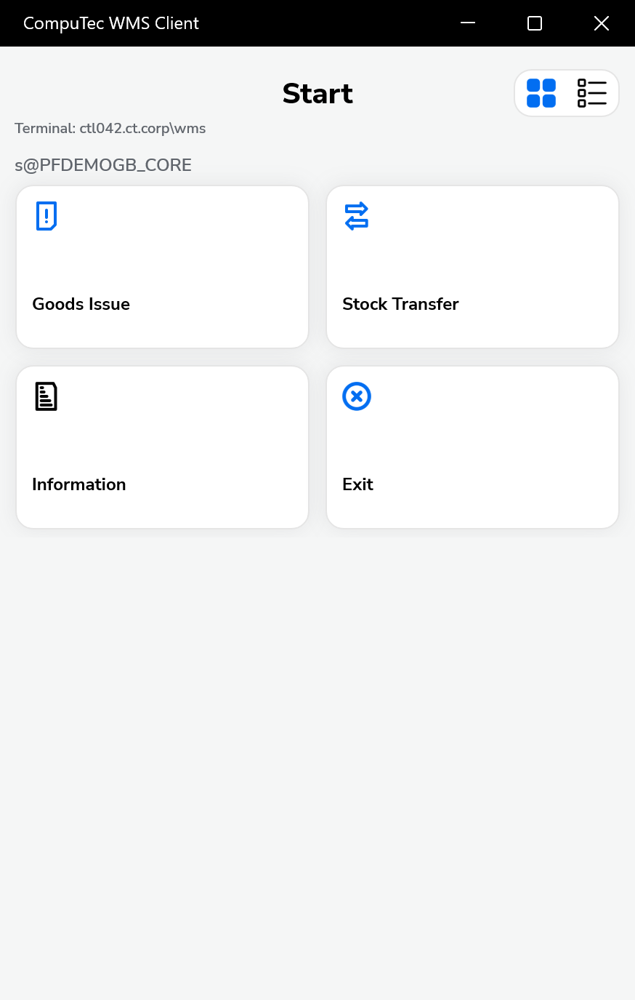

# Workflow Design Manager

The Interface Design Manager allows administrators to visually configure the layout of workflow screens used in CompuTec WMS. Through this tool, you can design the structure, appearance, and behavior of each transaction screen, ensuring that the user interface is optimized for operational efficiency.

This manager enables you to:

- Create menu templates
- Add, remove, or reorganize transactions
- Merge and configure layout grids
- Create multi-level containers
- Hide optional system buttons
- Assign custom icons to containers or transactions

---

## Activating the Option

Before creating or assigning templates, enable the feature:

- Navigate to [Custom Configuration](../../../custom-configuration/overview.md) → Manager tab.
- Select Enable Workflow Designer Manager.

This unlocks access to the template creator and layout designer.

## Creating a Template

Clicking Load Designer leads to the Select Template form. Choose a template on the left side of the form and click Delete to delete it or Load to open it.

In the new window on the left, there are available Templates; on the right, actions we can take:

- **New Template**: Create a new Template from scratch
- **Copy template**: Highlight a Template and click Copy template to create a copy
- **Load**: Highlight a Template and click Load to start editing it
- **Delete**: Highlight a Template and click Delete to remove it from the list.

## Editing

Clicking Load leads to Workflow Designer Manager, where it is possible to create a main menu template:

The form is divided into three panels:

- **The one on the left** is a mock-up of the application's main menu. Use the right-click context menu to add rows and columns. Doing so creates grids.
- **the center one** lists all of the transactions available from the application's main menu. Drag and drop it to the mock-up to fill a specific grid. You can drag and drop it back to the center panel to use it in another place.
  
    This panel also contains a Container element: it allows storing many transactions in one folder. Clicking a container on a main menu leads to another form with the container's content. It is possible to use container elements multiple times. It is also possible to create a multilevel menu using it. You can change a container's name using a context menu option.
- **the right one** contains general options: saving or canceling changes and saving and quitting the manager.

After adding some transactions to grids, it is possible to merge rows or columns. You can reach the option from a right-click context menu.

### Hide Options and Barcoder Setup Buttons

A new enhancement has been added to the configuration panel:

Settings:

- Hide barcoder setup button
- Hide options button

These settings appear on the right-side of the Interface Design Manager screen. Selecting these checkboxes allows administrators to:

- Remove advanced configuration buttons from the user interface
- Prevent operators from accessing setup-level screens
- Simplify the handheld user interface for operational clarity

Once enabled, the selected buttons will not be visible on the WMS client.

### Example

In the following example, we created a main menu template for users using Goods Issue and Stock Transfer transactions. We also use a container to group some of the informational options.

### Default Template

Workflow Designer Manager comes with one predefined template. If Interface Design Manager is not used, this template will be used by default. You cannot load it for editing. It can be copied and then edit the copy.

## Assigning a Template to a User

A template must be assigned to a specific SAP Business One user to work on.

Click the drop-down list next to Enable Interface Design Manager to choose a user to whom a template will be assigned. This action requires logging in to a database to download a list of users. After this, select a required user from a drop-down list.

Click Set Template, choose a template assigned to a user, and click Save.

You can now assign an icon to any container or transaction tile, making the interface more visual and easier to navigate.

:::warning
    Restarting the CompuTec WMS Server is required to apply the changes to a user.
:::
