# Interface Design Manager

The **Interface Design Manager** allows administrators to customize the layout and appearance of the **CompuTec WMS** client.

Using workflow templates, you can configure how the application's main menu is organized, control which transactions are available to users, group transactions into containers, customize line colors, and simplify the interface for warehouse operators.

With the **Interface Design Manager**, you can:

- create workflow templates,
- organize transactions,
- create multi-level menus,
- merge layout cells,
- assign custom icons,
- customize document line colors,
- hide selected interface buttons,
- assign templates to SAP Business One users.

## Enable the Interface Design Manager

Before creating or assigning templates, enable the feature.

1. Go to **Custom Configuration > Manager**.
2. Select **Enable Interface Design Manager**.
3. Select **Save**.

The **Interface Design Manager** becomes available.

## Create a template

1. Click **Load Designer**.

    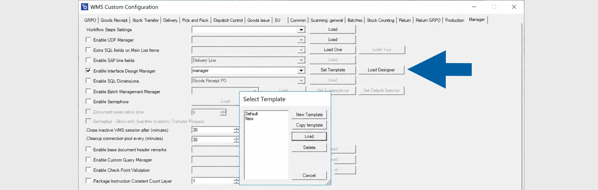

2. The **Select Template** window opens.
    From here, you can:
    - create a new template,
    - copy an existing template,
    - load a template for editing,
    - delete a template.

    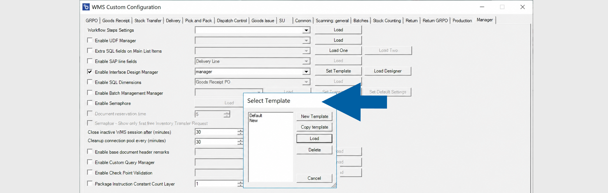

3. After selecting or creating a template, the **Interface Design Manager** opens.

## Design the workflow

The **Interface Design Manager** contains three working areas.

    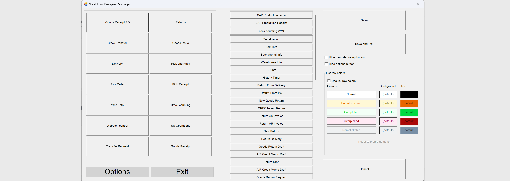

### Layout

The left panel displays the application's main menu.

Click **Options** to open the context menu, and then you can:

- add rows,
- add columns,
- merge rows and columns
- assign icons.

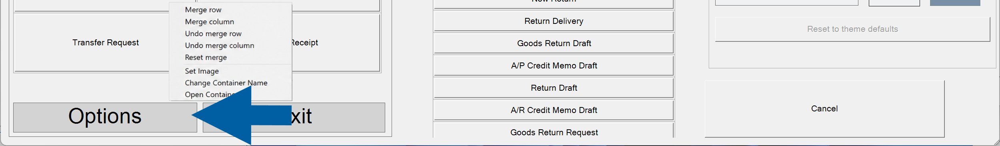

Drag transactions or containers into the layout to build the menu structure.

### Transactions

The center panel contains all available transactions.

Drag a transaction into the layout to make it available from the main menu.

To remove a transaction, drag it back to the transaction list.

### Containers

Containers allow you to group multiple transactions into a single menu item.

You can:

- create folders,
- rename containers,
- build multi-level menus by nesting containers.

### Configuration

The right panel contains options for saving the template and customizing the interface.

From here, you can:

- save changes,
- save and exit,
- cancel changes,
- hide selected buttons,
- customize document line colors.

After adding some transactions to grids, it is possible to merge rows or columns. You can reach the option from a right-click context menu.

## Hide interface buttons

To simplify the interface for warehouse operators, you can hide selected buttons.

Available options:

- **Hide barcoder setup button**
- **Hide options button**

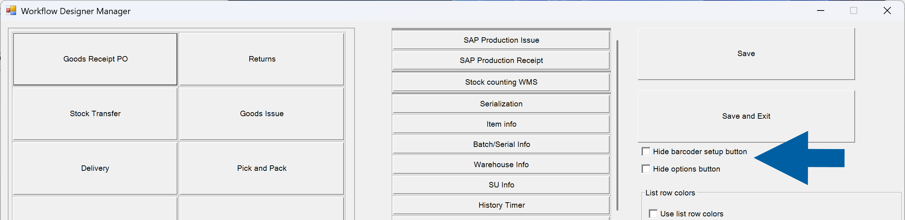

When enabled, the selected buttons are not displayed in the **CompuTec WMS** client.

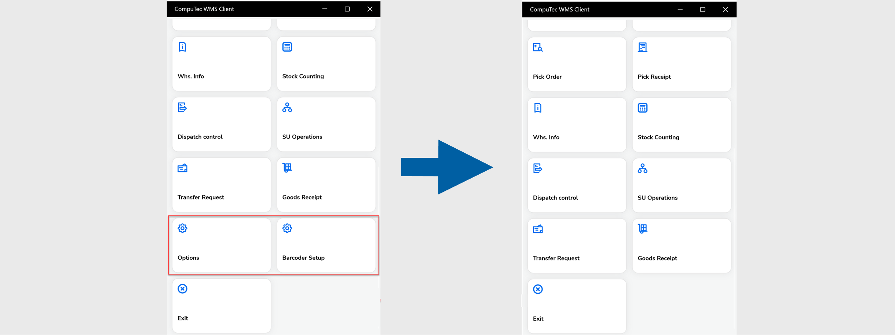

## Customize document line colors

You can customize the colors displayed for document lines in the **CompuTec WMS** client.

This makes it easier for warehouse operators to identify document statuses at a glance.

Available statuses include:

- **Normal**
- **Partially picked**
- **Completed**
- **Overpicked**
- **Non-clickable**

By default, each status uses the application's theme colors.

To use custom colors:

1. Select **Use list row colors**.

    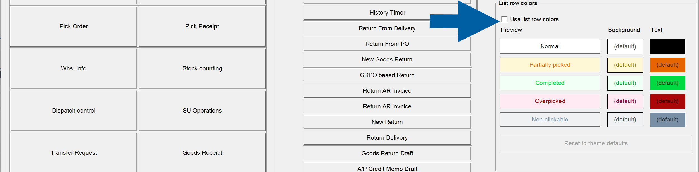

2. Select the background or text color for the required status.
3. Choose a color from the color picker.

    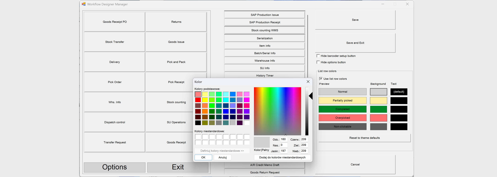

4. Select **OK**.
5. Save the template.

6. After assigning the template to a user, document lines are displayed using the selected colors in the **CompuTec WMS** client.

    For example:

    - completed lines can be displayed with a green background,
    - partially picked lines with a yellow background,
    - overpicked lines with a red background.

    

    :::info[note]
    Choose high-contrast colors to improve readability on handheld devices, especially in warehouse environments.
    :::

## Assign an icon

Icons make navigation easier by helping users quickly identify menu items.

You can assign custom icons to:

- transactions,
- containers.

To assign a custom icon, follow these steps:

1. Click **Options** in **Interface Design Manager**.
2. Click **Set Image**.

    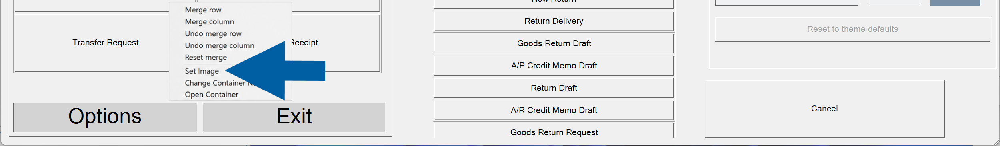

3. Select an image.

    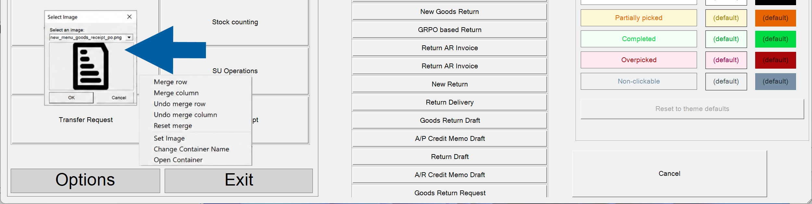

4. Click **OK**.
5. Save the template.

## Assign a template

A template becomes active only after it is assigned to a SAP Business One user.

1. In **WMS Custom Configuration** window, click the **drop-down list** next to **Enable Interface Design Manager**.

    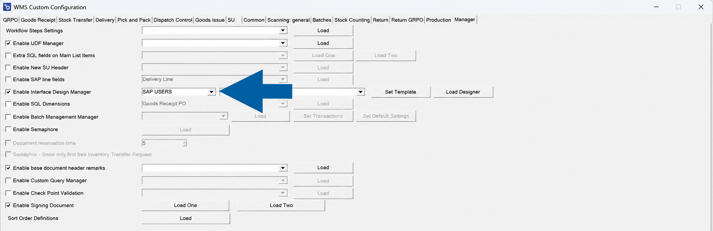

2. Select a user.
3. Click **Set Template**.

    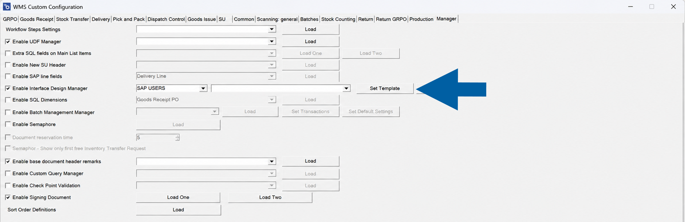

4. Choose the required template.
5. Select **Save**.

:::warning[important]

Restart the **CompuTec WMS Server** to apply the changes.
:::

## Default template

The **Interface Design Manager** includes one predefined template.

If no custom template is assigned, the default template is used automatically.

The default template cannot be edited directly.

To customize it:

1. Copy the default template.
2. Modify the copy.
3. Assign the copied template to users.

## Example

The following example shows a workflow template configured for warehouse operators working with **Goods Issue** and **Stock Transfer** transactions.

Informational functions are grouped into a separate container to keep the main menu simple and focused on daily operations.

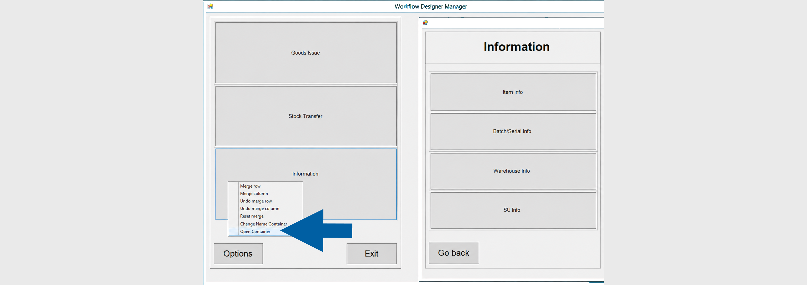
