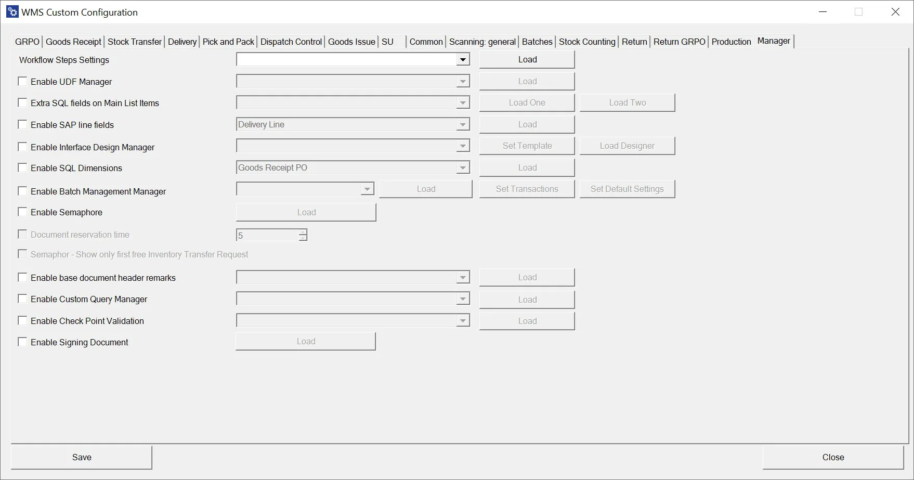
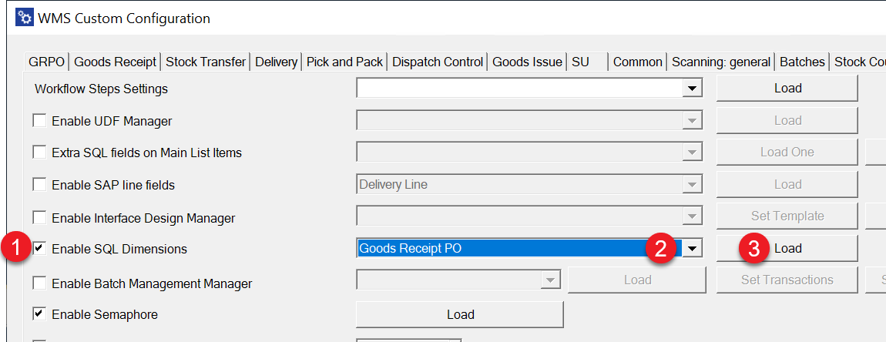
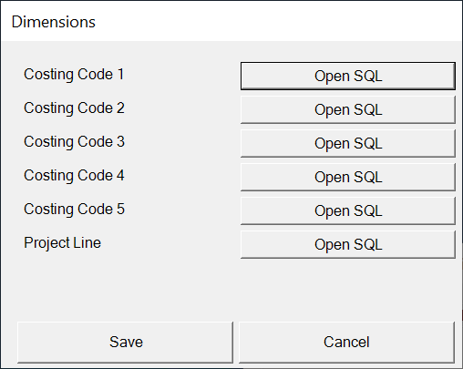
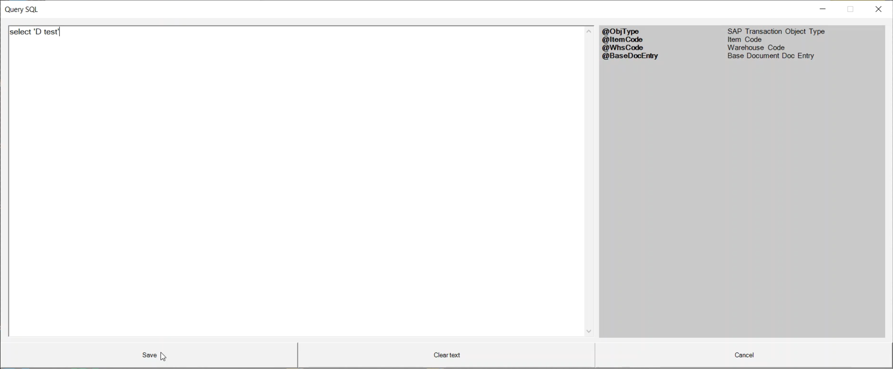

# Overview

**Workflow Step Settings** – allows choosing a workflow for a specific transaction. Click [here](../../../custom-configuration/custom-configuration-functions/manager/workflow-step-settings.md) to find out more.

**Enable UDF Manager** – UDF Manager allows to manage User Defined Fields during transactions.

**Extra SQL fields on Main List Items** – this option allows the display two additional values on the Item row on specific transactions. Click [here](../../../custom-configuration/custom-configuration-functions/manager/extra-fields-sql-in-main-list.md) to find out more.

**Enable SAP line fields** – this option allows the add document line fields to be displayed during transactions. Click [here](../../../custom-configuration/custom-configuration-functions/manager/sap-line-fields.md) to find out more.

**Enable Interface Design Manager** – this option allows to customize main menu options. Click [here](../../../custom-configuration/custom-configuration-functions/manager/interface-design-manager.md) to find out more.

**Enable SQL Dimensions** – allows for the automatic choice of dimensions in transactions based on an SQL query (instead of choosing it manually during a transaction). The option is available for Goods Receipt PO, Goods Receipt, Return, Return PO, Stock Transfer, Goods Issue, and Delivery.
    

    
Click here to find out more

    

    Check the checkbox (1), choose a required transaction from a drop-down list, and click Load (3):

    

    Choose a required Dimension by clicking the related 'Open SQL':

    

    Put in your SQL query and click 'Save.'
    
    

**Enable Batch Management Manager** – this option allows to define of FIFO behavior. Click [here](../../../custom-configuration/custom-configuration-functions/manager/batch-management-manager.md) to find out more.

**Enable Semaphore** – this option allows to activation of the Semaphore option in chosen transactions. Click here to find out more.

**Document reservation time** – period of a document being reserved for a specific user. Click [here](../../../custom-configuration/custom-configuration-functions/manager/semaphore.md#settings) to find out more.

**Semaphore** – Show only the first free Inventory Transfer Request – if checked, only the first open document will be available on the list of documents in the Inventory Transfer Request transaction (instead of all of the documents)

**Enable base document header remarks** – click [here](../../../custom-configuration/custom-configuration-functions/manager/enable-base-document-header-remarks.md) to find out more.

**Enable Custom Query Manager** – find out more information on this [here](../../../custom-configuration/custom-configuration-functions/manager/custom-query-manager/overview.md)

**Enable Check Point Validation** – find out more about it [here](../../../custom-configuration/custom-configuration-functions/manager/check-point-validation/overview.md).

**Package Instruction Constant Count Layer** - click [here](../../../custom-configuration/custom-configuration-functions/manager/package-instruction-constant-count-layer.md) to find out more.

**Enable Signing Documents** – find out more information on this [here](enable-signing-document.md).
