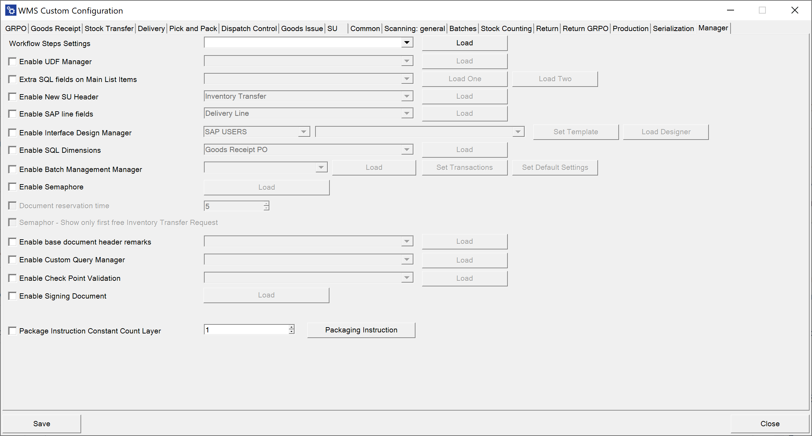

# Overview

Here’s a rundown of the key settings available in the Manager module

---

1. **Workflow Step Settings** – The Workflow Step Settings allow you to select a specific workflow for different types of transactions, helping to automate and standardize processes across the organization. To know more about "Workflow Step Settings", Click [here](../../../custom-configuration/custom-configuration-functions/manager/workflow-step-settings.md).

2. **Enable UDF Manager** – This option activates the User Defined Fields (UDF) Manager, which helps to manage custom fields during transactions, enabling greater data flexibility and customization.

3. **Extra SQL fields on Main List Items** – This setting allows you to display two additional SQL-based values in the item rows of select transactions, offering enhanced visibility for important data at a glance. To know more about "Extra SQL fields on Main List Items", Click [here](../../../custom-configuration/custom-configuration-functions/manager/extra-fields-sql-in-main-list.md).

4. **Enable New SU Header** - Allows you to display additional information on the Storage Unit Code bar.

5. **Enable SAP line fields** – This option enables document line fields to be visible during transactions, adding more context and detail to document interactions. To know  more about "SAP Line Fields", Click [here](../../../custom-configuration/custom-configuration-functions/manager/sap-line-fields.md) to find out more.

6. **Enable Interface Design Manager** – With the Interface Design Manager, users can customize main menu options, allowing a more personalized navigation experience within the SAP interface. To know more about "Interface Design Manager", click [here](../../../custom-configuration/custom-configuration-functions/manager/interface-design-manager.md).

7. **Enable SQL Dimensions** – This setting automates the choice of dimensions in transactions based on an SQL query, removing the need for manual dimension selection. It’s available for transactions like Goods Receipt PO, Stock Transfer, and Delivery.
    

    
Click here to find out more

    

    Check the checkbox (1), Select the desired transaction from the drop-down list, and click "Load" (3):

    

    Select the required Dimension by clicking the related 'Open SQL':

    

    Enter SQL query and click "Save".

    

    

    

8. **Enable Batch Management Manager** – This option enables you to define FIFO (First-In-First-Out) behavior for batch management, which helps optimize inventory control and management. To know more about "Batch Management Manager", click [here](../../../custom-configuration/custom-configuration-functions/manager/batch-management-manager.md).

9. **Enable Semaphore** – The Semaphore feature allows for concurrent transaction management by activating Semaphore for selected transactions. This helps prevent issues related to data access conflicts during simultaneous usage. Click [here](semaphore.md) to find out how to activate Semaphore.

10. **Document reservation time** – This option sets a reservation period for documents, ensuring they remain accessible exclusively to a designated user within a specified time frame. Click [here](../../../custom-configuration/custom-configuration-functions/manager/semaphore.md#settings) to find out more.

11. **Semaphore** – When enabled, only the first open document appears in the list during Inventory Transfer Requests, simplifying selection and reducing clutter.

12. **Enable base document header remarks** – This option enables remarks in the header of base documents, providing additional commentary or notes for reference. To know more about "Enable base document header remarks", click [here](../../../custom-configuration/custom-configuration-functions/manager/enable-base-document-header-remarks.md).

13. **Enable Custom Query Manager** – The Custom Query Manager allows the creation of custom SQL queries for specific requirements, enhancing flexibility in reporting and data access. To know more about "Custom Query Manager", click [here](../../../custom-configuration/custom-configuration-functions/manager/custom-query-manager/overview.md).

14. **Enable Check Point Validation** – This feature provides an added layer of validation to ensure data integrity and compliance with internal requirements. To know more about "Check Point Validation", click [here](../../../custom-configuration/custom-configuration-functions/manager/check-point-validation/overview.md).

15. **Package Instruction Constant Count Layer** - This setting allows the configuration of package instructions with a constant count layer for specific inventory management needs. To know more about "Package Instruction Constant Count Layer", click [here](../../../custom-configuration/custom-configuration-functions/manager/package-instruction-constant-count-layer.md).

16. **Enable Signing Documents** – This option enables document signing within the system, providing a secure way to authorize transactions. To know more about "Enabling Signing Documents", click [here](enable-signing-document.md).

---
