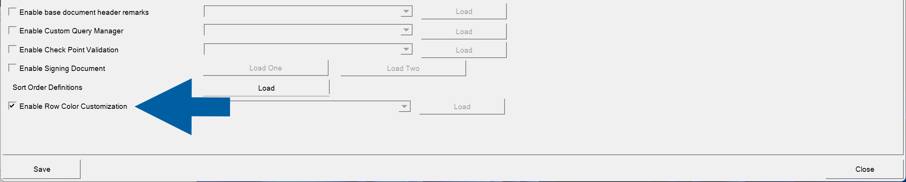
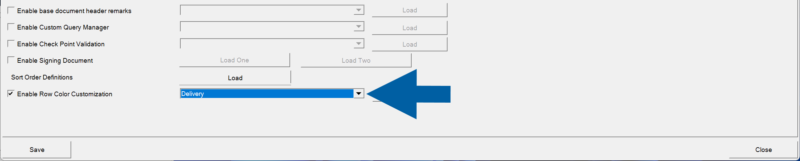
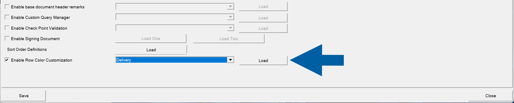
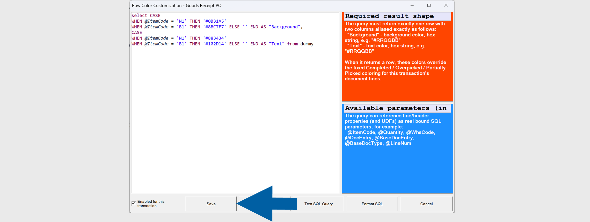
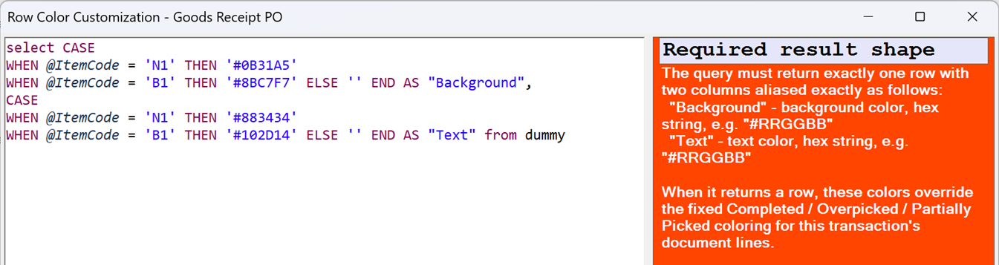

# Enable Row Color Customization

**Row Color Customization** allows you to apply custom background and text colors to document rows based on SQL query results. This helps users quickly identify specific items or document lines during warehouse operations.

You can define conditions using SQL and assign different colors when those conditions are met.

## Before you start

Before configuring this feature, ensure that:

- You have permission to modify the **WMS Custom Configuration**.
- The SQL query returns the required result format.
- The **WMS Server** is restarted after saving the configuration.

## Configure row color customization

To configure row color customization, follow these steps:

1. Open **WMS Custom Configuration**.
2. Select **Enable Row Color Customization**.

    

3. Select the transaction for which you want to configure row colors.

    

4. Click **Load**.

    

5. Enter your SQL query, amd click **Save**.

    

     :::info[note]

    The query must return exactly one row with the following two columns:

    | Column | Description |
    | --- | --- |
    | ``Background`` | Background color in hexadecimal format (for example, ``#RRGGBB``). |
    | ``Text`` | Text color in hexadecimal format (for example, ``#RRGGBB``). |

    :::

6. Restart the **WMS Server**.
7. Done! You've configured row color cutomization.

## Example

The following query changes the row colors based on the item code:

```sql
SELECT
CASE
    WHEN @ItemCode = 'N1' THEN '#0B31A5'
    WHEN @ItemCode = 'B1' THEN '#8BC7F7'
    ELSE ''
END AS "Background",
CASE
    WHEN @ItemCode = 'N1' THEN '#883434'
    WHEN @ItemCode = 'B1' THEN '#102D14'
    ELSE ''
END AS "Text"
FROM DUMMY;
```

    

## Result

When the SQL query returns a row, **CompuTec WMS** applies the returned colors to the corresponding document line.

If the query **does not** return color values, the **standard row colors** configured for the transaction are used.

    

## Additional information

- The SQL query can reference transaction parameters, including document header fields, line fields, and User-Defined Fields (UDFs).
- Available parameters are displayed in the SQL editor.
- The feature is configured separately for each transaction.
- Color values must be specified as hexadecimal color codes (for example, ``#0B31A5`` or ``#FFFFFF``).
- Restarting the **WMS Server** is required for configuration changes to take effect.
