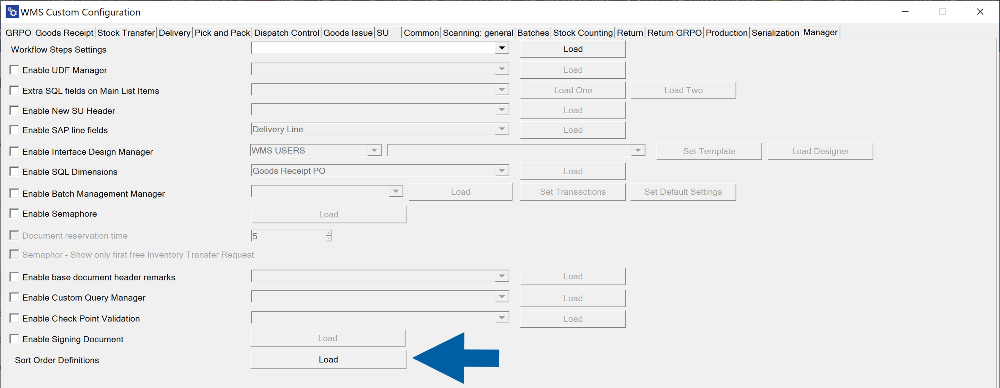
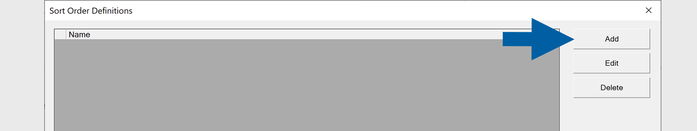
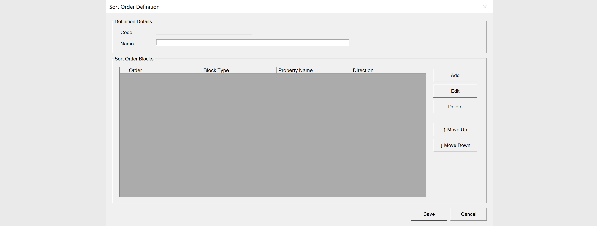
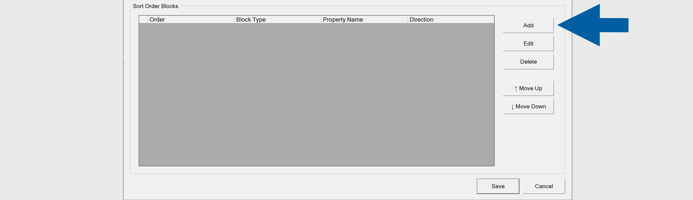
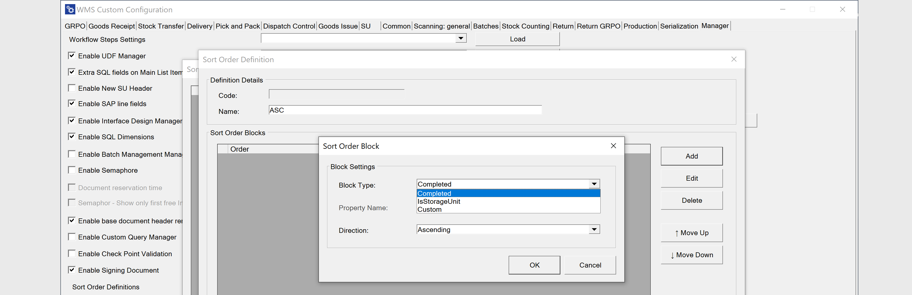

# Sort Order Definitions

The **Sort Order Definitions** feature allows you to control how document lines are displayed in the **Document Details** window in the **WMS client**.

By creating sorting templates, you can define custom sorting rules based on specific document properties. This helps users view and process document lines in a logical and operationally efficient order. For example, you can sort lines by completion status, or other available properties, in ascending or descending order.

Once configured, users can select the required sorting template directly in the **WMS client**.

## Settings

To configure **Sort Order Definitions**, follow these steps:

1. Go to **WMS Custom Configuration**.

2. Open the **Manager** tab.

3. Click **Load** next to **Sort Order Definitions**.

    

4. Done! The **Sort Order Definitions** window displays all available sorting templates.

To create a new **Sort Order Definition**, follow these steps:

1. In **WMS Custom Configuration** > **Manager** , click **Load** next to **Sort Order Definition**.

2. Click **Add**.

    

3. In the **Definition Details** section enter **Name** (this is the name displayed in the **WMS client**).

    

4. In the **Sort Order Blocks** section, click **Add** to define a sorting rule.

    

5. In **Sort Order Block** window, select the following fields:

    - **Block Type** – Defines the type of data used for sorting (for example, ``Completed``, ``IsStorageUnit``, or ``Custom``).
    - **Property Name** – Specifies the property to sort by (if applicable).
    - **Direction** – Select ``Ascending`` or ``Descending``.

    

6. Click **OK** to confirm the block.

7. Use **Move Up** or **Move Down** to adjust the priority of sorting blocks. The order of blocks determines sorting priority (top = highest priority).

8. Click **Save**.

You can also:

- Use **Edit** to modify an existing template.
- Use **Delete** to remove a template.

## Usage

Once a **Sort Order Definition** is created:

1. Open a transaction in the **WMS client** (for example, **Goods Receipt PO**).

2. Go to the **Document Details** screen.

3. Tap **More**.

    

4. Select **Sort Order Definition**. A list of available sorting templates will appear.

5. Select the required template (for example, ``ASC`` or ``DESC``). The document lines will immediately be reordered based on the selected sorting rules.

    

## Important Notes

- The sorting behavior depends on the defined **Block Type** and **Direction**.
- Multiple blocks allow layered sorting (primary, secondary, etc.).
- If no **Sort Order Definition** is selected, the default system sorting applies.
