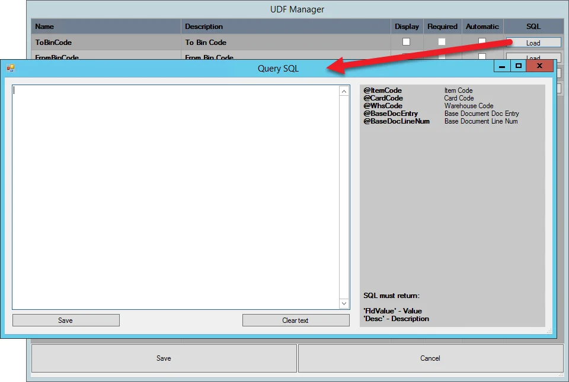
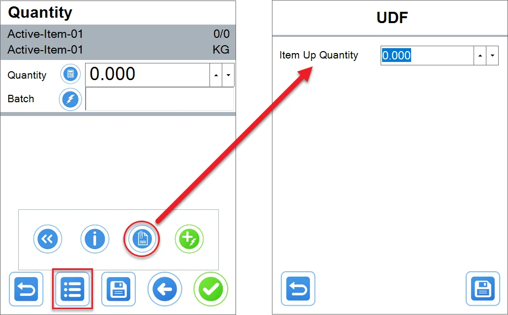
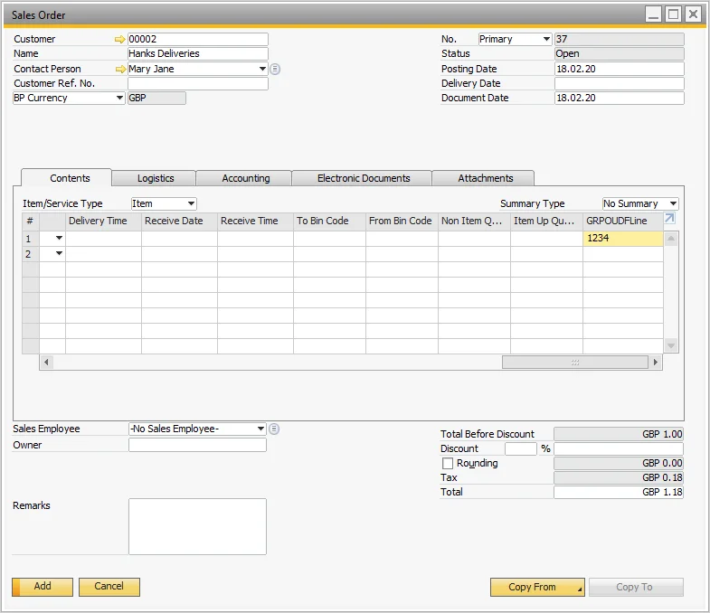
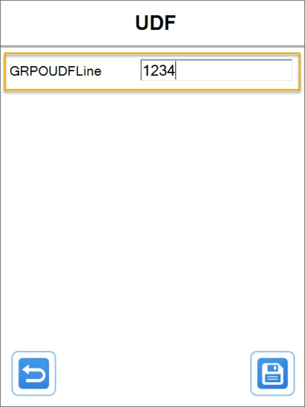

# UDF Manager

This guide provides an overview of the UDF (User-Defined Field) Manager tool in CompuTec WMS. The UDF Manager enables users to select which custom fields will be displayed at the document line level, providing flexibility and customization for specific business needs. UDFs are valuable for tailoring documents with additional information critical to your operations.

---

## General

### Prerequisites

Before utilizing UDF Manager in CompuTec WMS, UDFs must be defined in the database. For guidance on adding and managing UDFs, refer to the [Administrator's Guide](/docs/processforce/administrator-guide/udfs).

### Setting up

To enable and configure the UDF Manager:

1. Go to [Custom Configuration](../../../custom-configuration/overview.md) options > Manager tab
2. check the Enable UDF Manager check box
3. Select a document type from the drop-down list for which UDFs will be added:

    

4. You can configure values either for a header (e.g., Goods Receipt PO Document) or a document line (e.g., Goods Receipt PO Line).

5. Once you've selected the desired document type, click Load. This action requires entering your SAP Business One database credentials. A list of UDFs defined for the selected document type will then be displayed.

    

There are Name and Description fields along with three check boxes; when checked:

- **Display**: shows the UDF in the application
- **Required**: UDF is required to be filled before moving through the workflow.
- **Automatic**: UDF automatically fills the application with a query result. Click Load next to a specific line to go to the query form:

    

Now, the chosen UDFs will be displayed on lists during transactions.

You can change the order of the fields by dragging and dropping its line on the UDF Manager list (be sure to click and hold text from the Name or Description column).

#### Revision and Revision Description fields

For these UDFs, it is required to load an SQL query in Custom Configuration UDF Manager to get the UDFs displayed in CompuTec WMS:


```sql
SELECT "U_Code" AS "FldValue", "U_Code" AS "Desc" FROM "@CT_PF_IDT1" WHERE "U_ParentItemCode" = @ItemCode
```

```sql
SELECT "U_Description" AS "FldValue", "U_Description" AS "Desc" FROM "@CT_PF_IDT1" WHERE "U_ParentItemCode" = @ItemCode
```

Then, in CompuTec WMS, the user will be able to choose a revision and its description that matches the item

With this setup, the user can choose Revision and its description that matches the Item from CompuTec WMS level.

## Usage

### Document UDFs

Document UDFs are available on the Remarks screen:


Set up the required value, click the Save icon to save it, and return to the Remarks screen.

Click an arrow icon to go back to the Remarks screen without saving.

### Line UDFs

Line UDFs are available from specific line screens in the transactions:



### Example

Example

In this example, we want to add a UDF with a Bin location, to which we want to move Items on creating Inventory Transfer. We do not want to add value, but choose one from a drop-down list.

- Check the UDF Manager checkbox, choose Inventory Transfer Line, and click Load.
- Check the Display option on the ToBinCode line and click Load.
- Put in the following query:

    ```sql
    select "BinCode" as "FldValue", "BinCode" as "Desc" from OBIN
    ```

#### Result

The field is available by clicking a UDF icon to set up the details of an item chosen to be transferred.


## Base Document UDFs

UDFs from base documents are available on the following transactions:

- Goods Receipt PO From **Purchase Order**
- Goods Receipt PO From **A/P Invoice**
- Stock Transfer From **Transfer Request**
- Return From **Delivery**
- Return From **Goods Receipt PO**
- Delivery From **Sales Order**
- Delivery From **Pick Lists** (same as **Sales Orders**)
- Delivery From **A/R Reserve Invoice**
- CompuTec ProcessForce Pick Order From **Pick Order**
- CompuTec ProcessForce Pick Receipt From **Pick Receipt**/all Pick Receipts.

### Example Usage

#### Prerequisites

Choose a base document (one of the bold ones above), for example, **Sales Order**.
Add a UDF to "Marketing Documents->Rows" in SAP Business One (click [here](/docs/processforce/administrator-guide/udfs) to find out more about working with UDFs).


Create a base document with UDFs filled in:



In Custom Configuration in the Manager tab, check "Enable UDF Manager," and then choose "Delivery Line" and press "Load". Check "Display" on the UDF that's been added:


#### Usage in the application

- Open CompuTec WMS
- Choose Delivery
- Choose From the Sales Order
- Select a previously created Sales Order
- Select the first line
- Press the UDF button.

    
- UDF should be filled in:

    

## SU UDFs

Click [here](../../../../user-guide/storage-units/su-udfs.md) to find out more about SU UDFs.

---
The UDF Manager is a powerful tool in CompuTec WMS, allowing users to tailor documents and workflows to their unique requirements. By defining, displaying, and automating UDFs, businesses can enhance data accuracy and streamline their processes. Use this guide to make the most of the UDF Manager and customize your CompuTec WMS experience efficiently.
