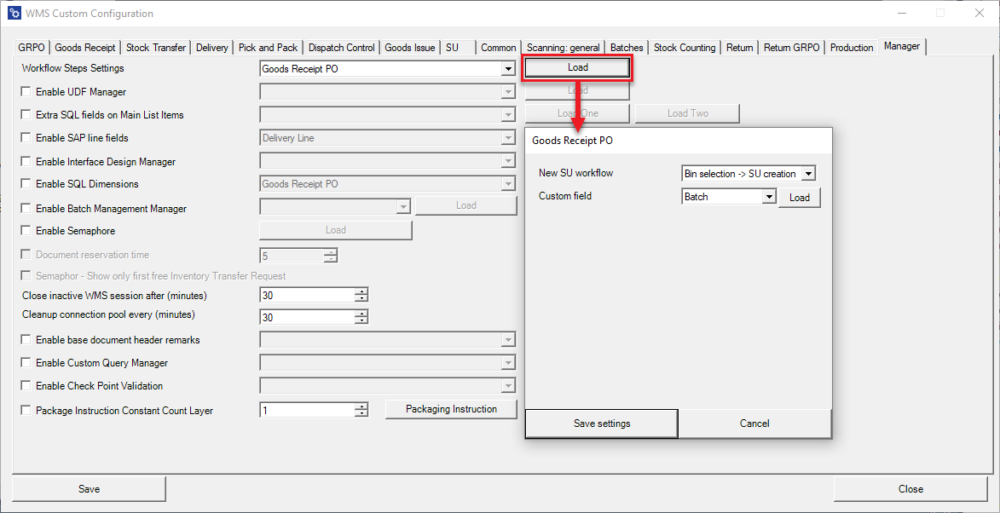
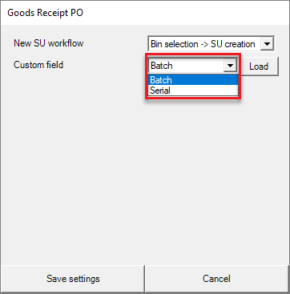
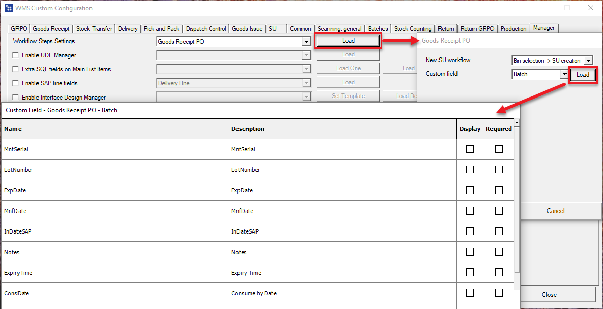
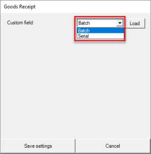
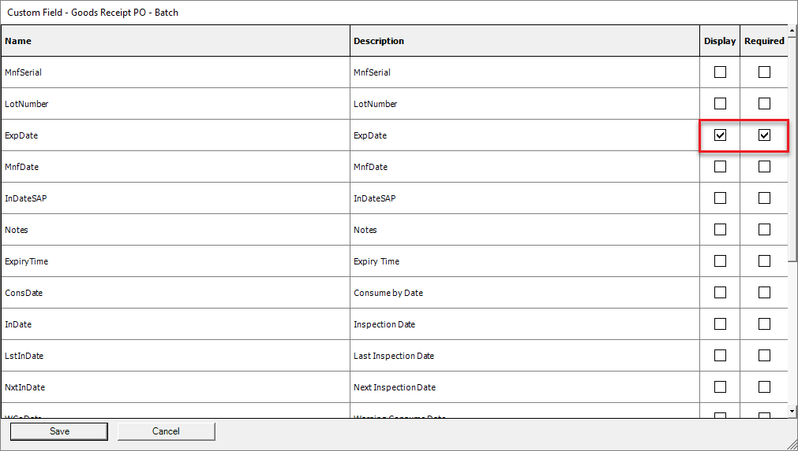
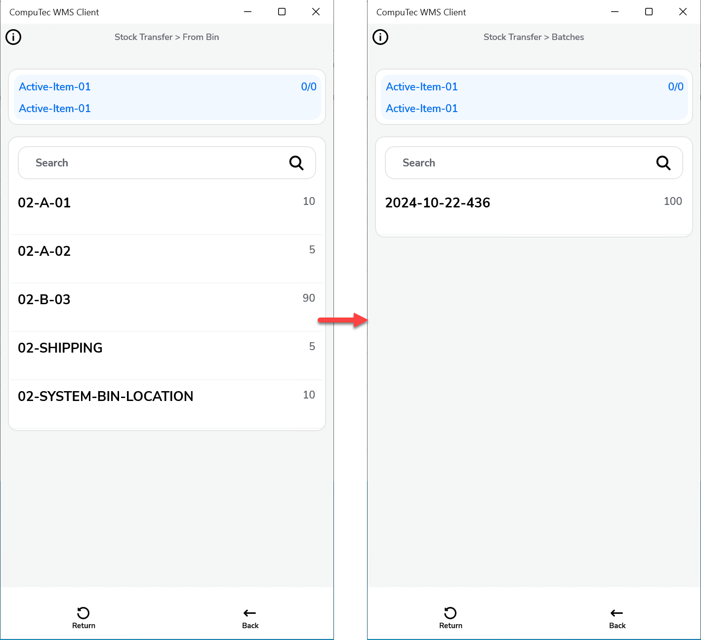
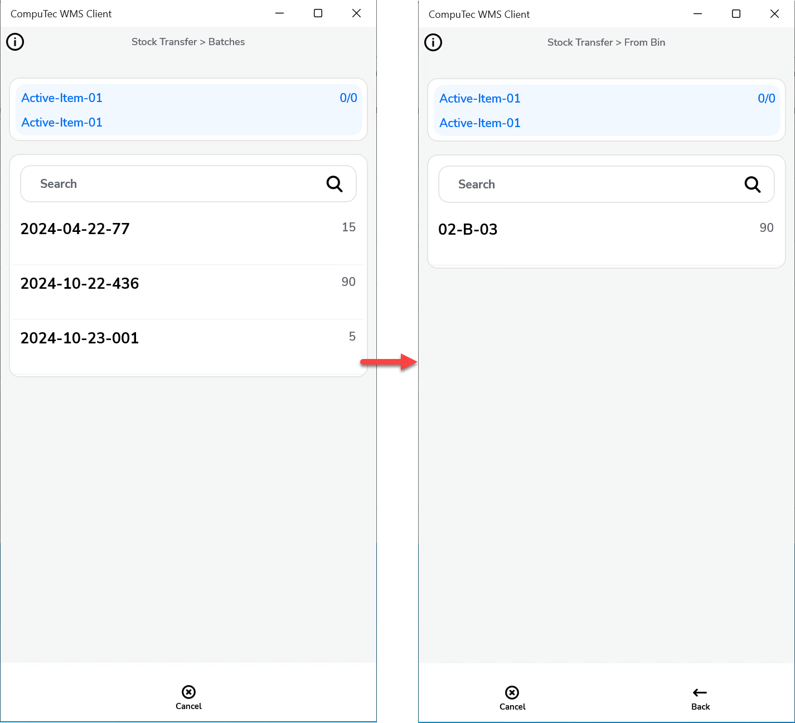
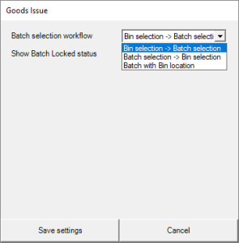

# Workflow Step Settings

The Workflow Step Settings provide a structured way to configure and customize the flow of transactions within your system. These settings define the sequence and requirements for different warehouse and inventory management operations, ensuring a smooth and efficient process. This guide explores the available transaction types, the workflows associated with them, and how you can customize fields and settings to suit your business needs.

---

There are seven transactions available for configuration, each with a set of possible workflows. You can select a transaction from the drop-down list and click Load to view and adjust the settings.

1. Delivery.

    For the Delivery transaction, three workflow options are available:
      - Bin selection → Batch selection
      - Batch selection → Bin selection
      - Batch with Bin location

2. Goods Receipt PO

  

  New SU workflow – two workflows are available for this transaction.
  Bin selection → SU creation (choosing localization first, then SU creation): SU creation will be then possible only on this on localization.
  
  Additionally, you can add custom fields that will be displayed for items managed by batches or serial numbers:

    
    

3. Goods Receipt

  For the Goods Receipt transaction, it's possible to add custom fields for items managed by batches or serial numbers. These fields can be set as required, ensuring users cannot proceed to the next step without completing them.

     

4. Inventory Transfer

    There are three workflow options available for the Inventory Transfer transaction:
    1. Bin selection → Batch selection
    2. Batch selection → Bin selection
    3. Batch with Bin location (Batch number for a specific location)

    
    
    **Examples**:

      1. Bin selection → Batch selection
  
        

      2. Batch selection → Bin selection
  
        

5. Goods Issue

    There are three possible workflows for this transaction:

    1. Bin selection → Batch selection
    2. Batch selection → Bin selection
    3. Batch with Bin location (Batch number in a specific Bin location)
  
    

6. ProcessForce Pick Order

  There are three possible workflows for this transaction:
    1. Bin selection → Batch selection
    2. Batch selection → Bin selection
    3. Batch with Bin location (Batch number in a specific Bin location)

    

7. ProcessForce Pick Receipt

  For Goods Receipt transactions, it is possible to add a custom field that will be displayed for Items managed by Batches or Serial Numbers. The fields can be set as required, and it will not be possible to go to the next step without filling them out.

---
The Workflow Step Settings allow you to tailor the transaction process to meet your specific business requirements. Whether you are managing deliveries, goods receipts, inventory transfers, or pick orders, the ability to configure the workflow and customize fields enhances operational efficiency and accuracy. By choosing the appropriate workflow options and adding custom fields, you ensure that each transaction follows a logical sequence that meets your organizational needs.
