# Workflow Step Settings

There are seven transactions to choose from. Choose one from the drop-down list and click Load.

- Delivery.

    Three options are available:
      - Bin selection → Batch selection
      - Batch selection → Bin selection
      - Batch with Bin location
- Goods Receipt PO
  

  
Click here to expand

  

  

  New SU workflow – two workflows are available for this transaction.
  Bin selection → SU creation (choosing localization first, then SU creation): SU creation will be then possible only on this on localization.
  Here, you can check an example SU creation → Bin selection workflow:

  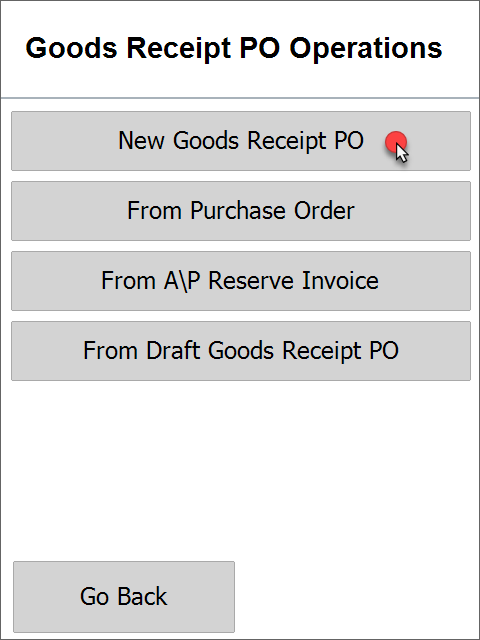 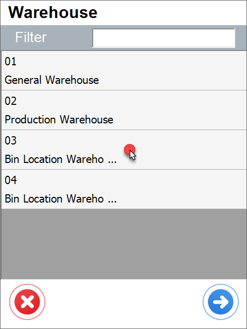 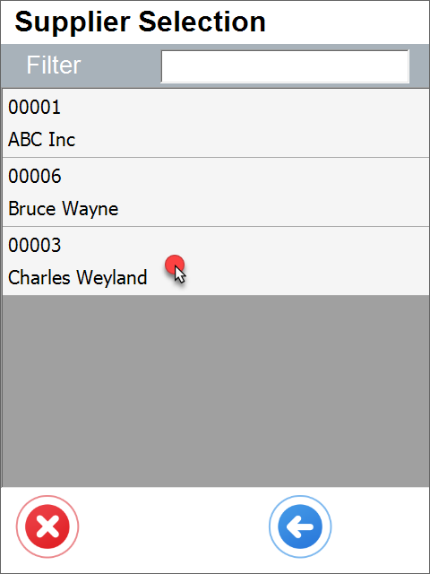 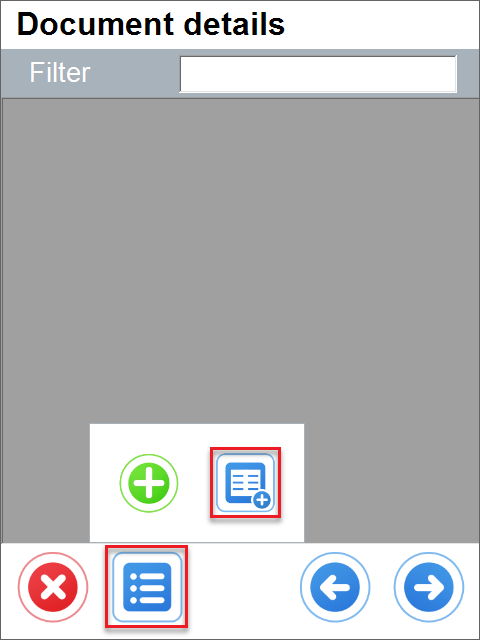 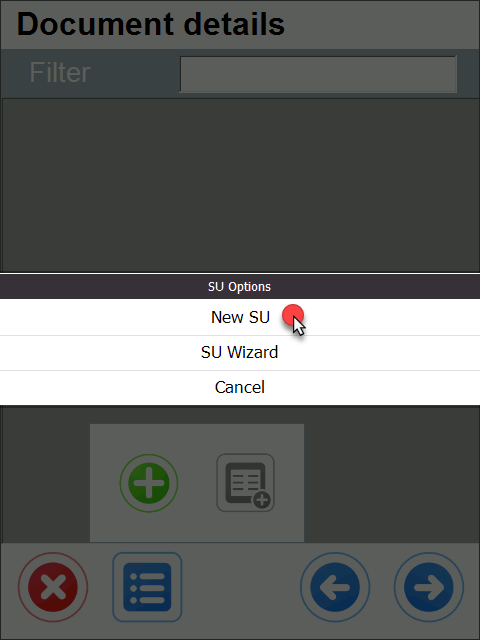 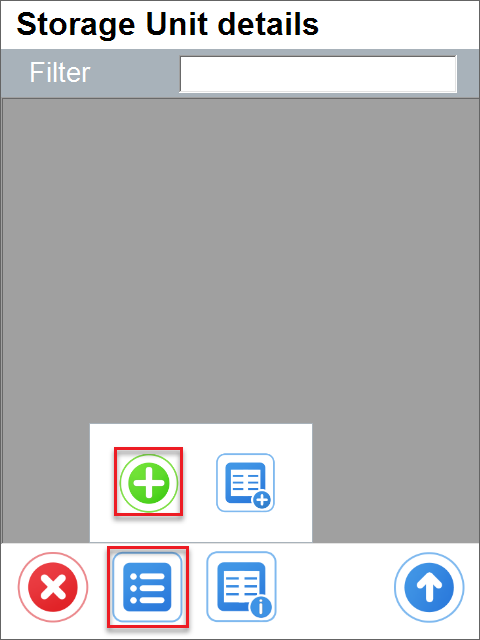 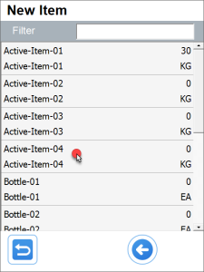 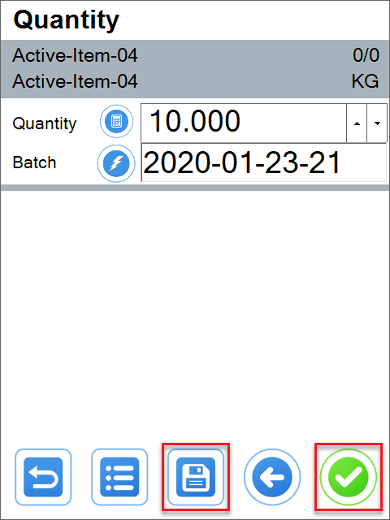 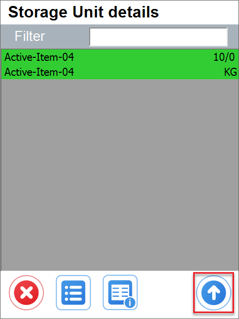 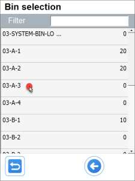 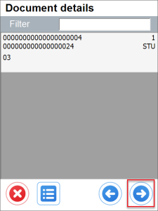

  It is also possible to add a custom field that will be displayed for Items managed by Batches or Serial Numbers:

  
  
  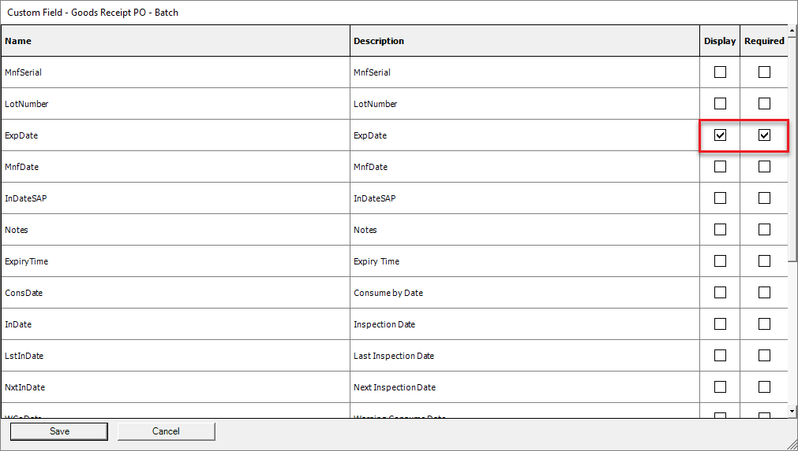
  

  

- Goods Receipt
  

  
Click here to expand

  

  For Goods Receipt transaction, it is possible to add a custom field that will be displayed for Items managed by Batches or Serial Numbers. The fields can be set as required, and it will be impossible to go to the next step without filling them out.

    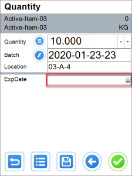 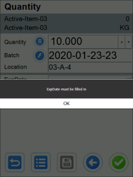
  

  

- Inventory Transfer
    There are three possible workflows for this transaction:
    1. Bin selection → Batch selection
    2. Batch selection → Bin selection
    3. Batch with Bin location (Batch number for a specific location)
    
    

    
Click here to expand

    

    **Examples**:
    1. Bin selection → Batch selection
  
     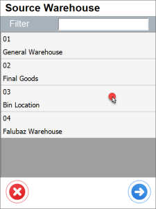 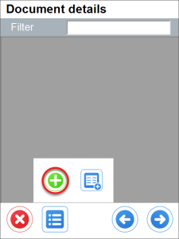 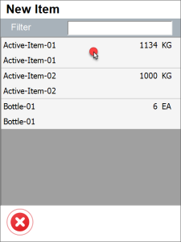  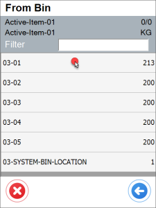 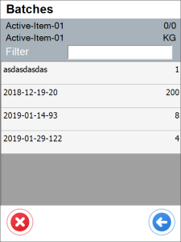
    2. Batch selection → Bin selection
  
    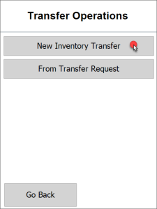     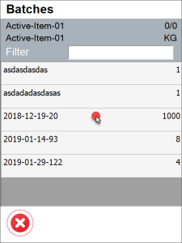 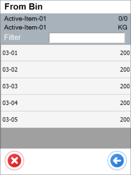
    

    

- Goods Issue
    There are three possible workflows for this transaction:
    1. Bin selection → Batch selection
    2. Batch selection → Bin selection
    3. Batch with Bin location (Batch number in a specific Bin location)
    
    

    
Click here to expand

    

    **Examples**:
    1. Bin selection → Batch selection.
  
    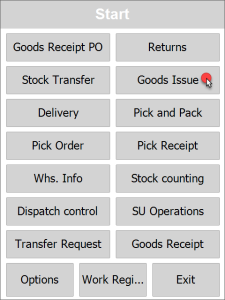 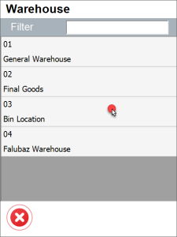 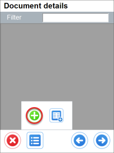 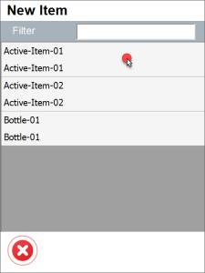 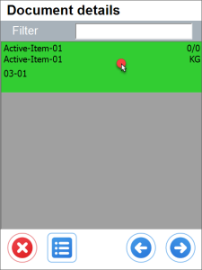 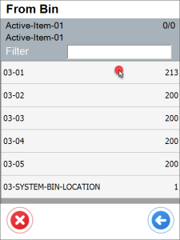 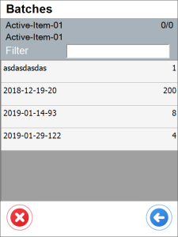
    2. Batch selection → Bin selection.
  
          
    3. Batch with Bin location.
    

    

- PF Pick Order
  There are three possible workflows for this transaction:
  1. Bin selection → Batch selection
  2. Batch selection → Bin selection
  3. Batch with Bin location (Batch number in a specific Bin location)

  
  

  
Click here to Expand

  

  **Examples**:
    1. Bin selection → Batch selection.
  
    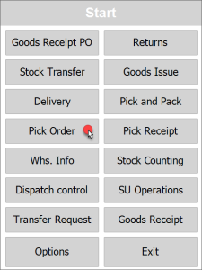 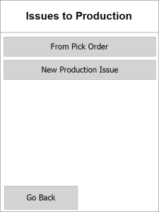 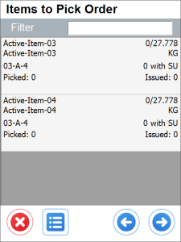 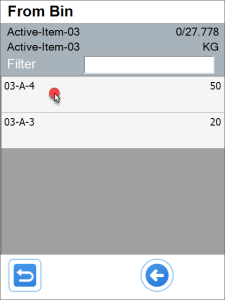 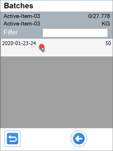 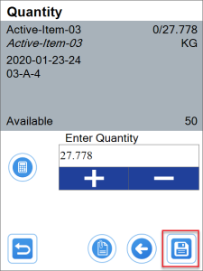
    2. Batch selection → Bin selection
  
       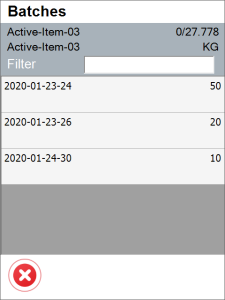 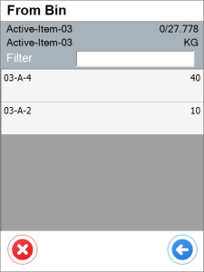 
  

  

- PF Pick Receipt
For Goods Receipt transactions, it is possible to add a custom field that will be displayed for Items managed by Batches or Serial Numbers. The fields can be set as required, and it will not be possible to go to the next step without filling them out.
