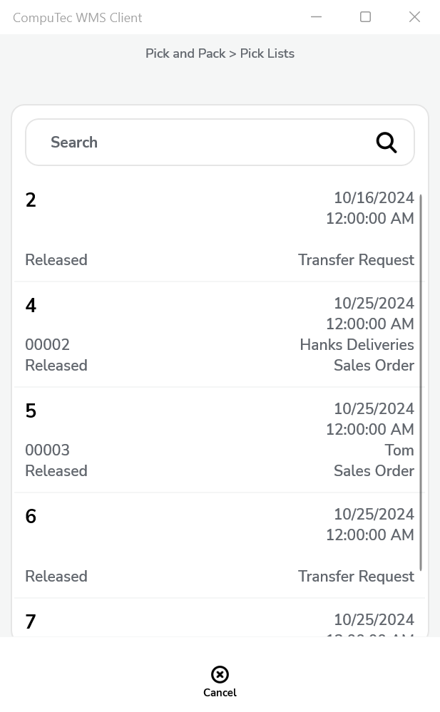
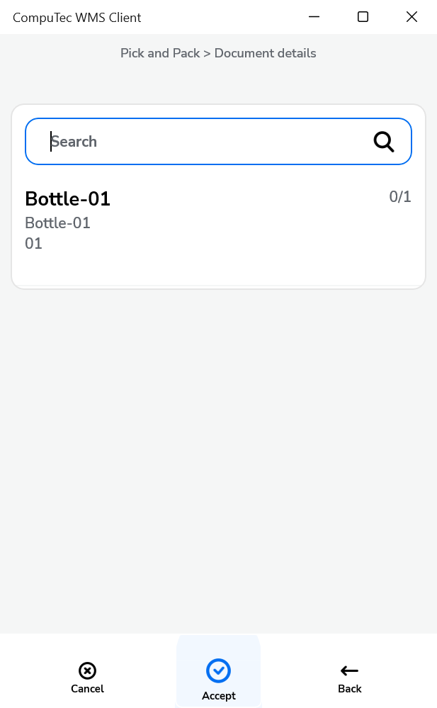
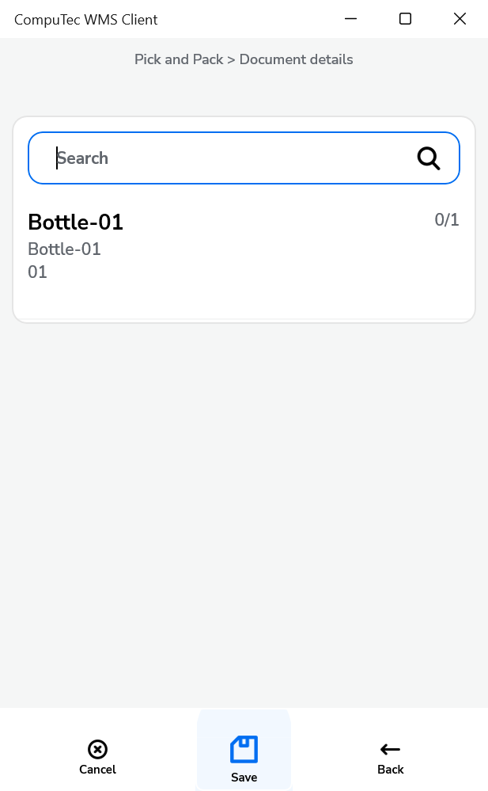
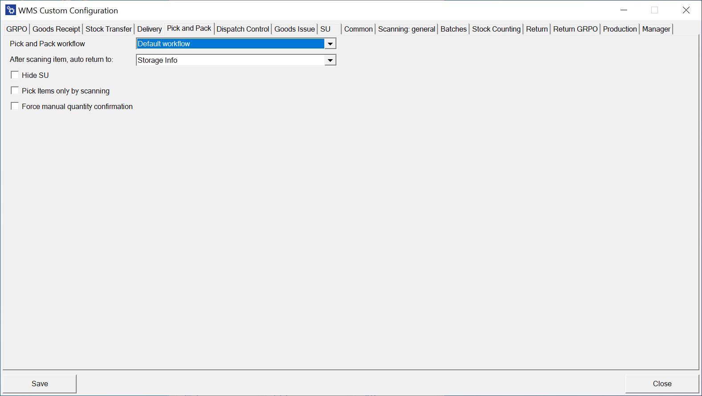
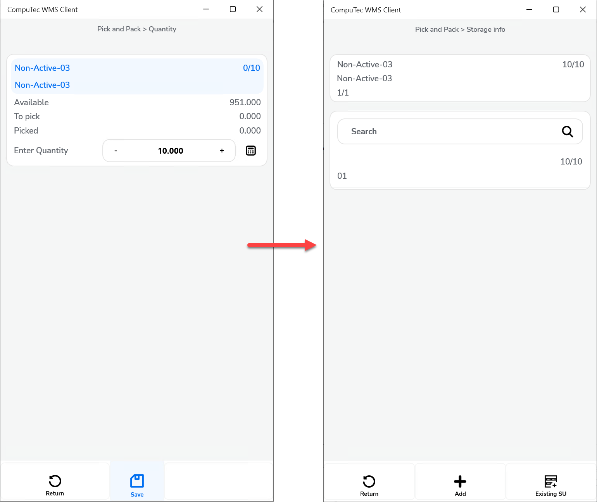
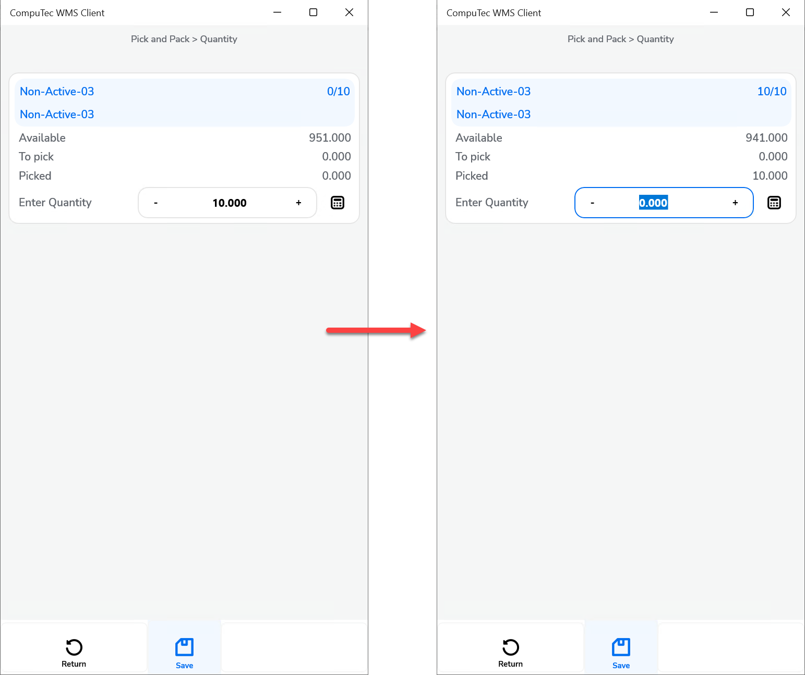
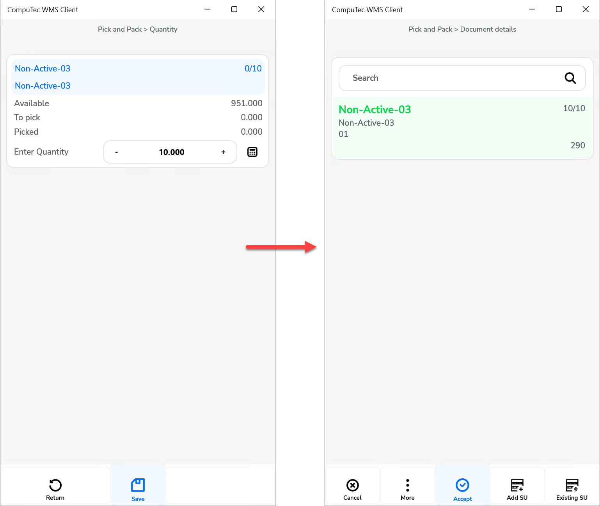

# Pick and Pack

## Old Pick and Pack

For version **2.10.21.4**, the custom configuration for Pick and Pack would look like the screenshot attached below:

**Pick and Pack Workflow** - you can choose the order of data entering. Available options: Default Workflow, Customer-Date Workflow, Date-Customer Workflow.
    

    
Click here to expand

    

    **Default Workflow**

        

    **Customer-Date Workflow**

        

    **Date-Customer WorkFlow**

        
    

    

**Update all picked content on transaction completion** – all chosen during transaction information is saved on saving a transaction (the data selected from during the transaction is not held until clicking the save button at the end of the transaction).
    

    
Click here to expand

    

    **Before marked**

        

    **After marked**
    
        
    

    

**Enable adding Item Details when Warehouse has Bin Locations** – allows adding Item details when in a Warehouse receipt, Bin locations are defined and quantities are not allocated.

**Pick Items only with scanning** – allows picking an Item only by scanning a barcode (cannot choose an Item manually).

**Force Manual quantity confirmation** – with this option checked, it is required to manually confirm previously set up quantity (scanning a barcode does not confirm it automatically).

**Enable over-picking to base open document quantity** – checking the option allows you to set quantity higher than on the related base document (leaving this checkbox unchecked blocks it).

## New Pick and Pack

From version **2.10.22.1**, the custom configuration for Pick and Pack would look like the screenshot attached below:

    

Pick and Pack Workflow - you can choose the order of data entering. Available options: Default Workflow, Customer-Date Workflow, Date-Customer Workflow.
    

    
Click here to expand

    

    **Default Workflow**

        

    **Customer-Date Workflow**

        

    **Date-Customer WorkFlow**

        
    

    

**After scanning item, auto return to: Storage Info, Quantity and Document Details** - This option allows you to change the window to which the application will go after setting and confirming the quantity for an Item.

    

    
Click here to expand

    

    **Storage Info**

        

    **Quantity**

        

    **Document Details**

        
    

    

**Hide SU** - Options related to the creation or adding of a Storage Unit (SU) are not visible.

**Pick Items only with scanning** – allows picking an Item only by scanning a barcode (cannot choose an Item manually).

**Force Manual quantity confirmation** – with this option checked, it is required to manually confirm previously set up quantity (scanning a barcode does not confirm it automatically).

## Changes

Old view of Pick and Pack tab:

    

Extra field in Pick and Pack query option has been removed.

It is possible to use this functionality by creating a specific SQL query in Custom Query Manager > Pick and Pack option:

    

In this example it is Customer List For Date Pick List:

    

In this example four fields are available and by default two of them are set up:

    
