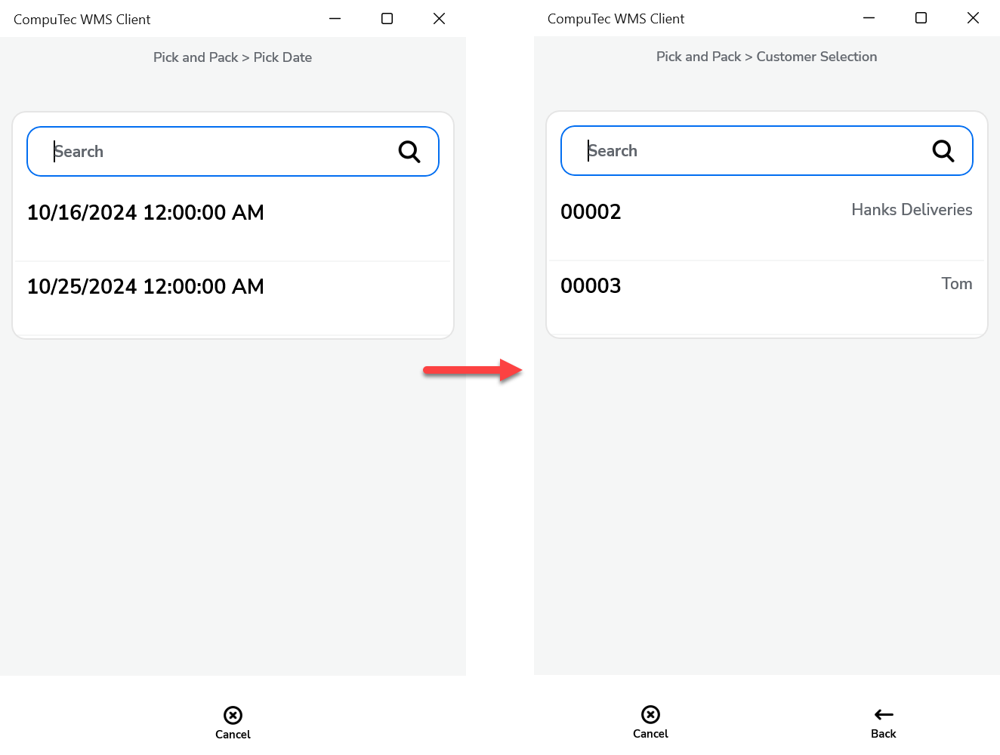
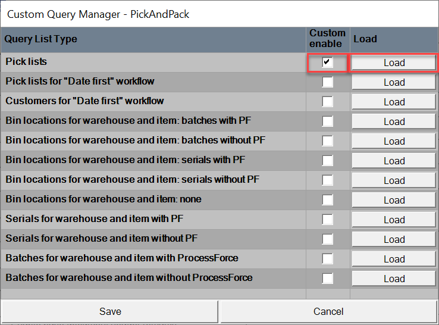

# Pick and Pack

**Pick and Pack Workflow** - you can choose the order of data entering. Available options: Default Workflow, Customer-Date Workflow, Date-Customer Workflow.
    

    
Click here to expand

    

    **Customer Date Workflow**

         

    **Date-Customer WorkFlow**
         

    **Default Workflow**

        
    

    

**Update all picked content on transaction completion** – all chosen during transaction information is saved on saving a transaction (the data selected from during the transaction is not held until clicking the save button at the end of the transaction).
    

    
Click here to expand

    

    **Before marked**

        

    **After marked**
    
        
    

    

**Enable adding Item Details when Warehouse has Bin Locations** – allows adding Item details when in a Warehouse receipt, Bin locations are defined.

**Pick Items only with scanning** – allows picking an Item only by scanning a barcode (cannot choose an Item manually)

**Force Manual quantity confirmation** – with this option checked, it is required to manually confirm previously set up quantity (scanning a barcode does not confirm it automatically)

**Enable over-picking to base open document quantity** – checking the option allows you to set quantity higher than on the related base document (leaving this checkbox unchecked blocks it).

## Changes

Old view of Pick and Pack tab:
    
Extra field in Pick and Pack query optionhas been removed.

It is possible to use this functionality by creating a specific SQL query in Custom Query Manager > Pick and Pack option:
    

In this example it is Customer List For Date Pick List:
    

In this example four fields are available and by default two of them are set up:
    
