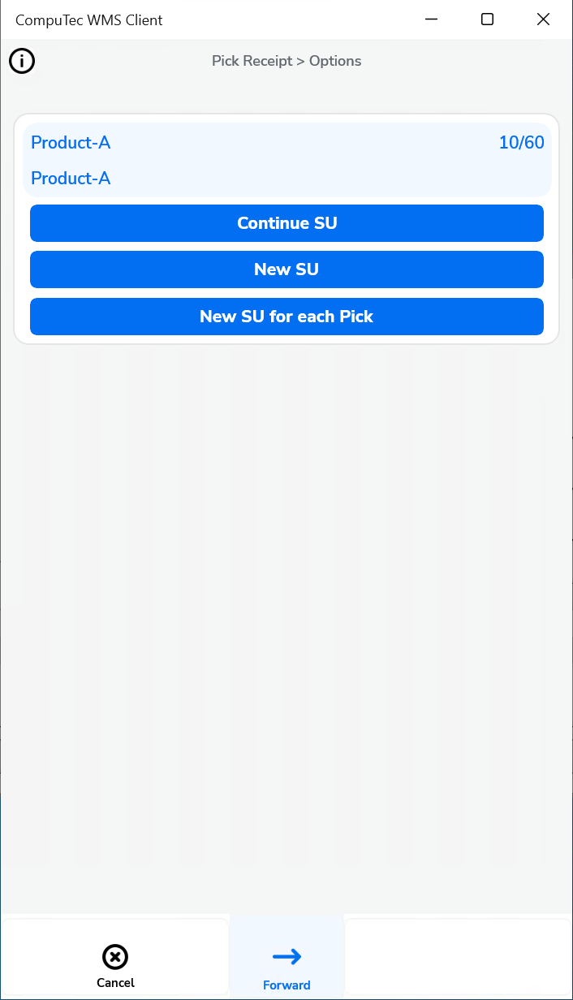
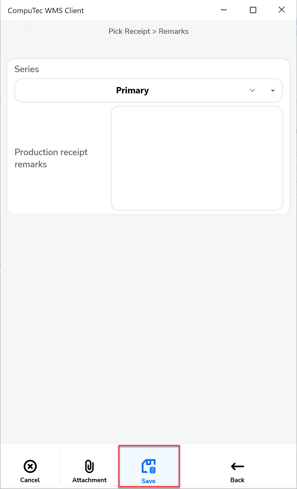
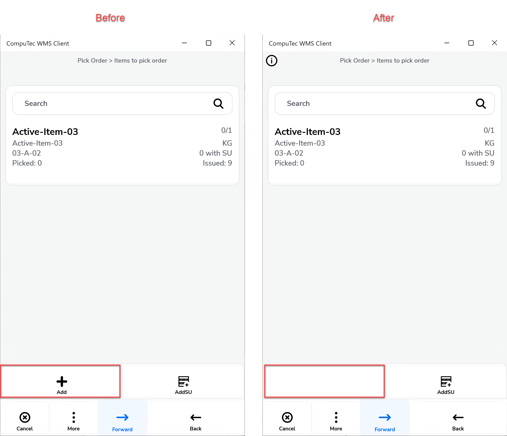

# Production

Effective management of production processes and inventory is crucial for businesses aiming to optimize their operations and maintain smooth workflows. The configurations available offer a wide range of options to streamline processes, control inventory movements, and enhance data accuracy.

---

## CompuTec ProcessForce Pick Receipt tab

**After picking, auto return to** – Specifies the form the application navigates to after confirming the picking quantity for a document line, with options like None, Document Details, or Remarks.
    

    
Click here to expand

    

    **Document Details Workflow**

        

        **Remarks**

        
    

    

**CompuTec ProcessForce Pick Receipt PopUp Timer checkpoint** – Configures checkpoints during the picking process, such as None, Select the base document, Select Item on the list, Pick quantity to the first line, Save Document

**Scan DocNum on Base Document** – Enables scanning using DocNum instead of DocEntry when accessing the Pick Receipt or Manufacturing Order window.

**Show only picked items from all pick receipts** – Filters the list to display only items with a picked quantity greater than zero.

**Show only Final Good Item** – Limits the displayed items to the Final Good Item only.

**Block creation of new Pick Receipts** –  Prevents users from creating new Pick Receipts, allowing work only on those generated in SAP. Enabling this option disables the following option: "Create new Pick Receipt when a new Manufacturing Order is added."

**Create a new Pick Receipt when a new Manufacturing Order is added** – Automatically generates a new Pick Receipt rather than adding items to an existing one when a new Manufacturing Order is added.

**Set Storage Unit default action and Skip Storage Unit options** – Provides options to create new storage units or continue with the last created unit after selecting a line. Choosing a default action like "New SU" or "New SU Each Pick" automatically skip displaying Storage Unit options.

    

    
Click here to expand

    

    After selecting a line, users can choose to create new storage units or continue packing the most recently created one.

    Selecting a default action, such as "New SU" or "New SU Each Pick" will automatically skip displaying Storage Unit options.

        
    

    

**Show extra field on Pick Batch Workflow** – Shows an additional field during batch selection if an SQL query is provided and the "Load" button is pressed:

    

**Copy available quantity to Quantity box** – Automatically copies the remaining quantity to the quantity box during picking.

**Force manual quantity confirmation** – Disables the "Fast Scan" feature, requiring manual confirmation (e.g., pressing the save button) before adding scanned items.

**Overwrite already picked batches** – When a batch is already picked for a line, selecting it again in WMS replaces the existing quantity instead of adding to it.

**Receipt from production always to default Bin Location** – Automatically assigns the default bin for receipts in warehouses with bin locations, preventing selection of alternate bins.

**Keep selected Bin Location after adding an item** – Keeps the Bin Location field unchanged after picking an item.

**Do not clear Batch, Serial, and quantity after picking an item** – Prevents these fields from being cleared after an item is picked, as opposed to previous versions.

**No automatic batch generation on saving Pick Receipt** – Requires manual entry of batch numbers when picking batch items, instead of generating them automatically.

**Do not update the Pick Receipt each time an Item is picked** – Stops automatic updates of the Pick Receipt document after every pick. Users must manually save the transaction in the Remarks window, which will generate a Goods Receipt document by default.

**Do not create Goods Receipt at the end of the transaction** - Prevents automatic creation of a Goods Receipt document when pressing the Save to DB button in the Remarks window. Goods Receipts can be created manually in SAP Business One.
Enabling this option also disables Storage Unit creation during the Pick Receipt transaction, as information about Storage Units would otherwise be lost.

    

**Enable Receipt From Production only on data entry level** - Requires users to enter a line and navigate to the Remarks window via the right arrow to create a Receipt From Production (Goods Receipt document).

    

**Enable Select Employee** - Allows users to select and receipt quantities as one of the users configured in SAP Business One.

    

**Do not save every scan to the Pick Receipt** -  Allows scanning multiple labels on the Quantity screen without updating the Pick Receipt each time. Updates are made only when the "Save" button is pressed.

## CompuTec ProcessForce Pick Order tab

**After scanning the item, auto return to** – Defines whether the application navigates to Document Details or remains on the Quantity Form after scanning an item barcode.

**ProcessForce Pick Order PopUp Timer checkpoint** – Configures a specific checkpoint, such as selecting the base document, picking an item, or saving the document, with options like None, Select Base Document, or Save Document.

**Copy available quantities to the Quantity box in Pick Order** – Automatically fills the quantity box with the available quantity during the Pick Order process.

**Enable Substitutes Items in Pick Order** – Allows the use of substitute items in Pick Orders; can be disabled if not needed.

**Block creation of new Pick Orders** - Prevents adding items from unrelated Manufacturing Orders and removes the "Add" button from the tooltip.

    

**Scan DocNum on Base Document** – Enables scanning by DocNum instead of DocEntry when working in the Pick Order or Manufacturing Order window.

**Do not create a Goods Issue at the end of the transaction** – Prevents automatic creation of a Goods Issue document at the end of the transaction, allowing it to be created manually via CompuTec ProcessForce → Pick Order.

## SAP Production Receipt tab

**After picking, auto return to:** – Defines the form the application navigates back to after confirming receipt on a document line, with options like Document Details or Item Details.

**Force manual quantity confirmation** – Requires users to manually confirm scanned quantities by pressing a button; otherwise, scanned quantities are auto-approved if unchecked.

**Enable adding Items with an empty Bin Code field** – Enables the addition of items from bins without specifying a location.

**Scan DocNum on the Base Document selection window** – Allows documents to be scanned using DocNum instead of DocEntry when selecting a base document.

**Forbid receipt of greater quantities than defined on the Production Order.** - Prevents receiving quantities greater than those specified in the corresponding Manufacturing Order.

**Permit receipt of each Batch only once** – This option Ensures that each batch number is receipted only once.

**Keep the selected Bin Location after adding an Item** – Keeps the previously selected bin location intact for subsequent entries.

## SAP Production Issue tab

**Skip Warehouse selection** – Eliminates the display of the warehouse selection screen for a streamlined process.

**Forbid ordering greater quantities than on Order** – When this option is checked, it ensures that the quantity issued does not exceed the amount specified in the related Manufacturing Order.

**Enable temporary data store for SAP Production Issue** – Allows users to save incomplete documents and return to them later for completion.

**Scan DocNum on the Base Document selection window** – Enables scanning of documents using DocNum instead of DocEntry when a base document is selected.

---
Through thoughtful configuration, companies can optimize resource management and achieve greater control over their production and inventory operations, leading to improved productivity and decision-making.
