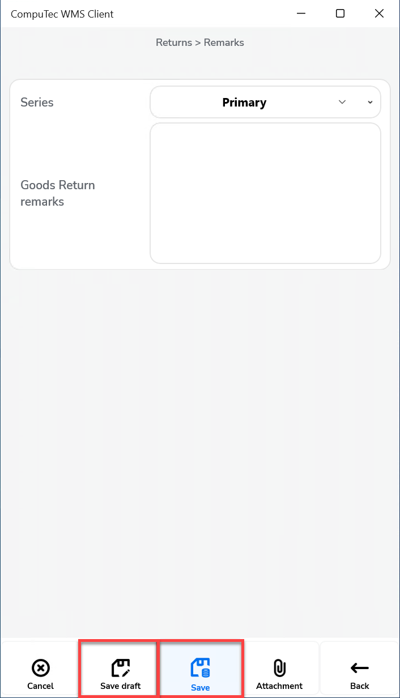

# Return GRPO

The options provided in the Return GRPO (Goods Receipt Purchase Order) setup enhance the flexibility of handling document returns and streamline warehouse operations.

**After picking, auto return to:** – Defines to which form the application navigates to once the picking quantity for a document line is confirmed.
    

    
Click here to expand

    

    **Document Details Workflow**

        

        **Item Details WorkFlow**

        
    

    

**Display Delivered Batches** –  Shows all batches or only the batches associated with the relevant Business Partner, based on the corresponding SAP Business One setting.

    

**Enable saving to drafts** – Allows saving documents as document drafts.
    

    
Click here to expand

    

    By default, the option is switched off, and the Remarks window looks like this:

        

    When the option is switched on, the Remarks window looks like this:

        
    

    

**Enable saving documents when drafts ON** – Provides the option to choose whether to save a transaction as a document or as a draft on the Remarks form. When this option is checked, two options are made available in the Remarks field:

        

**Scan DocNum on Goods Receipt PO select window** – Checking this option enables scanning a document using its DocNum instead of DocEntry.

**Force manual quantity confirmation** – When this option is checked, it requires manual confirmation of the previously entered quantity. Scanning a barcode alone will not confirm it automatically.

**Enable adding Items from different Warehouses** – Allows adding items from multiple warehouses.

**Return Items only from the base document** – When checked, the return document's item list is restricted to items from the base document. Unchecking this option allows creating a return document with any items added to the list.

**Return Items only from the base document for drafts** – Functions the same as the above option but applies specifically to draft documents.

**New Return PO: Supplier-Warehouse workflow** – Checking this option affects the workflow in how the Supplier form is displayed first. When this option is active, scanning a serial or batch number on the Warehouse selection window triggers the "Fast Scan," automatically selecting the warehouse, item, serial/batch, and quantity from the barcode and adding it to the document.

**Show Cost Dimensions** – Checking this checkbox Adds a button on the Quantity form (located next to the Back button) that opens the Cost Dimensions form.

---
By configuring these options, businesses can tailor the return process to their preferences, ensuring that inventory management is more efficient and that all relevant document information is accurately reflected. 