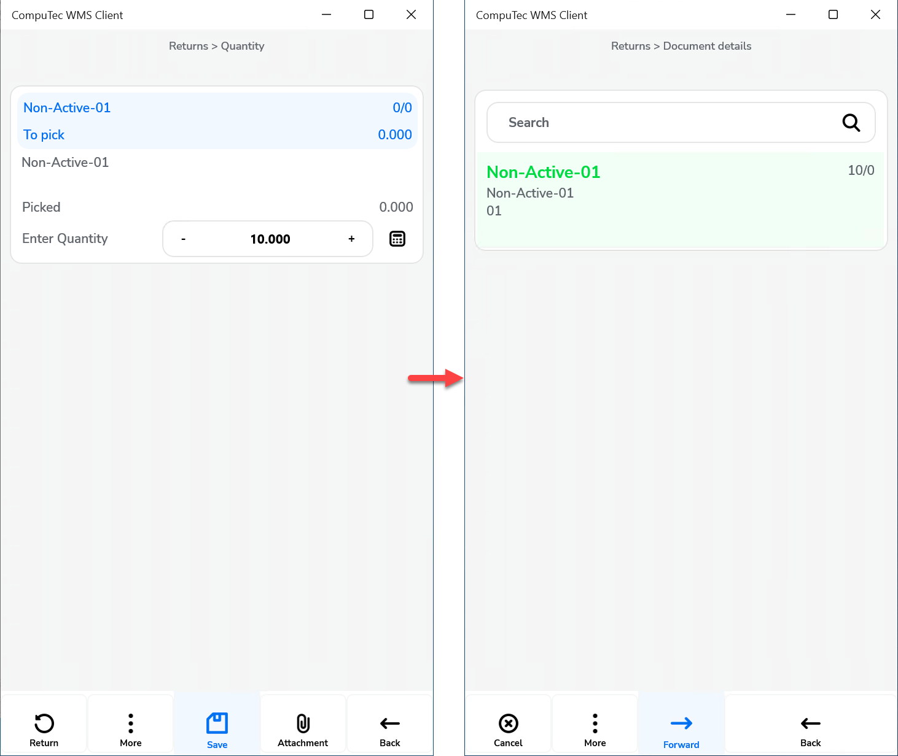

# Return GRPO

**After picking, auto return to:** – defines to which form the application leads after confirming picking quantity for a document line.
    

    
Click here to expand

    

    **Document Details Workflow**

        

        **Item Details WorkFlow**

        
    

    

**Display Delivered Batches** – display all Batches or only Batches of a related Business Partner.
    

    
Click here to expand

    

    Reflects the related SAP Business One option:

        
    

    

**Enable saving to drafts** – allows saving documents as document drafts.
    

    
Click here to expand

    

    By default, the option is switched off, and the Remarks window looks like this:

        

    When the option is switched on, the Remarks window looks like this:

        
    

    

**Enable saving documents when drafts ON** – allows deciding on the Remarks form whether to save a transaction as a document or a document draft.
    

    
Click here to expand

    

    When the option is checked, two options are available in the Remarks field:

        
    

    

**Scan DocNum on Goods Receipt PO select window** – checking this option allows you to scan a document by DocNum instead of DocEntry.

**Force manual quantity confirmation** – with this option checked, it is required to manually confirm previously set up quantity (scanning a barcode does not confirm it automatically).

**Enable adding Items from different Warehouses** – it is possibile to add items from different warehouses.

**Return Items only from the base document** – unchecking this checkbox allows creating a Return document based on any Items added to the list. Checking this option causes the Item list to be populated only by Items from the base document.

**Return Items only from the base document for drafts** – works the same way as the option above but for document drafts.

**New Return PO: Supplier-Warehouse workflow** – checking this option affects the workflow in how the Supplier form is displayed first. Choosing a Supplier leads to the Warehouse form. With this setting, scanning a Serial number or a Batch number on the Warehouse selection window will use the "Fast Scan," i.e., select warehouse, item, and serial/batch with the quantity provided in the scanned barcode and add it to the document.

**Show Cost Dimensions** – checking this checkbox adds a button (next to the Back button) on the Quantity form that leads to the Cost Dimensions form.
