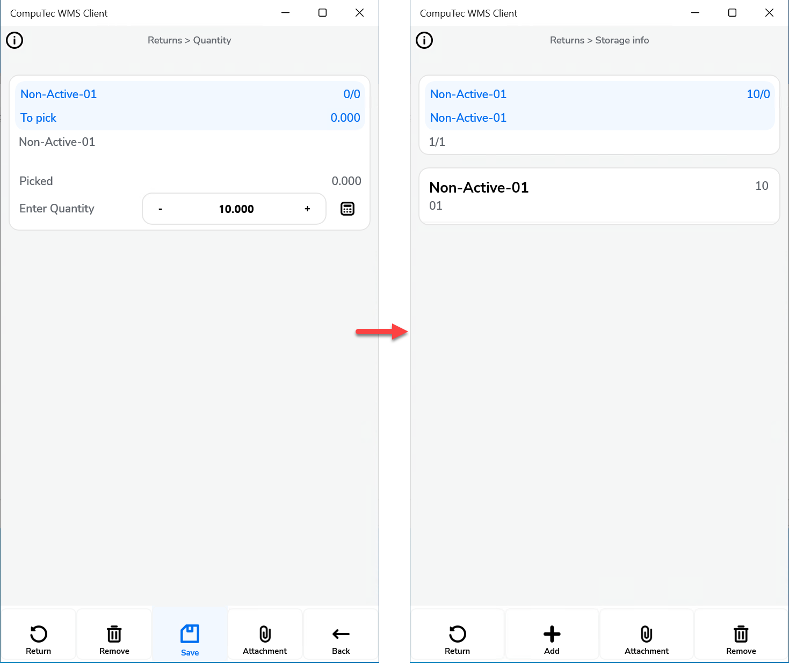
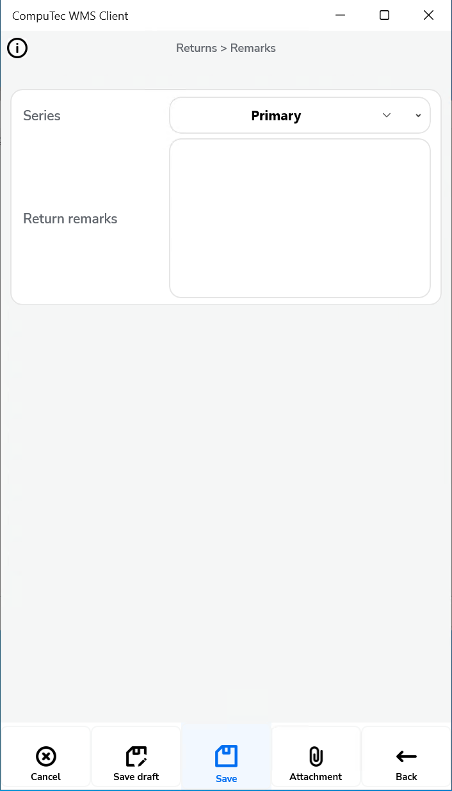

# Return

The Return functionality in SAP Business One provides a streamlined process for managing return transactions, allowing businesses to handle returns more efficiently. This section covers various options and settings related to return documents, helping you configure the system according to your specific workflow requirements.

---

**After picking an Item, auto return to** – Specifies the form the application will navigate to after confirming the picking quantity for a document line. The available options are the current Item details form and the current document details form.
    

    
Click here to expand

    

    **Document Details Workflow**

        

    **Item Details Workflow**

        
    

    

**Default Bin Location for Return document items** – When enabled, the Bin Location list is hidden during line detail settings, and a default Bin Location is automatically selected. If disabled, you can choose a Bin Location from the list. Three default options are available: Default Bin for Item, Warehouse Receiving Bin Location, and Source Bin from the Delivery document.

**Display Delivered Batches** – Shows either all batches or only those associated with the related Business Partner, in line with the corresponding SAP Business One option.

        

**Enable saving to drafts** – Allows saving documents as document drafts.
    

    
Click here to expand

    

    By default, the option is switched off, and the Remarks window looks like this:

        

    When the option is switched on, the Remarks window looks like this:

        
    

    

**Enable saving documents when drafts ON** – Allows the users to choose on the Remarks form whether to save the transaction as a document or as a draft.. When this option is checked, two options are made available in the Remarks field:

        

**Scan DocNum on Delivery selection window** –  Enables scanning by document number (DocEntry) when the checkbox is unchecked.

**Force manual quantity confirmation** – When enabled, it requires manual confirmation of the quantity set earlier (scanning a barcode will not automatically confirm it).

**Enable adding Items from different Warehouses** –  Provides the ability to add items from multiple warehouses.

**Return Items only from the base document** – When unchecked, this option allows the creation of a Return document with any items, not just those from the Delivery document.

**Return Items only from the base document for drafts** – Functions similarly to the previous option but applies specifically to document drafts.

**New Return: Customer-Warehouse workflow** – When enabled, selecting the Customer first will lead to the Warehouse form (reversing the default Warehouse-Customer workflow). With this setting, scanning a Serial or Batch number during the Warehouse selection will activate "Fast Scan," automatically selecting the warehouse, item, serial/batch, and quantity, then adding it to the document.

**Show Cost Dimensions** – Enabling this option adds a button next to the Back button on the Quantity form, which opens the Cost Dimensions form.

---
By utilizing these return settings, you can optimize the return workflow in SAP Business One, improving efficiency and accuracy. This configuration ensures that the system works seamlessly, enhancing your operational efficiency and supporting smoother return transactions.
